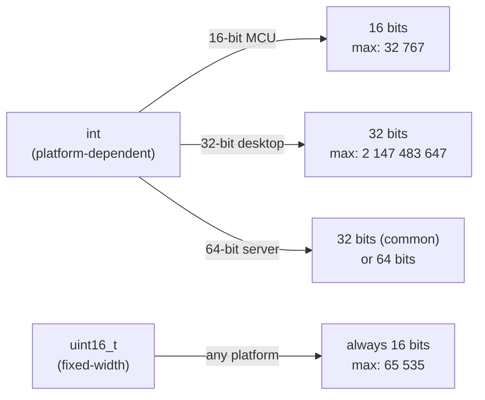

# Phase README — Sensor Readouts

> **Phase 03 — Variables and Integer Types** | Calypso · Core C

Declaring sensor variables with the right integer type makes range and overflow questions answerable at a glance — and eliminates a category of silent hardware-level bugs.

Phase 2 left two bugs in the fuel sensor code on purpose: fixing them requires knowing the right type. Every sensor value in the current codebase is declared as `int` — a type whose width depends on the platform. On a 64-bit desktop, `int` is typically 32 bits. On a 16-bit microcontroller, `int` may be exactly 2 bytes, with a maximum of 32,767. A fuel reading that exceeds that limit wraps around silently, with no error, no crash, and no warning. The type itself carries no information about whether the value is signed, how many bytes it occupies, or what happens when it overflows.

This phase introduces `<stdint.h>` fixed-width types and the discipline that goes with them. `uint16_t fuel_level` tells you the type is unsigned, 16 bits wide, and will behave identically on every platform. Format specifier macros from `<inttypes.h>` make sure `printf` reads exactly the right number of bytes. Range-check guards using `UINT16_MAX` and `INT8_MIN` express intent rather than magic numbers. By the end of this phase, the sensor section is no longer guesswork.

---

## 🗺️ Contents

- [Branch sequence](#-branch-sequence)
- [Solutions to previous challenges and thought pieces](#-solutions-to-previous-challenges-and-thought-pieces)
- [Why we made this decision](#-why-we-made-this-decision)
- [What we built in the previous branch](#-what-we-built-in-the-previous-branch)
- [What we're doing in this branch](#-what-were-doing-in-this-branch)
- [Learning goals](#-learning-goals)
- [Key concepts](#-key-concepts)
- [What to notice in the code](#-what-to-notice-in-the-code)
- [Running this branch](#-running-this-branch)
- [Challenges for students](#-challenges-for-students)
- [Thought pieces for the next branch](#-thought-pieces-for-the-next-branch)

---

## 📍 Branch sequence

| Branch | What it introduces | Abstraction level |
|---|---|---|
| `main` | Project scaffold — compiles and runs | Scaffold only |
| `phase-01_boot-and-io` | First program · `printf` / `scanf` · compilation model | Raw I/O |
| `phase-02_debugging` | `printf` tracing · VS Code debugger · three C error categories | — |
| `📌 phase-03_integer-types` | **`stdint.h` fixed-width types · `PRIu16` format specifiers · overflow guards** | — |
| `phase-04_compound-types` | `float` · `char` · `bool` · `enum MissionPhase` · `typedef` | — |
| `phase-05_operators` | Arithmetic · relational · logical · `sizeof` · explicit casts | — |
| `phase-06_bitwise` | Bitmasks · `ENGINE_CTRL` register · `1u << n` shift pattern | — |
| `phase-07_control-flow` | `while(1)` command loop · `switch` on mission phase · `goto` emergency shutdown | — |
| `phase-08_functions` | `sensors.c` / `engine.c` / `navigation.c` split · prototypes · pass-by-value | Modular |
| `phase-09_arrays` | Circular sensor history buffers · `sizeof` element count · `array[i]` ≡ `*(array + i)` | — |
| `phase-10_pointers` | `&` / `*` · pointer arithmetic · `const T*` vs `T* const` · `**` | — |
| `phase-11_strings` | `char` arrays · `strncpy` / `strcmp` / `strlen` · null terminator | — |
| `phase-12_structs` | `crew_member_t` · `spacecraft_t` · dot / arrow notation · nested structs | — |
| `phase-13_dynamic-memory` | `malloc` / `realloc` / `free` · dynamic crew roster · `NULL` checks | — |
| `phase-14_embedded-patterns` | `volatile` · memory-mapped I/O pointer · struct bitfields · `const` ROM data | Hardware abstraction |
| `phase-15_preprocessor` | `#define` constants · include guards · `#ifdef DEBUG_TELEMETRY` · function-like macro | — |
| `phase-16_file-io` | `fopen` / `fprintf` / `fwrite` · `calypso.log` · binary checkpoint | — |

---

## ✅ Solutions to previous challenges and thought pieces

### How challenges work

Additive challenges from the previous branch are solved in the first commit of this
branch — look for the `SOLUTION:` commit at the top of this branch's git history.
Analytical challenges and thought pieces are answered below.

```bash
git log --oneline          # find the SOLUTION commit hash
git show <hash>            # inspect the solution in isolation
```

### Challenge 1 — Classifying the fuel sensor error

The fuel level exceeding the full tank capacity and rising is a logical error: the program compiles, runs, and produces confident output — it just produces wrong output. It is not a syntax error because the compiler accepted the code. It is not undefined behaviour because no rule of the C standard is violated; addition of signed integers with values in the `int` range is well-defined. The right investigation strategy is systematic tracing — the bug is in the arithmetic, and tracing can localise exactly which expression produces the wrong value.

### Challenge 2 — Choosing printf tracing vs the interactive debugger

For scenario (a) — a bug that only appears on iteration 9,347 — reach for a conditional breakpoint in VS Code first. Setting the condition `i == 9347` (or `result < 0`) means the debugger runs freely until that exact state and pauses automatically. A `printf` trace would require filtering 9,346 lines of output by eye, which is error-prone and slow. For scenario (b) — bare-metal firmware with no debugger port — `printf` tracing (or its embedded equivalent, writing to a UART) is the only option. No interactive debugger can attach to a target that has no debug interface.

### Challenge 3 — Additive printf trace

Solved in the SOLUTION commit. See `main.c` — the `// SOLUTION (Challenge 3):` comment marks the added `printf` before the sensor calculation. The trace confirms that `initial_fuel`, `burn_rate`, and `elapsed` are correct going in, which localises the bug to the arithmetic: the inputs are right, so the calculation must be wrong.

### Challenge 4 — What the interactive debugger reveals

Stepping through the calculation line by line in VS Code shows the value of `consumed` after the first assignment and the value of `fuel_reading` after the second — before those values are printed. The `printf` trace from Challenge 3 confirms inputs but still only shows the final `fuel_reading` output. The debugger lets you observe every intermediate state without modifying and recompiling the source: you can see exactly when and where `consumed` acquires its inflated value and when `fuel_reading` goes wrong — without adding a single line of code.

### Challenge 5 (stretch) — Conditional breakpoint

The condition to enter in VS Code is `fuel_reading > initial_fuel`. This is more efficient than an unconditional breakpoint when the same sensor read runs many times in sequence: an unconditional breakpoint pauses on every execution regardless of outcome, requiring you to manually continue until the anomaly appears. The conditional breakpoint pauses only when the fault actually occurs — if the sensor read ran once per second over a 10-minute mission (600 times), an unconditional breakpoint would require 600 manual continues; the conditional one pauses once, exactly when the value is wrong.

### Thought piece 1 — Is `int` always the same size?

No. The C standard guarantees `int` is at least 16 bits but imposes no upper limit. On a 64-bit desktop with GCC, `int` is typically 32 bits. On a 16-bit MCU like the AVR or MSP430, `int` is exactly 16 bits — maximum 32,767 for signed. Code that assumes `int` is 32 bits will silently corrupt on a 16-bit target: a fuel reading of 950 kg is fine, but any value above 32,767 wraps to a negative number with no warning and no crash.

### Thought piece 2 — How does `printf` know how many bytes to read?

It does not. `printf` trusts the format specifier unconditionally. `%d` tells it to read a 32-bit `int` on a typical platform. If the actual argument is a `uint16_t` (2 bytes), `printf` still reads 4 bytes — pulling extra bytes from the stack that belong to the next argument or to unrelated local variables. The output is garbage or silently wrong, and no compiler warning is guaranteed. Matching the format specifier to the actual argument type is entirely the programmer's responsibility.

### Thought piece 3 — Silent integer overflow on embedded hardware

If the fuel sensor returns an overflowed value on a real MCU, the flight computer has no indication that anything went wrong. Depending on how the overflow resolves: a reading near the unsigned maximum might look like a nearly-full tank and suppress a low-fuel warning that should have triggered; a reading that wraps to a small positive value might look like near-empty and trigger an emergency shutdown mid-mission. Neither case produces an error message or a fault flag — the value looks like a valid sensor reading. This is why overflow in safety-critical systems is treated as a hard failure mode, not a corner case.

---

## 💡 Why we made this decision

### Platform-dependent width is an invisible contract

C's basic integer types — `int`, `short`, `long` — have platform-dependent widths. The C standard specifies minimum ranges: `int` is at least 16 bits, `long` is at least 32 bits. But the actual width depends on the compiler and target. On a 64-bit Linux machine with GCC, `int` is 32 bits. On a 16-bit AVR microcontroller, `int` is 16 bits. Code that uses `int` everywhere makes a silent platform assumption — it is an implicit contract with one specific target, and that contract breaks the moment the code runs somewhere else.

This is not a theoretical concern for Calypso. Flight computer firmware runs on embedded hardware where `int` may be 16 bits. If sensor variables are declared as `int` and the codebase is ever compiled for a smaller target, the fuel level calculation silently starts producing wrong answers. The type choice is a portability contract: get it right once, or debug the same bug on every new target.

### `<stdint.h>` makes the contract explicit

`<stdint.h>` (introduced in C99) provides types whose width is part of the name: `uint16_t` is always exactly 16 bits unsigned, `int8_t` is always exactly 8 bits signed. There is no ambiguity and no platform assumption. The type documents itself: `uint16_t fuel_level` tells any reader — human or compiler — that this value is unsigned, 16 bits wide, and will behave identically on every platform that supports C99.



### Why `UINT16_MAX` instead of `65535`

Writing `if (raw_value > 65535)` is a magic number: the number carries no information about why 65535 is the limit. If the type of the variable changes from `uint16_t` to `uint32_t`, the literal stays wrong silently — `65535` is still a valid number, the code still compiles, and the range check is now incorrect. `UINT16_MAX` is self-describing: it is the maximum value for a `uint16_t`, and its meaning is tied to the type name, not to a number you have to look up.

### Why `PRIu16` instead of `%d` or `%u`

`%d` tells `printf` to read a signed `int` — typically 4 bytes. `uint16_t` is 2 bytes. On most 32-bit and 64-bit platforms, calling `printf("%" PRIu16, fuel_level)` is equivalent to `printf("%hu", fuel_level)` — but the right specifier for `uint16_t` is `%hu`, not `%u` or `%d`. `PRIu16` expands to the correct specifier for the platform automatically. Using `%d` on a `uint16_t` is undefined behaviour if the sizes differ — the compiler will not warn you, and the output will be wrong in subtle ways.

---

## ⏮️ What we built in the previous branch

`phase-02_debugging` added a deliberately-broken fuel sensor simulation to `main.c`. Two bugs — an off-by-one in the burn period and a sign error in the fuel calculation — cause the sensor to report a level higher than the full tank capacity and still rising. The branch walked through `printf`-trace debugging and the VS Code interactive debugger to locate both bugs, but left them unfixed: the fix requires choosing the correct integer types, which is this phase's topic.

---

## 🎯 What we're doing in this branch

- Fix both Phase 2 bugs (off-by-one and sign error) as part of converting to correct types
- Redeclare `fuel_level` as `uint16_t` — unsigned, 16-bit, matches the value range of a fuel quantity in kg
- Redeclare `engine_temp_delta` as `int8_t` — signed, 8-bit, because temperature deltas can be negative (cooling phase)
- Redeclare `mission_elapsed_s` as `uint32_t` — unsigned, 32-bit, for elapsed seconds over a long mission
- Add a `const`-qualified tank capacity constant to demonstrate compile-time read-only enforcement
- Demonstrate declaration and initialisation as two separate steps, and together in one line
- Use `UINT16_MAX` and `INT8_MIN` / `INT8_MAX` in range-check guards against out-of-range sensor ADC readings
- Replace `%d` format specifiers with `PRIu16`, `PRId8`, and `PRIu32` from `<inttypes.h>`
- Initialise the engine status register with a hex literal (`0x1F`) and show its decimal equivalent

---

## 🧑🏻‍🏫 Learning goals

### Understand
- **Describe** how data is represented in memory using bits, bytes, and words — and why the number of bits in a type determines its range
- **Describe** a data type as a compile-time bundle of size, range, and permitted operations — not just a label for a value
- **Explain** how integer values are represented using binary and positional notation, and how hexadecimal maps directly onto groups of four bits
- **Distinguish** between signed and unsigned integers — how the sign bit works, what the range tradeoff is, and what happens when you choose the wrong one
- **Explain** integer overflow and underflow — when they occur, what unsigned and signed types produce, and why they are especially dangerous in embedded systems where there is no OS to catch the error
- **Explain** the role of `const` in declaring read-only variables — why it is a compile-time guarantee, not a runtime check

### Apply
- **Declare** and initialise sensor variables in C, including the two-step form (declaration separate from initialisation)
- **Use** `stdint.h` fixed-width types (`uint16_t`, `int8_t`, `uint32_t`) for all Calypso sensor variables instead of platform-dependent types
- **Use** `UINT16_MAX` and `INT8_MIN` / `INT8_MAX` to express type-limit guards without magic number literals
- **Use** the correct `<inttypes.h>` format specifier macro (`PRIu16`, `PRId8`, `PRIu32`) for each fixed-width sensor variable in `printf` calls
- **Choose** an appropriate fixed-width integer type for a sensor value given its range and sign requirements
- **Write** integer constants using hex notation (`0x1F`) for hardware register values and explain the correspondence to binary

---

## 🔑 Key concepts

| Concept | Plain English |
|---|---|
| **Fixed-width integer type** | A type whose size in bits is part of the name and is guaranteed on every platform. `uint16_t` is always exactly 16 bits unsigned — no platform can make it wider or narrower. |
| **Unsigned integer** | An integer type that represents only non-negative values. All bits contribute to magnitude. Range: 0 to 2ⁿ − 1 for an n-bit type. `uint16_t` max = 65,535. |
| **Signed integer** | An integer type that uses the most significant bit as a sign bit, halving the positive range to make room for negative values. `int8_t` range: −128 to 127. |
| **Integer overflow** | When arithmetic produces a value larger than the type's maximum. For unsigned types the result wraps to zero (modular arithmetic). For signed types the behaviour is undefined — the result is not guaranteed to be meaningful. |
| **Integer underflow** | When an unsigned arithmetic result would go below zero, it wraps to the type's maximum instead. `0u - 1` on a `uint16_t` gives 65,535. |
| **`stdint.h`** | A C99 standard header that defines fixed-width types (`uint8_t`, `int16_t`, etc.) and their limit constants (`UINT8_MAX`, `INT16_MIN`, etc.). |
| **`inttypes.h`** | A C99 standard header that defines format specifier macros like `PRIu16` and `PRId8` — they expand to the correct `printf` specifier for each fixed-width type on the current platform. |
| **`const`** | A type qualifier that marks a variable as read-only after its initialisation. Writing to a `const` variable is a compile error. It does not affect runtime behaviour — the value is still a variable in memory; the compiler simply refuses to generate code that modifies it. |
| **Declaration vs initialisation** | A declaration introduces a name and its type to the compiler. Initialisation gives that name a value. They can be combined on one line or done separately. Reading an uninitialised variable is undefined behaviour — the value is whatever bytes happened to be at that memory address. |
| **Hexadecimal literal** | An integer constant written in base 16, prefixed with `0x`. `0x1F` = 31 decimal = 0001 1111 binary. Each hex digit represents exactly 4 bits, so hex maps directly onto bit patterns — which is why it is the standard notation for hardware register values. |

---

## 🔍 What to notice in the code

**[`main.c` — includes](main.c)**
Three headers instead of one. `<stdint.h>` provides the fixed-width types; `<inttypes.h>` provides the `PRI` format macros. Neither is pulled in by `<stdio.h>`. The order mirrors the dependency: types are defined before their format specifiers can reference them.

**[`main.c` — `TANK_CAPACITY_KG` and `BURN_RATE_KGS`](main.c)**
Both are declared `const uint16_t` and `const uint8_t` on the same line as their initialisation. `const` makes the compiler refuse any later assignment. This is the correct pattern for mission parameters that are known at startup and must not change — it converts a naming convention ("treat this as constant") into a compiler-enforced rule.

**[`main.c` — `mission_elapsed_s` two-step form](main.c)**
Declared as `uint32_t mission_elapsed_s;` on one line, then assigned `= 10;` on the next. This is the two-step form — declaration separate from initialisation. Both steps are visible in the code so you can see they are distinct operations. In practice, two-step initialisation appears when the value is not known until after a function call or a conditional block.

**[`main.c` — `consumed_kg` and `fuel_level`](main.c)**
`BURN_RATE_KGS * mission_elapsed_s` promotes to `uint32_t` (the wider operand). The explicit cast to `uint16_t` documents the narrowing intentionally — without it, the compiler may warn about the implicit conversion, and the code is harder to audit. The subtraction is now `TANK_CAPACITY_KG - consumed_kg` — the sign error from Phase 2 (`+` instead of `-`) is fixed.

**[`main.c` — `raw_fuel_adc` guard](main.c)**
`raw_fuel_adc` is `uint32_t` and simulates an ADC value before it has been narrowed to `uint16_t`. The guard `raw_fuel_adc > UINT16_MAX` checks that the value fits before it is ever assigned — preventing a silent truncation. `UINT16_MAX` makes the limit self-describing; if the destination type changes, the constant name changes too.

**[`main.c` — `engine_temp_delta` and `raw_temp` guard](main.c)**
`engine_temp_delta` is `int8_t` — signed because the delta can be negative during a cooling phase. The guard checks `raw_temp < INT8_MIN || raw_temp > INT8_MAX` against an `int` that is deliberately out of range. This is the pattern for validating a sensor value from an external bus before narrowing it to a smaller type.

**[`main.c` — `PRIu16`, `PRId8`, `PRIu32` format macros](main.c)**
Each `printf` for a fixed-width type uses the matching `PRI` macro rather than a hand-picked `%d` or `%u`. The macros expand to the correct specifier for the platform — `%hu` for `uint16_t`, `%hhd` for `int8_t`, and so on. Using `%d` on a `uint16_t` is undefined behaviour if the sizes differ; the `PRI` macros eliminate that class of bug.

**[`main.c` — `engine_status_reg = 0x1F`](main.c)**
The hex literal `0x1F` is assigned to `uint8_t engine_status_reg`. The comment shows the binary and decimal equivalents. `printf` prints the value with `%02X` (two hex digits, zero-padded) and `%u` (decimal). Comparing the two outputs confirms they represent the same byte — and shows why hex is more useful than decimal for a value where individual bits matter.

---

## ▶️ Running this branch

**Prerequisites:** GCC or Clang (C99+) and CMake 3.10+, or just GCC/Clang on its own.

**With CMake (recommended):**
```bash
cmake -B build
cmake --build build
.\build\Debug\calypso.exe   # Windows (MSVC)
.\build\calypso.exe         # Windows (MinGW)
./build/calypso             # Linux / macOS
```

**Direct compilation (no CMake):**
```bash
gcc -std=c99 main.c -o calypso
./calypso
```

The program prints the boot banner, triggers both range-check fault messages (the out-of-range ADC values are deliberate), then prints the corrected sensor readings, and prompts for a command character and crew ID.

**Expected output (sensor section):**
```
FAULT: fuel ADC reading (65540) exceeds uint16_t range [0, 65535]

--- Sensor Status ---
Fuel level           : 950 kg
FAULT: temperature delta (-130) outside int8_t range [-128, 127]
Engine temp delta    : -12 K
Mission elapsed      : 10 s

Engine status reg    : 0x1F  (decimal: 31)
```

Fuel level is now 950 kg — the correct result of `1000 − 5 × 10`. Both Phase 2 bugs are fixed: the off-by-one (the extra `+1` in the burn period) and the sign error (addition replaced by subtraction).

---

## ✏️ Challenges for students

**Challenge 1 — Analytical**
`fuel_level` is declared as `uint16_t`. Calculate by hand: what is the maximum value this type can hold? Now suppose a sensor ADC fault caused the calculated `consumed_kg` to underflow — it becomes 70,000 due to a sign error. Trace what happens when `TANK_CAPACITY_KG - consumed_kg` is evaluated as `uint16_t` arithmetic. Does the assignment crash, clamp, or wrap — and why? What would the printed fuel level be?

**Challenge 2 — Analytical**
The range-check guard for the fuel ADC uses `UINT16_MAX` rather than the literal `65535`. Suppose the type of `fuel_level` were changed from `uint16_t` to `uint32_t` to support a heavier shuttle. With `UINT16_MAX` in the guard, what would need to change and why? With `65535`, what would happen to the guard — would it still compile? Would it still be correct?

**Challenge 3 — Additive**
Add a `uint32_t distance_to_destination_km` sensor to `main.c`. Initialise it to `384400` (roughly the Earth–Moon distance in km). Print it using the correct `<inttypes.h>` format specifier. Then add a range check: if the value exceeds `UINT32_MAX / 2` (half the maximum), print a fault message that includes both the value and the bound. What format specifier do you use in that fault `printf`?

**Challenge 4 — Analytical**
`engine_status_reg` is initialised to `0x1F`. Convert this to binary and decimal by hand, without running the code. Then explain: why is hexadecimal more useful than decimal for hardware register values? What does each hex digit correspond to in the binary layout, and why does that matter when individual bits control separate hardware functions?

**Challenge 5 — Additive (stretch)**
`mission_elapsed_s` is declared on one line and initialised on the next — the two-step form. Add a second sensor variable `uint32_t total_burn_s` using the same pattern: declare it without a value, then initialise it after `mission_elapsed_s`. Print both with their correct format specifiers. Now explain: if you accidentally printed `total_burn_s` before the initialisation line, what would C do? Why is this undefined behaviour rather than a compile error, and what might the compiler say (or not say) about it?

---

## 💭 Thought pieces for the next branch

1. The velocity sensor needs to represent values like 32.7 km/s. Can a `uint16_t` hold that? What type do we need, and what does that mean for how the value is stored in memory and how precisely it can be represented?
2. The mission phase is stored as a raw integer: `0` = `PREFLIGHT`, `1` = `LAUNCH`. If a function received the value `4`, would it know it was a mission phase — or could it be mistaken for a sensor reading, a crew ID, or something else entirely? What is the risk of that?
3. A sensor fault flag is simply true or false. Is there a dedicated type for that in C?

---

*Previous branch: [`phase-02_debugging`]*
*Next branch: [`phase-04_compound-types`]*
