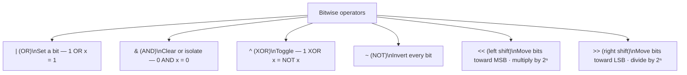
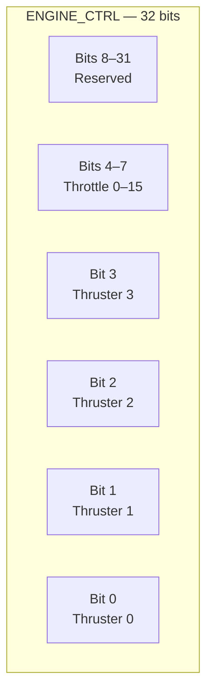

# Phase README — Engine Control Registers

> **Phase 06 — Bitwise Operations and Bitmasks** | Calypso · Core C

Manipulating individual bits in hardware registers using bitwise operators, bitmasks, and shift-based patterns.

The engine hardware exposes a 32-bit `ENGINE_CTRL` register and a 32-bit `ENGINE_STATUS` register. Each bit in `ENGINE_CTRL` controls a specific thruster pair or forms part of the throttle field; each bit in `ENGINE_STATUS` signals a specific fault condition. Arithmetic operators cannot manipulate a single bit without corrupting the others: adding 1 to set bit 0 only works if bits 0–3 are all already zero — any borrow or carry would flip adjacent bits. The flight computer needs operators that act on binary patterns directly. This phase introduces the six bitwise operators and the set/clear/test/toggle idioms built on top of them.

> **A note on scope.** This phase introduces bitwise operators (`&`, `|`, `^`, `~`, `<<`, `>>`). The register operations — enabling thrusters, reading the throttle field, testing fault flags — are written inline in `main.c` rather than as named functions. Named functions, separate source files, and prototypes are the subject of Phase 8. The phase plan describes these operations as "functions" in the loose sense of "operations that do a job"; implementing them as inline expressions now is intentional — you will see the friction that creates, and Phase 8 resolves it.

---

## 🗺️ Contents

- [Branch sequence](#-branch-sequence)
- [Solutions to previous challenges and thought pieces](#-solutions-to-previous-challenges-and-thought-pieces)
- [Why we made this decision](#-why-we-made-this-decision)
- [What we built in the previous branch](#-what-we-built-in-the-previous-branch)
- [What we're doing in this branch](#-what-were-doing-in-this-branch)
- [Learning goals](#-learning-goals)
- [Key concepts](#-key-concepts)
- [What to notice in the code](#-what-to-notice-in-the-code)
- [What this phase revealed](#-what-this-phase-revealed)
- [Running this branch](#-running-this-branch)
- [Challenges for students](#-challenges-for-students)
- [Thought pieces for the next branch](#-thought-pieces-for-the-next-branch)

---

## 📍 Branch sequence

| Branch | What it introduces | Abstraction level |
|---|---|---|
| `main` | Project scaffold — compiles and runs | Scaffold only |
| `phase-01_boot-and-io` | First program · `printf` / `scanf` · compilation model | Raw I/O |
| `phase-02_debugging` | `printf` tracing · VS Code debugger · three C error categories | — |
| `phase-03_integer-types` | `stdint.h` fixed-width types · `PRIu16` format specifiers · overflow guards | — |
| `phase-04_compound-types` | `float` / `double` · `bool` · `enum MissionPhase` · `typedef sensor_float_t` | — |
| `phase-05_operators` | Arithmetic · relational · logical · `sizeof` · explicit casts | — |
| `📌 phase-06_bitwise` | **Bitmasks · `ENGINE_CTRL` register · `1u << n` shift pattern** | — |
| `phase-07_control-flow` | `while(1)` command loop · `switch` on mission phase · `goto` emergency shutdown | — |
| `phase-08_functions` | `sensors.c` / `engine.c` / `navigation.c` split · prototypes · pass-by-value | Modular |
| `phase-09_arrays` | Circular sensor history buffers · `sizeof` element count · `array[i]` ≡ `*(array + i)` | — |
| `phase-10_pointers` | `&` / `*` · pointer arithmetic · `const T*` vs `T* const` · `**` | — |
| `phase-11_strings` | `char` arrays · `strncpy` / `strcmp` / `strlen` · null terminator | — |
| `phase-12_structs` | `crew_member_t` · `spacecraft_t` · dot / arrow notation · nested structs | — |
| `phase-13_dynamic-memory` | `malloc` / `realloc` / `free` · dynamic crew roster · `NULL` checks | — |
| `phase-14_embedded-patterns` | `volatile` · memory-mapped I/O pointer · struct bitfields · `const` ROM data | Hardware abstraction |
| `phase-15_preprocessor` | `#define` constants · include guards · `#ifdef DEBUG_TELEMETRY` · function-like macro | — |
| `phase-16_file-io` | `fopen` / `fprintf` / `fwrite` · `calypso.log` · binary checkpoint | — |

---

## ✅ Solutions to previous challenges and thought pieces

### How challenges work

Additive challenges from the previous branch are solved in the first commit of this
branch — look for the `SOLUTION:` commit at the top of this branch's git history.
Analytical challenges and thought pieces are answered below.

```bash
git log --oneline          # find the SOLUTION commit hash
git show <hash>            # inspect the solution in isolation
```

### Challenge 1 — Why does parenthesisation matter in `hours_to_dest`?

`/` and `*` share equal precedence and associate left-to-right, so `distance / velocity * 3600.0f` evaluates as `(distance / velocity) * 3600.0f`. With the actual values — 384,400 km and 32.70 km/s — that gives `(384400 / 32.70) * 3600 = 11754 * 3600 = ~42,314,400`, which is a dimensionally meaningless number (seconds multiplied by 3600, not divided). The parenthesised form `distance / (velocity * 3600.0f)` converts velocity to km/h first — `32.70 * 3600 = 117,720 km/h` — and then divides distance by that, giving `384400 / 117720 ≈ 3.27 hours`. The rule to carry forward: when a product must appear in the denominator, the parentheses are load-bearing, not cosmetic.

### Challenge 2 — Short-circuit evaluation and divide-by-zero

When `&&` evaluates `A && B`, and `A` is false, `B` is never evaluated — the C standard guarantees this, not just any given compiler. In the approach check `(velocity_kms <= 2.0f) && (fuel_level >= 50)`, the velocity condition is false (32.70 > 2.0), so the fuel condition is never evaluated; `approach_safe` is immediately `false`. A practical example where this matters: `n > 0 && total / n > threshold` — if `n` is 0, the left operand is false and `total / n` is never executed, preventing a divide-by-zero that would otherwise be undefined behaviour. Writing the safety check on the left of `&&` is deliberate: it makes the expression provably safe regardless of the right operand's value.

### Challenge 3 — Additive: `fuel_efficiency`

Solved in the SOLUTION commit. See `main.c` — the `// SOLUTION (Challenge 3):` block adds two lines: `fuel_efficiency_int` using `(sensor_float_t)(distance_to_destination_km / fuel_level)` (integer division first, then cast to float — result is 404.00 km/kg), and `fuel_efficiency` using `(sensor_float_t)distance_to_destination_km / fuel_level` (cast on the numerator before division — result is 404.63 km/kg). The outer cast on `fuel_efficiency_int` converts the already-truncated integer result to float; the numerator cast on `fuel_efficiency` promotes before division, preserving the fractional part.

### Challenge 4 — Do double the bytes mean double the significant digits?

The relationship is logarithmic, not linear. `float` is 32 bits total: 1 sign + 8 exponent + 23 mantissa bits. The mantissa encodes `2^23 = 8,388,608` distinct significand values, which corresponds to `log10(2^23) ≈ 6.92` — roughly 7 significant decimal digits. `double` is 64 bits total: 1 sign + 11 exponent + 52 mantissa bits. That gives `2^52 ≈ 4.5 × 10^15` distinct significand values — `log10(2^52) ≈ 15.65`, roughly 15–16 significant digits. Doubling the byte count from 4 to 8 adds 29 mantissa bits (`23 → 52`). Those 29 bits add `29 × log10(2) ≈ 8.73` decimal digits — more than double, but only because the double format allocates proportionally more of the extra bits to the mantissa than to the exponent. The takeaway: each additional mantissa bit contributes roughly 0.3 decimal digits of precision, so precision grows with `log2` of the representable significand count, not linearly with byte size.

### Challenge 5 — Additive (stretch): `sensor_cycle` with `%`

Solved by the navigation section already in the phase code. See the `// SOLUTION (Challenge 5):` comment in `main.c` at the `sensor_cycle` block. `sensor_cycle` is initialised to 0, advanced by 5 (`% 4 = 1` → skip), then advanced by 3 to 8 (`% 4 = 0` → update due). The ternary `(sensor_cycle % 4 == 0) ? "[update due]" : "[skip]"` produces the status string directly without an `if` statement.

### Thought piece 1 — What operator can set exactly one bit?

Bitwise OR (`|`). `reg |= (1u << N)` creates a mask with only bit N set — all other bit positions in the mask are 0. OR with 0 leaves a bit unchanged; OR with 1 sets it. So the operation sets bit N and leaves every other bit exactly as it was. Contrast with `reg + (1u << N)`: that works only if bit N is currently 0 and no lower bits cause a carry — in general, addition can corrupt adjacent bits through borrow propagation.

### Thought piece 2 — How to extract the 4-bit throttle field from bits 4–7

Two steps: shift right to bring the target bits to position 0, then AND to discard the bits above. `(ENGINE_CTRL >> 4) & 0x0Fu` — right-shifting by 4 moves bits 4–7 into positions 0–3; the mask `0x0F` (binary `00001111`) then zeroes everything above bit 3. The result is a value in the range 0–15 with no information from bits 0–3 or bits 8–31. An equivalent form that masks before shifting uses the in-place mask `0xF0u`: `(ENGINE_CTRL & 0xF0u) >> 4`. Both produce the same result — the distinction between them is the subject of Challenge 4 in this phase.

### Thought piece 3 — `&` (bitwise AND) versus `&&` (logical AND)

`&&` converts each operand to a boolean first (zero = false, non-zero = true) and produces exactly 1 or 0; it short-circuits. `&` operates on the binary representation of both operands bit by bit and produces an integer result that can be any value, not just 0 or 1; it never short-circuits. Given the same inputs: `2 && 4 = 1` (both non-zero → true), but `2 & 4 = 0` (binary `010 & 100 = 000` — no bit is set in both). On the approach safety check from Phase 5, `(velocity_kms <= 2.0f) & (fuel_level >= 50)` would compile (the relational sub-expressions produce `int` 0 or 1) and happen to give the same answer — but it would not short-circuit, and on integer register values the results would diverge. The rule: use `&&` and `||` for conditions; use `&`, `|`, `^` only when you intend to operate on bit patterns.

---

## 💡 Why we made this decision

### Hardware registers pack multiple signals into one integer

A 32-bit hardware register is not a single number — it is a dense structure where every bit (or group of bits) has an independent meaning. In `ENGINE_CTRL`, bit 0 enables thruster pair 0, bit 1 enables thruster pair 1, bits 4–7 hold the throttle level. Setting the throttle must not disturb the thruster bits, and enabling a thruster must not disturb the throttle field. Arithmetic cannot do this reliably: `reg + 8` sets bit 3 only if the low three bits happen to be zero — if bit 1 is already set, the addition carries and flips bit 2. Bitwise operators act on individual bit positions with no interaction between them.

The six bitwise operators map directly to operations on binary patterns:



### `ENGINE_CTRL` register layout

The register is designed so each functional field occupies a contiguous group of bits. Thruster pair enables live in the low nibble; the throttle level lives in the second nibble.



### `1u << N` over hard-coded hex literals

`1u << THRUSTER_3_BIT` and `0x00000008u` both produce the same 32-bit pattern. The shift form is preferred because the bit position is explicit in the source: reading `1u << 3` tells you immediately that bit 3 is being targeted. Reading `0x00000008` requires you to mentally convert hex to binary to find the bit position — and the chance of an off-by-one in that conversion is real. The `u` suffix on `1u` matters: without it, the literal `1` is a signed `int`, and on platforms where `int` is 32 bits, `1 << 31` shifts into the sign bit — undefined behaviour in C. `1u` is unsigned, so the shift is always well-defined for bit positions 0–30 on any platform where `unsigned int` is at least 32 bits.

---

## ⏮️ What we built in the previous branch

`phase-05_operators` added the navigation calculation section to `main.c`. Burn rate, time to destination, and an approach safety verdict are computed inline using arithmetic, relational, and logical operators. The explicit cast `(sensor_float_t)consumed_kg / mission_elapsed_s` demonstrated the integer-vs-float division distinction. `&&` combined two sensor conditions into a single `bool approach_safe`, and short-circuit evaluation meant the fuel check was skipped when velocity was already out of range. The `sizeof` operator confirmed the byte sizes of `sensor_float_t` and `uint16_t`. Prefix and postfix increment showed the difference between evaluating before and after incrementing. The SOLUTION commit for Phase 5 added `fuel_efficiency` (Challenge 3) and annotated the existing `sensor_cycle` block (Challenge 5 stretch).

---

## 🎯 What we're doing in this branch

- Add `ENGINE_CTRL` and `ENGINE_STATUS` as `uint32_t` global variables simulating hardware registers
- Define named `const uint8_t` bit-position constants for thruster bits, throttle field, and status fault bits — no hard-coded hex literals
- Set individual thruster bits with `ENGINE_CTRL |= (1u << THRUSTER_N_BIT)`
- Clear a thruster bit with `ENGINE_CTRL &= ~(1u << THRUSTER_N_BIT)`
- Toggle a thruster bit with `ENGINE_CTRL ^= (1u << THRUSTER_N_BIT)`
- Test a fault flag with `(ENGINE_STATUS & (1u << CRITICAL_FAULT_BIT)) != 0`
- Set the throttle field (bits 4–7) with a shifted value: `ENGINE_CTRL |= ((uint32_t)level << THROTTLE_SHIFT)`
- Extract the throttle field with `(ENGINE_CTRL >> THROTTLE_SHIFT) & THROTTLE_MASK`
- Print the register value in hex (`%08X`) after each operation so the bit pattern is visible

---

## 🧑🏻‍🏫 Learning goals

### Understand
- **Explain** left and right shift in terms of binary position movement and their correspondence to multiplication and division by powers of 2 — and why `1u << N` creates the bitmask for bit N

### Apply
- **Apply** bitwise operators (`&`, `|`, `^`, `~`, `<<`, `>>`) to the `ENGINE_CTRL` and `ENGINE_STATUS` register values
- **Construct** bitmasks to set, clear, test, and toggle specific bits in `ENGINE_CTRL`
- **Build** bitmasks with `1u << THRUSTER_N_BIT` rather than hard-coded hex or binary literals
- **Extract** the 4-bit throttle field from bits 4–7 using right-shift followed by masking

### Analyze
- **Examine** the set, clear, and toggle idioms and explain why each one leaves the unmasked bits unchanged — trace a concrete 32-bit example through the truth table
- **Compare** `1u << N` (shift-based mask) and a hard-coded hex literal — what information is lost in the hex form, and what errors does that create?

---

## 🔑 Key concepts

| Concept | Plain English |
|---|---|
| **Bitwise operators** | Six operators that work on individual bit positions of an integer: `&` (AND), `\|` (OR), `^` (XOR), `~` (NOT/complement), `<<` (left shift), `>>` (right shift). They treat the integer as a sequence of bits, not as a number. |
| **Bitmask** | An integer whose bit pattern is chosen to isolate, set, or clear a specific bit or field. `1u << N` is the canonical mask for bit N — a single 1 in position N and 0 everywhere else. |
| **Set a bit** | `reg \|= (1u << N)` — OR with the mask. A bit ORed with 1 becomes 1; a bit ORed with 0 stays unchanged. Only bit N is affected. |
| **Clear a bit** | `reg &= ~(1u << N)` — AND with the complement of the mask. `~(1u << N)` has 0 only at bit N and 1 everywhere else. A bit ANDed with 0 becomes 0; a bit ANDed with 1 stays unchanged. Only bit N is affected. |
| **Toggle a bit** | `reg ^= (1u << N)` — XOR with the mask. A bit XORed with 1 flips; a bit XORed with 0 stays unchanged. Only bit N is affected. |
| **Test a bit** | `(reg & (1u << N)) != 0` — AND isolates bit N; the rest become 0. The `!= 0` converts the integer result to a boolean true/false. |
| **Extract a bit field** | `(reg >> shift) & mask` — right-shift brings the target bits to position 0, then AND removes everything above. For bits 4–7: `(reg >> 4) & 0x0Fu` gives a value in 0–15. |
| **Left shift (`<<`)** | `x << n` moves every bit n positions toward the most significant bit, filling the vacated low bits with 0. For unsigned types with no overflow, this multiplies by 2ⁿ. `1u << N` places a single 1 at bit position N. |
| **Right shift (`>>`)** | `x >> n` moves every bit n positions toward the least significant bit. For unsigned types this divides by 2ⁿ, discarding the remainder. Used to bring a bit field into the low positions for masking. |
| **`1u << N` pattern** | The standard idiom for constructing a single-bit mask. The `u` suffix makes the literal `unsigned int`, ensuring the shift is well-defined for all bit positions in a 32-bit unsigned register. |

---

## 🔍 What to notice in the code

**[`main.c:31–47`](main.c#L31)**
The register globals and named constants. `ENGINE_CTRL` and `ENGINE_STATUS` are plain `uint32_t` global variables — the "hardware register" abstraction is the naming and the operations, not a special type. The bit positions are `const uint8_t` variables rather than `#define` macros — `#define` is Phase 15; these serve the same readability purpose with the means available now. `THROTTLE_MASK = 0x0Fu` carries a comment explaining it is the mask applied after shifting — that note is load-bearing for Challenge 4.

**[`main.c:314–328`](main.c#L314) — set and clear**
The set (`|=`) and clear (`&=`) operations use the identical `1u << THRUSTER_N_BIT` mask construction — the only difference is the operator and, for clear, the `~` complement. Read the two lines side by side: `|=` with the mask sets the bit; `&=` with the complement clears it. The `printf` after each operation prints the full 32-bit register in hex so you can trace each bit change directly.

**[`main.c:331–335`](main.c#L331) — toggle**
Two consecutive XOR operations with the same mask. The first clears thruster 2 (which was set), the second restores it. Reading `0x00000074` → `0x00000070` → `0x00000074` in the output confirms that XOR is its own inverse — two applications with the same mask cancel out.

**[`main.c:339`](main.c#L339) — throttle extraction**
`(ENGINE_CTRL >> THROTTLE_SHIFT) & THROTTLE_MASK` is the two-step pattern: shift right by 4 to bring bits 4–7 into positions 0–3, then AND with `0x0F` to zero positions 4 and above. With `ENGINE_CTRL = 0x00000074`, shifting right by 4 gives `0x00000007`; masking gives `7`. This is what Challenge 4 asks you to trace in reverse order.

**[`main.c:344–354`](main.c#L344) — STATUS fault test**
The test expression `(ENGINE_STATUS & (1u << CRITICAL_FAULT_BIT)) != 0` isolates the target bit with AND, then the `!= 0` converts the integer result to `bool`. Both `SENSOR_FAULT_BIT` (bit 0) and `CRITICAL_FAULT_BIT` (bit 2) were set, so `ENGINE_STATUS = 0x00000005` — binary `0b00000101` — and both tests report "SET".

---

## 🔗 What this phase revealed

By the end of this phase, `main.c` contains the boot report, the full sensor suite, the navigation calculations from Phase 5, and now the engine register operations. Every `ENGINE_CTRL` write is a naked `|=`, `&=`, or `^=` expression with no indication of which part of the system is responsible for it. If two code paths both write to `ENGINE_CTRL` — say, the thruster enable logic and a fault-recovery path — there is nothing stopping them from conflicting, and nothing enforcing that the register is only touched through a defined interface.

> **LEARNING MOMENT:** These inline operations are a preview of what Phase 8 encapsulates. Wrapping the set/clear/test/toggle operations in named functions with explicit parameters would give each operation a name, hide the implementation detail, and make it impossible to accidentally bypass the interface. That is the structural lesson of Phase 8 — the friction here is deliberate.

---

## ▶️ Running this branch

**Prerequisites:** GCC or Clang (C99+) and CMake 3.10+, or just GCC/Clang on its own.

**With CMake (recommended):**
```bash
cmake -B build
cmake --build build
.\build\Debug\calypso.exe   # Windows (MSVC)
.\build\calypso.exe         # Windows (MinGW)
./build/calypso             # Linux / macOS
```

**Direct compilation (no CMake):**
```bash
gcc -std=c99 main.c -o calypso
./calypso
```

The program prints the boot banner, the full sensor suite, the navigation calculations from Phase 5, and then the new engine control section. When prompted for a command and crew ID, enter any single character for each.

**Expected engine control output:**
```
--- Engine Control ---
ENGINE_CTRL initial    : 0x00000000
Set thruster 0         : 0x00000001  (|= 1u << 0)
Set thruster 2         : 0x00000005  (|= 1u << 2)
Set throttle = 7       : 0x00000075  (|= 7u << 4)
Clear thruster 0       : 0x00000074  (&= ~(1u << 0))
Toggle thruster 2 off  : 0x00000070  (^= 1u << 2)
Toggle thruster 2 on   : 0x00000074  (^= 1u << 2)

Throttle level read    : 7  ((ENGINE_CTRL >> 4) & 0x0F)

ENGINE_STATUS          : 0x00000005
Critical fault         : SET  (bit 2)
Sensor fault           : SET  (bit 0)
```

---

## ✏️ Challenges for students

**Challenge 1 — Analytical**
The clear-bit operation is `reg &= ~(1u << N)`. Trace through a 4-bit example with `reg = 0b1101` and `N = 2`. Write out the mask `(1u << 2)`, its bitwise complement `~(1u << 2)` (show all four bits), and the result of ANDing `reg` with that complement. Explain in terms of the AND truth table why every bit except bit 2 is unchanged.

**Challenge 2 — Analytical**
`1u << 31` shifts a 1 into the highest bit position of a 32-bit unsigned integer. If you wrote `1 << 31` instead (signed `int` literal, no `u` suffix), what problem could arise on a platform where `int` is 32 bits? What does the C standard say about shifting into or past the sign bit of a signed integer? Would the compiler warn you?

**Challenge 3 — Additive**
Enable thruster 1 in `ENGINE_CTRL` using the `|=` pattern. Then set the throttle level to 10 using the shift-into-field pattern. After both operations, read the throttle back out using `(ENGINE_CTRL >> THROTTLE_SHIFT) & THROTTLE_MASK` and print it. Confirm the read-back value matches 10 and that bit 1 is still set.

**Challenge 4 — Analytical**
The throttle extraction is written as `(ENGINE_CTRL >> THROTTLE_SHIFT) & THROTTLE_MASK` where `THROTTLE_MASK = 0x0Fu`. What happens if you reverse the order to `(ENGINE_CTRL & THROTTLE_MASK) >> THROTTLE_SHIFT`? Trace through both orderings with `ENGINE_CTRL = 0xA0u` (throttle field = 10, no thrusters). Do they produce the same result? What in-place mask would make the reversed order correct?

**Challenge 5 — Additive (stretch)**
The `ENGINE_STATUS` register currently uses only bits 0–2 (fault flags). Design a `BATTERY_LEVEL` field using bits 4–7 (4 bits, representing 0–15). Write the code to set `BATTERY_LEVEL` to 12 in `ENGINE_STATUS` without disturbing bits 0–2. Then read the battery level back out and print it. Print the full `ENGINE_STATUS` hex value before and after the write so the bit-level change is visible.

---

## 💭 Thought pieces for the next branch

1. We can set bits in the engine register, but the computer makes no decisions about when to do so. The mission has five defined phases — `PREFLIGHT`, `LAUNCH`, `CRUISE`, `APPROACH`, `DOCKED` — and each one has different valid engine states. What C language construct naturally maps a discrete state to a block of behaviour?
2. A real flight computer runs continuously — it does not execute once and exit. How do you express in C "keep running forever unless something tells you to stop"?
3. If `CRITICAL_FAULT` is set in `ENGINE_STATUS` during a run, the computer needs to jump immediately to an emergency shutdown sequence and skip all remaining normal operations. What C mechanism lets you break out of the current flow and jump to a labelled point?

---

*Previous branch: [`phase-05_operators`]*
*Next branch: [`phase-07_control-flow`]*
