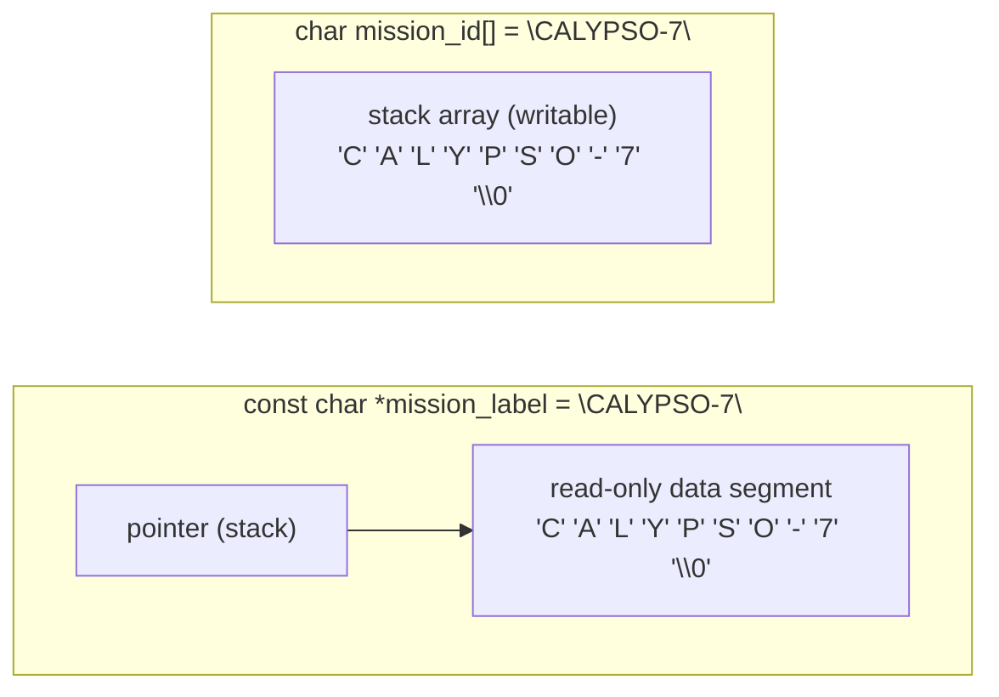

# Phase README — Crew names and communications

> **Phase 11 — Strings** | Calypso · Core C

Null-terminated character arrays, safe copy with `strncpy`, name lookup with `strcmp`, and transmission length validation with `strlen` — introducing C string handling and the mutable-array vs read-only-literal distinction.

The comms log has been printing `"UNKNOWN"` for every crew member since Phase 8. We had fixed-width integer types, floating-point velocity, a mission phase enum, and pointer-based calibration — but no mechanism to store text. The root problem is that C has no native string type. Text is a sequence of `char` values in a contiguous array with a null byte (`'\0'`) at the end marking where the string stops. Everything else — assignment, comparison, and length measurement — requires explicit library functions from `string.h`.

This phase adds a crew management module with `char name[MAX_NAME_LEN]` arrays for each roster slot. `strncpy` copies a name safely into a fixed-size buffer. `strcmp` compares two names character by character rather than comparing addresses. `strlen` counts characters up to the null terminator for transmission length validation. Alongside the mutable crew name arrays, the shuttle designation is stored as a string literal — a read-only sequence the compiler places in non-writable memory. Attempting to write through a literal pointer is undefined behaviour.

> **A note on scope.** Dynamic string allocation (`malloc` for variable-length buffers) is Phase 13. Formatted string building with `sprintf` and `sscanf` is covered in Phase 15 alongside the preprocessor. This phase works with fixed-size `char` arrays and the four `string.h` functions every C programmer uses daily.

---

## 🗺️ Contents

- [Branch sequence](#-branch-sequence)
- [Solutions to previous challenges and thought pieces](#-solutions-to-previous-challenges-and-thought-pieces)
- [Why we made this decision](#-why-we-made-this-decision)
- [What we built in the previous branch](#-what-we-built-in-the-previous-branch)
- [What we're doing in this branch](#-what-were-doing-in-this-branch)
- [Learning goals](#-learning-goals)
- [Key concepts](#-key-concepts)
- [What to notice in the code](#-what-to-notice-in-the-code)
- [What this phase revealed](#-what-this-phase-revealed)
- [Running this branch](#-running-this-branch)
- [Challenges for students](#-challenges-for-students)
- [Thought pieces for the next branch](#-thought-pieces-for-the-next-branch)

---

## 📍 Branch sequence

| Branch | What it introduces | Abstraction level |
|---|---|---|
| `main` | Project scaffold — compiles and runs | Scaffold only |
| `phase-01_boot-and-io` | First program · `printf` / `scanf` · compilation model | Raw I/O |
| `phase-02_debugging` | `printf` tracing · VS Code debugger · three C error categories | — |
| `phase-03_integer-types` | `stdint.h` fixed-width types · `PRIu16` format specifiers · overflow guards | — |
| `phase-04_compound-types` | `float` / `double` · `bool` · `enum MissionPhase` · `typedef sensor_float_t` | — |
| `phase-05_operators` | Arithmetic · relational · logical · `sizeof` · explicit casts | — |
| `phase-06_bitwise` | Bitmasks · `ENGINE_CTRL` register · `1u << n` shift pattern | — |
| `phase-07_control-flow` | `while(1)` command loop · `switch` state machine · `goto` emergency shutdown | — |
| `phase-08_functions` | `sensors.c` / `engine.c` / `navigation.c` split · prototypes · pass-by-value | Modular |
| `phase-09_arrays` | Sensor history buffers · `sizeof` element count · `array[i]` ≡ `*(array + i)` | — |
| `phase-10_pointers` | `&` / `*` · in-place calibration · pointer arithmetic · `const T*` vs `T* const` · `**` | — |
| `📌 phase-11_strings` | **`char` arrays · null terminator · `strncpy` / `strcmp` / `strlen` / `strncat` · literal vs mutable** | — |
| `phase-12_structs` | `crew_member_t` · `spacecraft_t` · dot / arrow notation · nested structs | — |
| `phase-13_dynamic-memory` | `malloc` / `realloc` / `free` · dynamic crew roster · `NULL` checks | — |
| `phase-14_embedded-patterns` | `volatile` · memory-mapped I/O pointer · struct bitfields · `const` ROM data | Hardware abstraction |
| `phase-15_preprocessor` | `#define` constants · include guards · `#ifdef DEBUG_TELEMETRY` · function-like macro | — |
| `phase-16_file-io` | `fopen` / `fprintf` / `fwrite` · `calypso.log` · binary checkpoint | — |

---

## ✅ Solutions to previous challenges and thought pieces

### How challenges work

Additive challenges from the previous branch are solved in the first commit of this
branch — look for the `SOLUTION:` commit at the top of this branch's git history.
Analytical challenges and thought pieces are answered below.

```bash
git log --oneline          # find the SOLUTION commit hash
git show <hash>            # inspect the solution in isolation
```

### Challenge 1 — Pointer arithmetic step size after `ptr++`

After `uint16_t *ptr = fuel_history; ptr++;`, `ptr` holds the address of the second element — not `fuel_history + 1` byte, but `fuel_history + sizeof(uint16_t)` bytes (2 bytes on every platform, because `uint16_t` is always 2 bytes). Pointer arithmetic operates in units of the pointed-to type's size. The compiler determines the step size from the declared type at compile time: `uint16_t *` means each `++` advances by 2 bytes; `uint32_t *` would advance by 4. This is what makes `ptr++` a reliable way to walk any typed array without manually computing byte offsets.

### Challenge 2 — Uninitialised pointer vs null pointer

A null pointer holds `NULL` (address 0), which is a known-invalid sentinel. You can test for it before dereferencing: `if (ptr != NULL)`. A runtime crash on `NULL` dereference is immediate and at the exact dereference site — easy to diagnose. An uninitialised pointer holds whatever bytes happened to be in that stack slot — a garbage address that looks valid to the runtime. The crash (if any) happens later, at an unrelated point, because the garbage address may land in a readable memory region. You cannot distinguish an uninitialised pointer from a valid one by testing its value; the only defence is always initialising: `uint16_t *p = NULL`.

### Challenge 3 — `const uint16_t *buf` vs `uint16_t * const ptr`

`const uint16_t *buf` constrains the data: you cannot write through `buf` inside the function (`*buf = 0` is a compile error), but you can reseat `buf` to point elsewhere. `uint16_t * const ptr` constrains the pointer itself: `ptr` cannot be reseated after initialisation, but the data it points to is fully mutable (`*ptr = 0` is fine). In the Calypso codebase, `compute_average` and `detect_drift` use `const uint16_t *buf` — they only read the history buffer, and `const` encodes that promise. `pENGINE_CTRL` in `engine.c` uses `uint32_t * const` — it always addresses `ENGINE_CTRL`, cannot be redirected, but the register value is intentionally mutable.

### Thought piece 1 — How C represents strings in memory

A C string is a contiguous sequence of `char` values terminated by a null byte (`'\0'`, value 0). There is no dedicated string type — just the convention that the sequence ends at the first `'\0'`. `"CALYPSO"` in memory occupies 8 bytes: `C`, `A`, `L`, `Y`, `P`, `S`, `O`, `\0`. All standard library functions (`strlen`, `strcmp`, `strncpy`) rely on the null terminator to know where the string ends. If the terminator is absent — for example, because `strncpy` ran out of space — any function that reads past the array bounds has undefined behaviour.

### Thought piece 2 — Writing to a string literal

`char *designation = "CALYPSO-7"` stores a pointer to a string literal. The compiler places the literal bytes in a read-only data segment (`.rodata` on Linux; a const section on Windows). Writing through `designation` — `designation[8] = 'X'` — is undefined behaviour: on most systems it causes a segmentation fault because the page is mapped read-only. To get a writable copy, declare `char designation[] = "CALYPSO-7"` — this copies the literal bytes onto the stack at initialisation time, producing a mutable local array. Both declarations look similar at the point of use; the difference is entirely in what the memory model allows.

### Thought piece 3 — Why `==` cannot compare strings

`==` on two `char *` variables compares the pointer values — the addresses — not the string contents. Two `char` arrays holding identical text at different memory locations compare unequal with `==`. The correct function is `strcmp(a, b)`, which walks both arrays byte by byte until it finds a difference or reaches the null terminator; it returns 0 only when the contents are identical. Using `==` on strings is a silent logic error: it does not produce a compile error, but it will almost always give the wrong result.

---

## 💡 Why we made this decision

### The comms log cannot name anyone

From Phase 8 onward, crew identification has been a `uint8_t id` — a number. The comms system prints `"UNKNOWN"` for every name because there is no type in the codebase that can hold text. The fundamental obstacle is that C has no string type. Text in C is a `char` array with a null byte at the end that marks where the string stops. Without a way to store that array, there are no crew names.

The natural representation is `char name[MAX_NAME_LEN]`: a fixed-size array with room for up to `MAX_NAME_LEN - 1` printable characters plus the null terminator. This is the standard C idiom for fixed-length names in a flat-memory system. The crew module declares three parallel arrays — `names[MAX_CREW][MAX_NAME_LEN]`, `ranks[MAX_CREW]`, and `ids[MAX_CREW]` — with index `i` in each referring to the same crew member by convention.

### Why `strncpy` and not `=`

You cannot assign a string to a `char` array with `=`. `name = src` is a compile error: `name` decays to a pointer in expression context and cannot appear on the left side of an assignment. You have to copy character by character. `strncpy(dest, src, n)` does that copy for you, reading at most `n` bytes from `src`. The bound is the safety guarantee: if `src` is longer than your buffer, `strncpy` stops at `n` bytes and does not overflow. The catch is that when `src` is longer than `n`, `strncpy` fills to `n` bytes but leaves `dest` *without* a null terminator. You must add `dest[n-1] = '\0'` explicitly after every `strncpy` call. The unbounded `strcpy` has no cap at all — it copies until it finds `'\0'` in `src` regardless of how much space `dest` has — which is why it is unsafe on any input you do not fully control.

### Why `strcmp` and not `==`

`==` on two `char *` values compares the addresses stored in the pointers, not the character sequences they point to. Two arrays holding `"CHEN"` at different addresses compare unequal with `==`. `strcmp(a, b)` walks both arrays byte by byte until it finds a difference or reaches `'\0'` in both simultaneously. It returns 0 only when the contents are identical. Using `==` on strings is a silent error: the compiler accepts it without warning because it is valid pointer comparison — it just does not do what you intend.

### String literal vs mutable array



Both forms start from the same literal text. `const char *mission_label` stores a pointer to the compiler's copy in read-only memory — any write through it is undefined behaviour. `char mission_id[]` copies those bytes onto the stack at the point of declaration — it is an ordinary writable array. The two look similar at the point of declaration; only the memory model differs. This phase makes that difference concrete by showing both in `main.c` and modifying only the array.

---

## ⏮️ What we built in the previous branch

Phase 10 added pointer-based in-place calibration (`sensors_calibrate`), `const`-qualified read parameters across `compute_average` and `detect_drift`, a fixed register pointer (`static uint32_t * const pENGINE_CTRL`), and a pointer-to-pointer channel reconfiguration function (`sensors_configure_channel`). The SOLUTION commit at the top of this branch adds `sensors_calibrate_velocity` (Challenge 4) and `sensors_print_history_ptr` (Challenge 5 stretch) — both follow the same pointer patterns introduced in Phase 10.

---

## 🎯 What we're doing in this branch

- Add `crew.h` with `#define MAX_CREW 6` and `#define MAX_NAME_LEN 24`, a `CrewRank` enum, and the crew module API
- Add `crew.c` with three parallel arrays: `static char names[MAX_CREW][MAX_NAME_LEN]`, `static CrewRank ranks[MAX_CREW]`, `static uint8_t ids[MAX_CREW]`
- Implement `crew_init()` using `strncpy` to fill every name slot with `"UNKNOWN"`
- Implement `crew_set_name(int idx, const char *src)` using `strncpy` plus explicit null termination to safely copy a name into the fixed-size slot
- Implement `crew_find_by_name(const char *name)` using `strcmp` to walk the roster and return the index, or `-1` if not found
- Implement `crew_print_manifest()` using `strlen` to report each name's character count alongside the roster entry
- In `main.c`: show `const char *mission_label = "CALYPSO-7"` (literal, read-only) alongside `char mission_id[] = "CALYPSO-7"` (stack copy, writable) to contrast the two representations; demonstrate `strncat` for building a comms transmission buffer; call `crew_init()`, load a three-person roster, perform a name lookup, and add an `m` command to print the manifest

---

## 🧑🏻‍🏫 Learning goals

### Understand
- **Explain** how C represents a string as a null-terminated `char` array — why the `'\0'` sentinel exists and what happens when it is missing
- **Explain** the difference between a mutable `char` array initialised from a literal and a `const char *` pointer to a string literal in read-only memory — and why writing through the literal pointer is undefined behaviour
- **Explain** why `strcpy` and `strcat` are unsafe and how `strncpy` and `strncat` bound the operation — including the edge case where `strncpy` does not null-terminate
- **Identify** the common sources of undefined behaviour in C string handling: missing null terminator, buffer overflow, and reading past allocated memory

### Apply
- **Declare** and initialise strings using both `char array[]` syntax and string literal pointer syntax
- **Use** `strncpy` to copy a name safely into a fixed-size `char` array with explicit null termination
- **Use** `strcmp` to implement `crew_find_by_name()` — returning the roster index when contents match, `-1` otherwise
- **Use** `strlen` in `crew_print_manifest()` to measure each name's character count for transmission length reporting
- **Use** `strncat` to append a crew name to a comms transmission buffer, bounding the append to prevent overflow
- **Pass** strings to and from functions as `const char *` parameters — in `crew_set_name()` which accepts a source name, and `crew_get_name()` which returns a pointer to the stored name

### Analyze
- **Examine** why `==` on two `char *` values compares addresses rather than string contents, and trace what `crew_find_by_name()` would return if it used `==` instead of `strcmp`

---

## 🔑 Key concepts

| Concept | Plain English |
|---|---|
| **Null terminator (`'\0'`)** | A zero byte at the end of every C string. All `string.h` functions stop reading at this byte. Without it, they read past the array's end — undefined behaviour. |
| **`char` array** | A fixed-size block of memory holding characters. `char name[24]` holds up to 23 printable characters plus the null terminator. |
| **String literal** | Text in double quotes, e.g. `"CALYPSO-7"`. The compiler places these bytes in a read-only data segment. Assigning to `const char *` gives a pointer to that read-only memory. |
| **Mutable `char` array** | `char name[] = "CALYPSO-7"` copies the literal bytes onto the stack at declaration time — a writable local array, independent of the literal. |
| **`strncpy(dest, src, n)`** | Copies at most `n` bytes from `src` to `dest`. Does not guarantee null termination when `src` is longer than `n − 1`. Always add `dest[n-1] = '\0'` to close the array. |
| **`strncat(dest, src, n)`** | Appends at most `n` bytes of `src` to `dest`, then writes a null terminator. The bound prevents overflow; always compute the remaining space as `sizeof(dest) - strlen(dest) - 1`. |
| **`strcmp(a, b)`** | Compares two strings byte by byte. Returns 0 if equal, negative if `a` < `b` lexicographically, positive if `a` > `b`. Never use `==` to compare string contents. |
| **`strlen(s)`** | Counts bytes from `s` up to but not including `'\0'`. Returns the number of printable characters — the null terminator is not counted. |
| **Buffer overflow** | Writing more bytes than a `char` array was declared to hold. `strncpy` and `strncat` prevent it with an explicit length cap; `strcpy` and `strcat` do not. |

---

## 🔍 What to notice in the code

**[`main.c:38–49`](main.c#L38)**
Two declarations side by side show the literal-vs-mutable split. `const char *mission_label = "CALYPSO-7"` stores a pointer to read-only memory — the comment explains why writing through it would be undefined behaviour. `char mission_id[] = "CALYPSO-7"` copies those bytes onto the stack; `mission_id[8] = '8'` on [line 46](main.c#L46) modifies the copy safely and the output shows the result.

**[`crew.c:39–40`](crew.c#L39)**
`crew_init` uses `strncpy` to fill every name slot with `"UNKNOWN"`. The explicit `names[i][MAX_NAME_LEN - 1] = '\0'` on the next line is deliberate: the block comment above explains that `strncpy` does not null-terminate when the source is longer than the bound. "UNKNOWN" is short enough that this call is safe without it — but the pattern must be consistent. `crew_set_name` at [line 55–56](crew.c#L55) shows the same pattern in a case where it actually matters.

**[`crew.c:47–58`](crew.c#L47)**
`crew_set_name` is the string assignment function. The block comment on lines 49–54 explains the exact condition under which `strncpy` leaves `dest` unterminated: when `src` fills the entire bound without reaching a `'\0'`. Line 55 copies; line 56 forces termination. Without line 56, a name exactly 23 characters long would produce an unterminated array and undefined behaviour in any subsequent `strlen` or `strcmp` call.

**[`crew.c:70–82`](crew.c#L70)**
`crew_find_by_name` walks the roster with `strcmp`. The comment on lines 72–76 explains why `==` is wrong: it would compare pointer addresses, not string contents. Two arrays both holding `"PARK"` at different addresses would compare unequal with `==` but return 0 from `strcmp`. This is the core behavioural difference — compare the implementation here with what Challenge 2 asks you to reason through.

**[`crew.c:84–94`](crew.c#L84)**
`crew_print_manifest` uses `strlen` on each stored name. `strlen(names[i])` counts bytes up to but not including the null terminator — so `"CHEN"` returns 4, not 5. The manifest prints this count as the payload character length, simulating a comms transmission where byte count matters.

**[`main.c:175–183`](main.c#L175)**
The `strncat` demonstration in the crew identification section. The bound on line 182 is `sizeof(comms_buf) - strlen(comms_buf) - 1`: total capacity minus bytes already occupied minus one byte reserved for the terminator. Without this calculation, `strncat` could append past the end of `comms_buf`. The `m` command at [line 277](main.c#L277) shows a second `strncat` call that builds a bracketed comms line by chaining two appends.

---

## 🔗 What this phase revealed

Crew data in this phase lives in three parallel arrays: `names[MAX_CREW][MAX_NAME_LEN]`, `ranks[MAX_CREW]`, and `ids[MAX_CREW]`. They form a crew member only by convention — index `i` in all three arrays refers to the same person. Adding a new field (say, a crew assignment) means a fourth array and updated initialisation, load, and print logic throughout `crew.c`. There is no type that enforces this relationship; nothing prevents the arrays from drifting out of sync.

> **LEARNING MOMENT:** Parallel arrays are a structural smell. The coupling is entirely by index convention — the compiler cannot detect when one array is updated without the other. Phase 12 introduces `struct`, which bundles related fields into a single named type. One slot in a `crew_member_t` array contains everything about one person; index drift becomes impossible.

---

## ▶️ Running this branch

**Prerequisites:** GCC or Clang (C99+) and CMake 3.10+, or just GCC/Clang on its own.

**With CMake (recommended):**
```bash
cmake -B build
cmake --build build
.\build\Debug\calypso.exe   # Windows (MSVC)
.\build\calypso.exe         # Windows (MinGW)
./build/calypso             # Linux / macOS
```

**Direct compilation (no CMake):**
```bash
gcc -std=c99 main.c sensors.c engine.c navigation.c crew.c -o calypso
./calypso
```

The boot sequence now includes the string literal vs mutable array demonstration immediately after the startup banner:

```
Mission label (literal) : CALYPSO-7  (read-only; cannot be modified)
Mission ID (mutable)    : CALYPSO-8  (stack copy; safely modified)
```

After engine control output, the crew identification section prints:

```
--- Crew Identification ---
Comms transmission      : COMMS: CHEN
Lookup 'PARK'           : slot 2
Lookup 'UNKNOWN_CREW'   : slot -1 (not found)
```

| Command | Action |
|---|---|
| `n` | Advance mission phase |
| `s` | Sensor scan — history, averages, drift, channel reconfiguration |
| `m` | Print crew manifest with name lengths; build comms line with `strncat` |
| `e` | Emergency shutdown via `goto` |
| `q` | Normal quit |

**Expected output — `m` command:**
```
--- Crew Manifest (3 / 6 slots) ---
  [101] ENG    CHEN                     (4 chars)
  [102] ENG    VASQUEZ                  (7 chars)
  [103] ENG    PARK                     (4 chars)
Comms line              : TX[CHEN]  (len=8)
```

All three crew members show `ENG` (default rank) until Challenge 4 adds `crew_set_rank`.

---

## ✏️ Challenges for students

**Challenge 1 — Analytical**
`strncpy(dest, src, MAX_NAME_LEN)` does not always null-terminate `dest`. Under exactly what condition does it leave `dest` without a null terminator? Why is that dangerous for any function that later reads `dest` as a C string? How does `crew_set_name()` in this phase prevent that outcome?

**Challenge 2 — Analytical**
What does `strcmp("COMMANDER", "commander")` return, and why? If you wanted `crew_find_by_name()` to match names regardless of case — so `"chen"` finds the slot holding `"CHEN"` — how would you approach that without changing the stored names? Name the standard library function you would need and describe the approach. (You do not need to implement it.)

**Challenge 3 — Analytical**
`strlen("CALYPSO-7")` returns 9. How many bytes does `char mission_id[] = "CALYPSO-7"` occupy on the stack? Why is there a one-byte discrepancy, and why does `strlen` not include that extra byte in its count?

**Challenge 4 — Additive**
Add `void crew_set_rank(int idx, CrewRank rank)` to `crew.c` and `crew.h`. Call it from `main.c` to assign a distinct rank to each of the three loaded crew members (`RANK_COMMANDER`, `RANK_PILOT`, `RANK_ENGINEER`). Confirm the ranks appear correctly in the manifest when you press `m`.

**Challenge 5 — Additive (stretch)**
Add `void crew_transmit_names(void)` to `crew.c` and `crew.h`. For each crew member, build a comms line by appending the name to a `"TX: "` prefix using `strncat`, then print the result alongside `strlen(names[i])` as the payload byte count. Call it from `main.c` after `crew_print_manifest()`.

---

## 💭 Thought pieces for the next branch

1. Crew data is now spread across parallel arrays: `char names[MAX_CREW][MAX_NAME_LEN]`, `CrewRank ranks[MAX_CREW]`, `uint8_t ids[MAX_CREW]`. Adding a new field — say, a crew assignment — means a fourth parallel array and updates in every function that touches the roster. What is the risk of this design? Is there a way in C to represent "one crew member" as a single entity?
2. We pass crew name, rank, and ID as three separate arguments wherever a function needs to describe a person. What would it look like to pass "a crew member" as a single argument?
3. `names[i]` and `ranks[i]` refer to the same crew member by convention. If any function updates one array without touching the other, the indices fall out of sync and the manifest becomes inconsistent. What design change would make that class of bug impossible?

---

*Previous branch: [`phase-10_pointers`]*
*Next branch: [`phase-12_structs`]*
