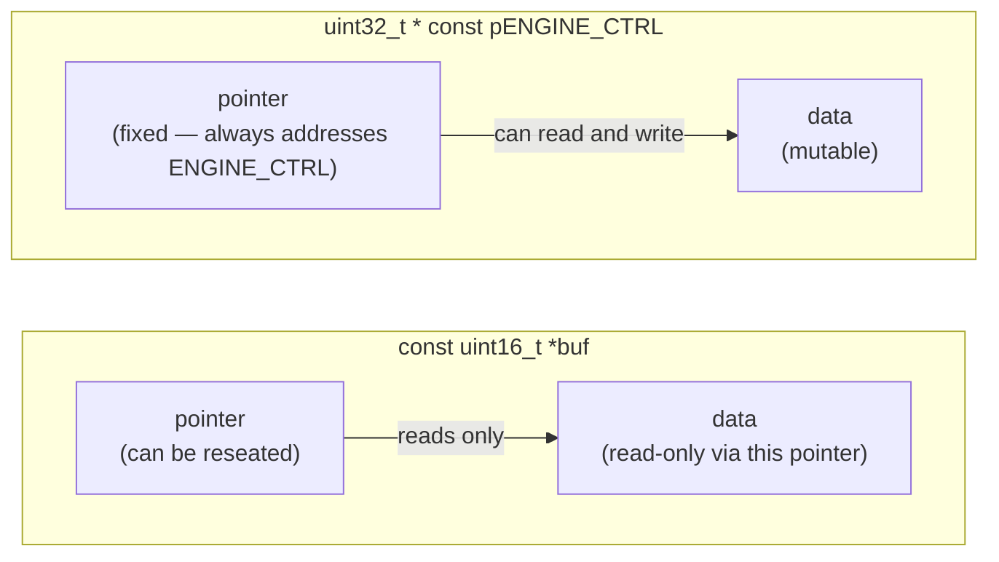

# Phase README — Low-level sensor access

> **Phase 10 — Pointers** | Calypso · Core C

Pointer variables, in-place calibration, and pointer arithmetic over the sensor history buffer — introducing the address-of operator, dereference, `const T*` vs `T* const`, and a pointer-to-pointer for sensor channel reconfiguration.

`sensors_apply_calibration()` in the previous phase took a fuel reading by value, computed a corrected copy, and handed it back. That works for one variable — but it cannot modify the caller's storage directly. If you want to apply a correction to every slot in the fuel history buffer, passing by value and returning copies is the wrong tool. To modify a caller's variable from inside a function, you need its address.

A pointer is a variable that holds a memory address. `uint16_t *reading` is a variable that holds the address of a `uint16_t`. The address-of operator `&` produces that address; the dereference operator `*` follows it back to the value. `sensors_calibrate(&fuel, 5)` passes the address of `fuel`, and `*reading += 5` writes through that address directly into the caller's variable. The original changes, not a copy.

> **A note on scope.** Dynamic memory — `malloc`, `free`, and heap-allocated arrays — is Phase 13 material. This phase works entirely with pointers to stack and file-scope variables: addresses of things that already exist. Null and uninitialised pointer pitfalls are shown as DELIBERATE-marked examples, not as runnable code.

---

## 🗺️ Contents

- [Branch sequence](#-branch-sequence)
- [Solutions to previous challenges and thought pieces](#-solutions-to-previous-challenges-and-thought-pieces)
- [Why we made this decision](#-why-we-made-this-decision)
- [What we built in the previous branch](#-what-we-built-in-the-previous-branch)
- [What we're doing in this branch](#-what-were-doing-in-this-branch)
- [Learning goals](#-learning-goals)
- [Key concepts](#-key-concepts)
- [What to notice in the code](#-what-to-notice-in-the-code)
- [What this phase revealed](#-what-this-phase-revealed)
- [Running this branch](#-running-this-branch)
- [Challenges for students](#-challenges-for-students)
- [Thought pieces for the next branch](#-thought-pieces-for-the-next-branch)

---

## 📍 Branch sequence

| Branch | What it introduces | Abstraction level |
|---|---|---|
| `main` | Project scaffold — compiles and runs | Scaffold only |
| `phase-01_boot-and-io` | First program · `printf` / `scanf` · compilation model | Raw I/O |
| `phase-02_debugging` | `printf` tracing · VS Code debugger · three C error categories | — |
| `phase-03_integer-types` | `stdint.h` fixed-width types · `PRIu16` format specifiers · overflow guards | — |
| `phase-04_compound-types` | `float` / `double` · `bool` · `enum MissionPhase` · `typedef sensor_float_t` | — |
| `phase-05_operators` | Arithmetic · relational · logical · `sizeof` · explicit casts | — |
| `phase-06_bitwise` | Bitmasks · `ENGINE_CTRL` register · `1u << n` shift pattern | — |
| `phase-07_control-flow` | `while(1)` command loop · `switch` state machine · `goto` emergency shutdown | — |
| `phase-08_functions` | `sensors.c` / `engine.c` / `navigation.c` split · prototypes · pass-by-value | Modular |
| `phase-09_arrays` | Sensor history buffers · `sizeof` element count · `array[i]` ≡ `*(array + i)` | — |
| `📌 phase-10_pointers` | **`&` / `*` · in-place calibration · pointer arithmetic · `const T*` vs `T* const` · `**`** | — |
| `phase-11_strings` | `char` arrays · `strncpy` / `strcmp` / `strlen` · null terminator | — |
| `phase-12_structs` | `crew_member_t` · `spacecraft_t` · dot / arrow notation · nested structs | — |
| `phase-13_dynamic-memory` | `malloc` / `realloc` / `free` · dynamic crew roster · `NULL` checks | — |
| `phase-14_embedded-patterns` | `volatile` · memory-mapped I/O pointer · struct bitfields · `const` ROM data | Hardware abstraction |
| `phase-15_preprocessor` | `#define` constants · include guards · `#ifdef DEBUG_TELEMETRY` · function-like macro | — |
| `phase-16_file-io` | `fopen` / `fprintf` / `fwrite` · `calypso.log` · binary checkpoint | — |

---

## ✅ Solutions to previous challenges and thought pieces

### How challenges work

Additive challenges from the previous branch are solved in the first commit of this
branch — look for the `SOLUTION:` commit at the top of this branch's git history.
Analytical challenges and thought pieces are answered below.

```bash
git log --oneline          # find the SOLUTION commit hash
git show <hash>            # inspect the solution in isolation
```

### Challenge 1 — Why `sizeof(buf)` gives pointer size inside `detect_drift()`

When `fuel_history` is passed to `detect_drift()`, the array name decays to a pointer to its first element at the call site. Inside the function, `buf` is a `uint16_t *` — a pointer variable that holds an 8-byte address on a 64-bit platform. `sizeof(buf)` measures that pointer variable, not the array it addresses. The array's total size is lost the moment it decays; that is exactly why `len` must be passed as a separate argument. The compiler has no way to recover the original array size from a pointer alone.

### Challenge 2 — What `buf[i]` ≡ `*(buf + i)` reveals about pointer arithmetic

Pointer addition does not operate in bytes — it operates in units of the pointed-to type's size. When `buf` is `uint16_t *` and you write `buf + i`, the compiler multiplies `i` by `sizeof(uint16_t)` (2 bytes) to produce the byte offset from the base address. `buf[i]` is exactly `*(buf + i)` by definition — the subscript operator is syntactic sugar for pointer arithmetic plus dereference. The step size is implicit in the type and determined by the compiler at compile time.

### Challenge 3 — Out-of-bounds write to index `SENSOR_HISTORY_LEN`

C does not check. Writing to `fuel_history[SENSOR_HISTORY_LEN]` addresses the memory immediately past the last valid element — whatever happens to be there. On the stack it might overwrite a local variable, the saved frame pointer, or a return address. At file scope it might corrupt an adjacent variable. The program continues without an error message; the consequence is a corrupted value somewhere, a crash at a later unrelated point, or a silent security vulnerability. Bounds discipline is entirely your responsibility.

### Thought piece 1 — Can `compute_average()` write back through the pointer it receives?

Yes — `buf` is `uint16_t *`, not `const uint16_t *`, so the function could write through it with `buf[i] = 0`. Whether it *should* is a design question: the name `compute_average` implies a read, not a write. Adding undeclared write behaviour to a reader makes the interface harder to reason about. The right answer is `const uint16_t *buf` in the parameter: it tells both the caller and the compiler that this function will only read through the pointer. Phase 10 adds that qualifier.

### Thought piece 2 — What `array[i]` ≡ `*(array + i)` tells us about memory layout

Array subscripting is pointer arithmetic in disguise. `i` is scaled by the element size — `fuel_history + 3` does not add 3 bytes; it adds 3 × `sizeof(uint16_t)` = 6 bytes. The array name in an expression context is a pointer to element zero; every subsequent element is exactly `i × sizeof(element)` bytes further along. Elements are guaranteed contiguous in memory; that is what makes pointer arithmetic over a buffer predictable and what lets you traverse it with `ptr++` instead of `buf[i]`.

### Thought piece 3 — Fixing the calibration function that operates on a copy

Pass a pointer to the variable instead of the variable itself. `sensors_calibrate(uint16_t *reading, uint16_t offset)` receives the address of the caller's variable; `*reading += offset` writes through that address directly into the caller's storage. At the call site: `sensors_calibrate(&fuel, 5)`. After the call, `fuel` holds the corrected value — no return value needed. Phase 10 builds exactly this.

---

## 💡 Why we made this decision

### From "return a copy" to "modify in place"

`sensors_apply_calibration(uint16_t reading, uint16_t offset)` computed a corrected value from a copy and returned it. The caller had to capture the return value and decide what to do with it. If you wanted to calibrate all ten slots of the fuel history buffer — applying the same correction to each — you would need to loop, call the function ten times, and reassign each result. The function cannot reach into the caller's array because it was never given the locations, only the values.

The natural fix is to pass the address. `sensors_calibrate(uint16_t *reading, uint16_t offset)` receives a pointer — the memory address of the caller's variable. `*reading += offset` follows that address and writes the corrected value directly into the caller's storage. The function needs no return value because the side effect is the point.

This is the fundamental distinction between pass-by-value and pass-by-pointer in C. Neither is universally better: pass-by-value keeps the caller's variable safe (the callee cannot accidentally corrupt it), while pass-by-pointer is necessary when a function must write back to the caller.

### `const` as intent expressed in the type

Two functions in this phase take pointer parameters with different intentions:

- `compute_average(const uint16_t *buf, int len)` — reads through `buf` but must not write. `const` encodes that promise; the compiler will reject any attempt to write through `buf` inside the function.
- `sensors_calibrate(uint16_t *reading, uint16_t offset)` — must write through `reading`. No `const`.

`uint32_t * const pENGINE_CTRL` in `engine.c` is a different kind of `const`: the pointer itself is constant. It always addresses `ENGINE_CTRL`; you cannot reseat it to point elsewhere. The value at that address can still be changed. On real embedded hardware, a control register lives at a fixed physical address for the life of the program — a `T * const` pointer models that directly.

The two qualifiers answer two different questions:
- `const T *` — is the data the pointer points to read-only?
- `T * const` — is the pointer itself fixed (cannot be reseated)?



### `**` for pointer indirection

`sensors_configure_channel(uint16_t **channel, uint16_t *new_buf)` takes a pointer-to-pointer. The caller passes `&primary_channel` — the address of a `uint16_t *` variable. Inside the function, `*channel = new_buf` writes a new address into the caller's pointer variable, redirecting it to a different history buffer. Without `**`, the function would only receive a copy of the pointer value — the same limitation that forced us from pass-by-value to pass-by-pointer for scalar values now applies one level up.

---

## ⏮️ What we built in the previous branch

`phase-09_arrays` added fixed-size circular history buffers for fuel and velocity: `static uint16_t fuel_history[SENSOR_HISTORY_LEN]` and `static uint16_t velocity_history[SENSOR_HISTORY_LEN]`, both file-scoped in `sensors.c`. A `for` loop fills each buffer slot by slot; `sensors_compute_fuel_avg()` and `sensors_detect_fuel_drift()` pass the array — which decays to a pointer at the call site — to static helper functions. The SOLUTION commit at the top of this branch adds a `pressure_history` buffer (Challenge 4) and changes `sensors_detect_fuel_drift()` to return the index of the first drifting reading rather than a boolean (Challenge 5).

---

## 🎯 What we're doing in this branch

- Add `sensors_calibrate(uint16_t *reading, uint16_t offset)` in `sensors.c` — takes the address of a sensor reading and applies an offset in place using the dereference operator; demonstrate alongside `sensors_apply_calibration()` in `main.c` to show the pass-by-value vs pass-by-pointer contrast
- Update `compute_average` to use `const uint16_t *buf` — the `const` qualifier prevents writes through the parameter; update `detect_drift` to iterate using a pointer variable (`ptr++`) rather than index arithmetic
- Add `static uint32_t * const pENGINE_CTRL = &ENGINE_CTRL` in `engine.c` — a fixed pointer to the simulated control register; use it in `engine_enable_thruster()` and `engine_disable_thruster()` to demonstrate `T * const`
- Add `sensors_configure_channel(uint16_t **channel, uint16_t *new_buf)` in `sensors.c` — takes a pointer-to-pointer and redirects the caller's pointer to a different history buffer; demonstrate from `main.c` with `&primary_channel`
- Add DELIBERATE-commented examples in `main.c` showing null, uninitialised, and dangling pointer pitfalls — not executed, but visible at the point where the concepts are introduced

---

## 🧑🏻‍🏫 Learning goals

### Understand
- **Explain** a pointer as a variable that holds a memory address — the difference between the pointer variable (which stores an address), the address it holds (a location in memory), and the value at that address (the data itself)
- **Explain** the difference between a null pointer (`NULL` — a known-invalid address, detectable before dereference) and an uninitialised pointer (holds a garbage address, not detectable) — and why uninitialised is more dangerous
- **Explain** why an array name decays to a pointer to its first element when used in an expression or passed to a function
- **Explain** the difference between `const uint16_t *` (the pointed-to data is read-only; the pointer can be reseated) and `uint16_t * const` (the pointer is fixed; the data it points to is mutable)
- **Identify** the three most dangerous pointer errors — dangling pointers, use-after-free, and uninitialised pointer dereference — and explain why each is difficult to detect at runtime

### Apply
- **Declare** pointer variables, use `&` to take an address, and `*` to dereference it — in `sensors_calibrate()` and its call site in `main.c`
- **Apply** pointer arithmetic over the sensor history buffer in `detect_drift()` using a pointer variable that advances with `ptr++`
- **Use** a `uint16_t **` parameter in `sensors_configure_channel()` to redirect a caller's pointer to a different history buffer

### Analyze
- **Differentiate** `const uint16_t *buf` from `uint16_t * const ptr` — identify which constrains the pointer and which constrains the data; trace through which operations are permitted in each case

---

## 🔑 Key concepts

| Concept | Plain English |
|---|---|
| **Pointer** | A variable that holds a memory address. `uint16_t *p` means `p` stores an address; `*p` follows that address to the `uint16_t` stored there. |
| **Address-of operator (`&`)** | Produces the memory address of a variable. `&fuel` gives the address of the `fuel` variable — what you pass when a function needs to write back to the caller's storage. |
| **Dereference operator (`*`)** | Follows a pointer to the value it addresses. `*reading += 5` reads the value at the address in `reading`, adds 5, and writes the result back to that same address. |
| **Pointer arithmetic** | Advancing a pointer by one (`ptr++`) moves it by `sizeof(*ptr)` bytes — not 1 byte. For `uint16_t *`, each `++` moves 2 bytes, landing on the next element. |
| **`const T *`** | Pointer to const data — the data pointed to cannot be modified through this pointer. The pointer itself can be reseated to point elsewhere. |
| **`T * const`** | Const pointer — the pointer cannot be reseated; it always addresses the same location. The data it points to can be modified. |
| **`T **`** | Pointer-to-pointer. `*pp` is the inner pointer; `**pp` is the value it ultimately points to. Pass `&ptr` to give a function the ability to change which address `ptr` holds. |
| **Null pointer** | A pointer holding `NULL` (address 0) — a known-invalid address. Dereferencing causes a crash. Safe to test before use: `if (ptr != NULL)`. |
| **Uninitialised pointer** | A pointer declared but never assigned — holds a garbage address. Dereferencing it is undefined behaviour; the crash may not occur at the dereference site. Always initialise: `uint16_t *p = NULL`. |
| **Dangling pointer** | A pointer that once held a valid address but no longer does — the variable it pointed to went out of scope, or the allocated memory was freed. Reading or writing through it is undefined behaviour. |

---

## 🔍 What to notice in the code

*Placeholder — completed after code is written.*

---

## 🔗 What this phase revealed

With pointers come new obligations. `sensors_calibrate(uint16_t *reading, uint16_t offset)` can now modify the caller's variable — but nothing in the type system prevents a caller from passing a null or dangling pointer. Every function that accepts a pointer either trusts its callers to pass a valid address or checks `reading != NULL` before dereferencing.

> **LEARNING MOMENT:** Pass-by-value was simpler to reason about — the callee had no path back to the caller's stack. Pointers add power and add responsibility in equal measure. The three dangerous pointer errors (uninitialised, dangling, null dereference) are all consequences of the same trade-off: C lets you address memory directly, and it will not stop you from addressing the wrong location.

---

## ▶️ Running this branch

*Placeholder — completed after code is written.*

---

## ✏️ Challenges for students

**Challenge 1 — Analytical**
`uint16_t *ptr = fuel_history; ptr++;` — what address does `ptr` hold after the increment? What unit does pointer addition operate in, and how does the compiler determine the step size for each increment?

**Challenge 2 — Analytical**
Why is an uninitialised pointer more dangerous than a null pointer? What is different about how you would detect each one before dereferencing it?

**Challenge 3 — Analytical**
`const uint16_t *buf` and `uint16_t * const ptr` look similar but restrict different things. Name what each restricts, and give one example from the Calypso codebase where each is the right qualifier to use.

**Challenge 4 — Additive**
Add `sensors_calibrate_velocity(uint16_t *reading, uint16_t offset)` to `sensors.c` and `sensors.h`, following the same pattern as `sensors_calibrate()`. Call it from `main.c` on the result of `(uint16_t)velocity` before the sensor scan prints, and confirm the calibrated value appears in the output.

**Challenge 5 — Additive (stretch)**
Add `void sensors_print_history_ptr(const uint16_t *buf, int len)` to `sensors.c` and `sensors.h`. It should iterate over the buffer using a pointer variable (`ptr++`, not index notation) and print each element's value and memory address using `printf` and `%p`. Call it from `main.c` after the fuel average line in the `s` command.

---

## 💭 Thought pieces for the next branch

1. The comms log prints `"UNKNOWN"` for every crew name because there is no way to store text. How does C represent text in memory — what is a "string" at the byte level?
2. The shuttle has a designation `"CALYPSO-7"`. If we store it as `char *designation = "CALYPSO-7"` and then try to modify the last character, what happens and why?
3. We want to find a specific crew member by name. Can we compare two strings with `==`? What would that actually compare?

---

*Previous branch: [`phase-09_arrays`]*
*Next branch: [`phase-11_strings`]*
