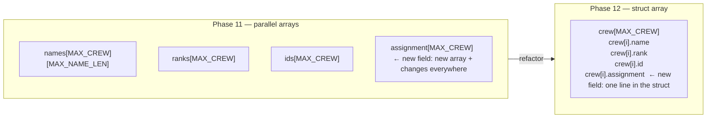

# Phase README — Crew records

> **Phase 12 — Structs and user-defined types** | Calypso · Core C

Grouping related fields into a named type — replacing three parallel arrays with a single `crew_member_t` struct that keeps every crew member's data together.

The Phase 11 crew module worked, but it was structurally fragile. Three separate arrays — `names[MAX_CREW][MAX_NAME_LEN]`, `ranks[MAX_CREW]`, and `ids[MAX_CREW]` — referred to the same crew member by index convention. There was no type in the codebase that said "this is a crew member." Any function that updated one array without touching the others would silently break the manifest, and the compiler had no way to detect the mismatch. Adding a new data field — say, a crew assignment — meant a fourth parallel array and changes to every function that iterated the roster.

C's `struct` solves this directly. A `struct` bundles variables of different types into a single named type. `crew_member_t` holds a name, a rank, an ID, and an assignment together in one object. A `crew_member_t crew[MAX_CREW]` array can only have one index per person — the index drift that was invisible with parallel arrays is impossible with a struct array because there is only one record per slot.

This phase also introduces a second struct, `spacecraft_t`, to show that struct composition scales: mission state and sensor readings can be grouped into a single object and passed around the codebase as one argument rather than five.

> **A note on scope.** Dynamic allocation for a variable-length crew roster — so the roster can grow at runtime — is Phase 13. This phase works with a fixed `crew_member_t crew[MAX_CREW]` array declared at compile time.

---

## 🗺️ Contents

- [Branch sequence](#-branch-sequence)
- [Solutions to previous challenges and thought pieces](#-solutions-to-previous-challenges-and-thought-pieces)
- [Why we made this decision](#-why-we-made-this-decision)
- [What we built in the previous branch](#-what-we-built-in-the-previous-branch)
- [What we're doing in this branch](#-what-were-doing-in-this-branch)
- [Learning goals](#-learning-goals)
- [Key concepts](#-key-concepts)
- [What to notice in the code](#-what-to-notice-in-the-code)
- [Running this branch](#-running-this-branch)
- [Challenges for students](#-challenges-for-students)
- [Thought pieces for the next branch](#-thought-pieces-for-the-next-branch)

---

## 📍 Branch sequence

| Branch | What it introduces | Abstraction level |
|---|---|---|
| `main` | Project scaffold — compiles and runs | Scaffold only |
| `phase-01_boot-and-io` | First program · `printf` / `scanf` · compilation model | Raw I/O |
| `phase-02_debugging` | `printf` tracing · VS Code debugger · three C error categories | — |
| `phase-03_integer-types` | `stdint.h` fixed-width types · `PRIu16` format specifiers · overflow guards | — |
| `phase-04_compound-types` | `float` / `double` · `bool` · `enum MissionPhase` · `typedef sensor_float_t` | — |
| `phase-05_operators` | Arithmetic · relational · logical · `sizeof` · explicit casts | — |
| `phase-06_bitwise` | Bitmasks · `ENGINE_CTRL` register · `1u << n` shift pattern | — |
| `phase-07_control-flow` | `while(1)` command loop · `switch` state machine · `goto` emergency shutdown | — |
| `phase-08_functions` | `sensors.c` / `engine.c` / `navigation.c` split · prototypes · pass-by-value | Modular |
| `phase-09_arrays` | Sensor history buffers · `sizeof` element count · `array[i]` ≡ `*(array + i)` | — |
| `phase-10_pointers` | `&` / `*` · in-place calibration · pointer arithmetic · `const T*` vs `T* const` · `**` | — |
| `phase-11_strings` | `char` arrays · null terminator · `strncpy` / `strcmp` / `strlen` / `strncat` · literal vs mutable | — |
| `📌 phase-12_structs` | **`crew_member_t` · `spacecraft_t` · dot / arrow notation · nested structs · array of structs** | — |
| `phase-13_dynamic-memory` | `malloc` / `realloc` / `free` · dynamic crew roster · `NULL` checks | — |
| `phase-14_embedded-patterns` | `volatile` · memory-mapped I/O pointer · struct bitfields · `const` ROM data | Hardware abstraction |
| `phase-15_preprocessor` | `#define` constants · include guards · `#ifdef DEBUG_TELEMETRY` · function-like macro | — |
| `phase-16_file-io` | `fopen` / `fprintf` / `fwrite` · `calypso.log` · binary checkpoint | — |

---

## ✅ Solutions to previous challenges and thought pieces

### How challenges work

Additive challenges from the previous branch are solved in the first commit of this
branch — look for the `SOLUTION:` commit at the top of this branch's git history.
Analytical challenges and thought pieces are answered below.

```bash
git log --oneline          # find the SOLUTION commit hash
git show <hash>            # inspect the solution in isolation
```

### Challenge 1 — When `strncpy` leaves `dest` unterminated

`strncpy(dest, src, n)` leaves `dest` without a null terminator when `src` contains at least `n` bytes before its own `'\0'`. In that case, `strncpy` copies exactly `n` bytes from `src` and stops — it fills the buffer but never writes the terminator. Any subsequent `strlen`, `strcmp`, or `printf("%s")` call on `dest` will read past the end of the array until it finds a `'\0'` somewhere in memory, which is undefined behaviour. `crew_set_name()` prevents this by always writing `names[idx][MAX_NAME_LEN - 1] = '\0'` after the `strncpy` call, regardless of source length.

### Challenge 2 — `strcmp` and case sensitivity

`strcmp("COMMANDER", "commander")` returns a non-zero value — the two strings are not equal. `strcmp` compares bytes numerically: uppercase `'C'` is ASCII 67, lowercase `'c'` is ASCII 99; the first character already differs, so the function returns a negative value. To match names regardless of case you would normalise both strings before comparing — for example, calling `tolower()` on each character in turn while walking both arrays. The stored names would remain unchanged; only the comparison logic would use lowercased copies.

### Challenge 3 — `strlen` count vs array size

`strlen("CALYPSO-7")` returns 9 — it counts the 9 printable characters up to but not including the null terminator. `char mission_id[] = "CALYPSO-7"` occupies 10 bytes on the stack: 9 character bytes plus the `'\0'` that the compiler appends automatically. `strlen` deliberately excludes the terminator from its count because the terminator is an implementation detail of the C string convention, not part of the visible text. This one-byte gap is why buffer calculations always use `sizeof(array) - 1` or `MAX_NAME_LEN - 1` when computing the maximum number of printable characters a buffer can hold.

### Thought piece 1 — Parallel arrays and the risk of index drift

The risk is invisible coupling: every function that reads or writes the roster must keep all three arrays in sync by index, enforced only by convention. The compiler cannot detect when `names[2]` is updated without a matching update to `ranks[2]`. Adding a fourth field — say, a crew assignment — means a fourth array and changes to `crew_init()`, every `crew_set_*` function, and every print or iteration loop. C's `struct` fixes this: a `crew_member_t` that bundles name, rank, and ID into one type means there is exactly one object per crew member and one index per slot. Field drift becomes structurally impossible.

### Thought piece 2 — Passing a crew member as a single argument

With the current parallel arrays, you pass name, rank, and ID as three separate arguments wherever a function needs to describe one person. With a `crew_member_t` struct you write `void comms_broadcast(crew_member_t member)` and the caller passes `crew[i]` as a single value — the compiler copies all fields automatically. If the function needs to modify the original rather than a copy, you pass a pointer instead: `void comms_update(crew_member_t *member)` and use `member->rank = RANK_COMMANDER` inside the function.

### Thought piece 3 — Preventing index drift

Replacing the three parallel arrays with a single `crew_member_t crew[MAX_CREW]` array makes the drift structurally impossible. There is only one index per person: `crew[i].name`, `crew[i].rank`, and `crew[i].id` are all fields of the same object at the same index. A function that updates `crew[i].rank` without touching `crew[i].name` is perfectly fine — they are both part of the same record. The compiler enforces that every `crew_member_t` has all its fields; you can never have a rank without a name slot.

---

## 💡 Why we made this decision

### Parallel arrays have no structural relationship

The three arrays in Phase 11 — `names`, `ranks`, `ids` — were related only by the agreement that index `i` means the same crew member in all three. That agreement lived in comments and in the programmer's head. Nothing prevented `crew_set_name(0, "CHEN")` and `crew_set_rank(1, RANK_COMMANDER)` from running in the wrong order and silently corrupting the manifest. Every function that iterated the roster had to touch all three arrays consistently.

A `struct` moves that relationship into the type system. Once `crew_member_t` exists, the question "what fields does a crew member have?" has a single authoritative answer that the compiler enforces. Adding a new field means editing the struct definition once — every existing `crew_member_t` variable automatically gains the new field.



### Dot notation vs arrow notation

When you have a `crew_member_t` variable directly — `crew_member_t m` — you access its fields with a dot: `m.rank`. When you have a pointer to a struct — `crew_member_t *p` — you use arrow notation: `p->rank`. The arrow is shorthand for `(*p).rank`: dereference first, then access the field. The two forms are equivalent in meaning; the choice of notation signals whether you are working with a copy or a pointer, which determines whether modifications reach the original.

---

## ⏮️ What we built in the previous branch

Phase 11 added a crew management module using three parallel arrays: `char names[MAX_CREW][MAX_NAME_LEN]`, `CrewRank ranks[MAX_CREW]`, and `uint8_t ids[MAX_CREW]`. `strncpy` handled safe name assignment with explicit null termination, `strcmp` powered crew lookup, and `strlen` measured name lengths for the manifest and comms buffer. The SOLUTION commit at the start of this branch adds `crew_set_rank()` (Challenge 4), which assigns distinct ranks to the loaded crew members, and `crew_transmit_names()` (Challenge 5 stretch), which builds a `"TX: <name>"` comms line per slot using `strncat`.

---

## 🎯 What we're doing in this branch

- Add a `CrewAssignment` enum (`ASSIGN_FLIGHT`, `ASSIGN_ENGINEERING`, `ASSIGN_SCIENCE`, `ASSIGN_MEDICAL`) to `crew.h`
- Define `typedef struct { char name[MAX_NAME_LEN]; CrewRank rank; uint8_t id; CrewAssignment assignment; } crew_member_t` in `crew.h`
- Replace the three parallel arrays in `crew.c` with `static crew_member_t crew[MAX_CREW]` and update all functions to use dot notation (`crew[i].name`, `crew[i].rank`, etc.)
- Add `crew_print_member(crew_member_t m)` to demonstrate pass-by-value: the function prints one crew member's fields from a copy — changes inside cannot affect the caller's record
- Add `crew_reassign(crew_member_t *m, CrewAssignment new_assignment)` to demonstrate pass-by-pointer: arrow notation writes back through the address, modifying the caller's struct directly
- Define `typedef struct` for `position_t` (`float x_au`, `float y_au`) and `spacecraft_t` (`char shuttle_id[16]`, `enum MissionPhase phase`, `sensor_float_t velocity`, `uint16_t fuel`, `position_t position`) in `main.c`; pass `spacecraft_t` by pointer into `spacecraft_status()` and access fields with arrow notation
- Use `sc.position.x_au` to demonstrate nested struct field access

---

## 🧑🏻‍🏫 Learning goals

### Understand
- **Explain** struct memory layout — members are stored in declaration order, and the compiler may insert padding bytes between fields to satisfy alignment requirements; `sizeof(struct)` can exceed the sum of its field sizes

### Apply
- **Declare** a `struct` to group related variables of different types and use `typedef struct` to give it a named alias (`crew_member_t`)
- **Access** struct members using dot notation on a direct variable and arrow notation (`->`) on a pointer to a struct
- **Pass** `crew_member_t` to a function by value (copy) and by pointer (in-place modification) — and explain what the caller sees after each
- **Declare** and iterate over `crew_member_t crew[MAX_CREW]`, accessing each member's fields with dot notation
- **Declare** nested structs (`position_t` inside `spacecraft_t`) and access inner fields through the chain: `sc.position.x_au`

### Analyze
- **Examine** the before/after diff between the parallel-array roster and the struct-array roster — identify which functions shrank, which stayed the same, and why adding a new field now requires fewer changes

---

## 🔑 Key concepts

| Concept | Plain English |
|---|---|
| **`struct`** | A type that groups variables of different types under one name. All fields live in one contiguous block of memory. |
| **`typedef struct`** | Gives the struct a clean alias so you can write `crew_member_t` instead of `struct crew_member_s` everywhere. |
| **Dot notation (`.`)** | Access a field on a struct variable you hold directly: `m.rank`. |
| **Arrow notation (`->`)**  | Access a field through a pointer to a struct: `p->rank`, shorthand for `(*p).rank`. |
| **Pass by value** | The function receives a copy of the struct. Modifications inside the function do not reach the caller's variable. |
| **Pass by pointer** | The function receives the address of the struct. Modifications through `->` write directly to the caller's variable. |
| **Nested struct** | A struct whose field is itself a struct. Access the inner field with a chain of dots: `sc.position.x_au`. |
| **Struct array** | An array where every element is a struct: `crew_member_t crew[MAX_CREW]`. One index, all fields. |
| **Alignment and padding** | The compiler may insert unused bytes between struct fields so each field starts at an address that matches its size. `sizeof(struct)` can be larger than the sum of its fields. |

---

## 🔍 What to notice in the code

_Completed after code is written._

---

## ▶️ Running this branch

_Completed after code is written._

---

## ✏️ Challenges for students

**Challenge 1 — Analytical**
`sizeof(crew_member_t)` may not equal `MAX_NAME_LEN + sizeof(CrewRank) + sizeof(uint8_t) + sizeof(CrewAssignment)`. What causes the discrepancy? On which field boundary is padding most likely to be inserted, and why? How could you check whether padding is present without reading compiler documentation?

**Challenge 2 — Analytical**
`spacecraft_status(spacecraft_t sc)` receives the struct by value. `spacecraft_update_fuel(spacecraft_t *sc, uint16_t new_fuel)` receives a pointer. After each function modifies the fuel field and returns, what does the caller's `sc.fuel` contain — and why? Trace both cases step by step.

**Challenge 3 — Analytical**
The `crew_find_by_name()` function now calls `strcmp(crew[i].name, name)` instead of `strcmp(names[i], name)`. The string comparison logic is identical. What did the refactor change structurally — and what does the new form make impossible that the parallel-array form allowed?

**Challenge 4 — Additive**
Add `void crew_print_member(crew_member_t m)` to `crew.c` and `crew.h`. It should print all four fields on one line. Call it from `main.c` for `crew[0]` after roster load. This function receives by value — confirm in a comment that `crew[0]` in `main.c` is unmodified after the call.

**Challenge 5 — Additive (stretch)**
Add `void crew_reassign(crew_member_t *m, CrewAssignment new_assignment)` that updates the assignment field through the pointer. Call it from `main.c` to move `crew[0]` to `ASSIGN_SCIENCE`, then call `crew_print_member(crew[0])` to confirm the change. Add a comment explaining why a pointer parameter was required here instead of pass-by-value.

---

## 💭 Thought pieces for the next branch

1. `MAX_CREW` is a compile-time constant baked into the array declaration. Even if the shuttle can physically accommodate more crew mid-mission, the roster can never grow beyond `MAX_CREW` without a recompile. What if a docking manoeuvre transferred additional crew members above that limit?
2. When a crew member disembarks, we overwrite their slot with a blank record. If the array were dynamically allocated, we might `free` that slot's memory instead — but what risk does that create with the pointer we just freed?
3. `realloc` can resize an allocation — but if it moves the block to a new address, the original pointer is now invalid. What kind of error results from using that old pointer after `realloc` has moved the memory?

---

*Previous branch: [`phase-11_strings`]*
*Next branch: [`phase-13_dynamic-memory`]*
