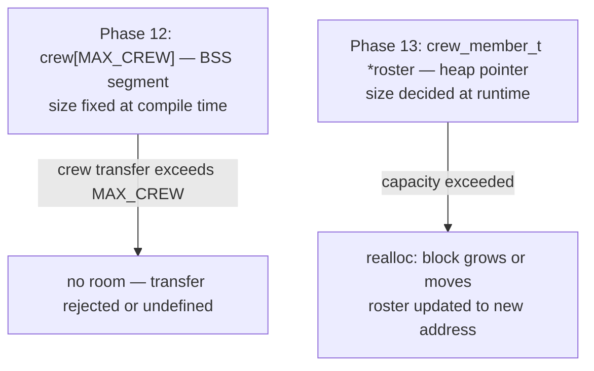
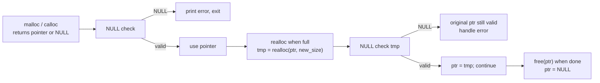

# Phase README — Dynamic crew roster

> **Phase 13 — Dynamic memory management** | Calypso · Core C

Replacing the compile-time crew array with a heap-allocated roster that can grow mid-mission — and taking on full manual responsibility for every byte allocated.

The Phase 12 crew roster uses a fixed `crew_member_t crew[MAX_CREW]` array. `MAX_CREW` is a compile-time constant, and no matter how much available RAM the system has, the roster can never hold more entries without recompiling the binary. For an interplanetary shuttle that may take on additional crew during a docking manoeuvre, that is an operational constraint, not just a code style choice.

C's answer is dynamic memory: `malloc` allocates a block of heap memory at runtime, `realloc` resizes it when capacity is exceeded, and `free` releases it when it is no longer needed. There is no garbage collector, no destructor, no reference counter — you allocate, you resize, you free. The discipline is total and the compiler does not help. A missing `free` is a memory leak; a `free` followed by a use is undefined behaviour; a stale pointer after `realloc` moves the block is undefined behaviour. This phase introduces all three so you can recognise and reason about each.

> **A note on scope.** `volatile` qualifiers for hardware registers and struct bitfields for register layout mapping are Phase 14. This phase stays focused on heap allocation, `NULL` checks, and the before/after of replacing a fixed array with a resizable buffer.

---

## 🗺️ Contents

- [Branch sequence](#-branch-sequence)
- [Solutions to previous challenges and thought pieces](#-solutions-to-previous-challenges-and-thought-pieces)
- [Why we made this decision](#-why-we-made-this-decision)
- [What we built in the previous branch](#-what-we-built-in-the-previous-branch)
- [What we're doing in this branch](#-what-were-doing-in-this-branch)
- [Learning goals](#-learning-goals)
- [Key concepts](#-key-concepts)
- [What to notice in the code](#-what-to-notice-in-the-code)
- [Running this branch](#-running-this-branch)
- [Challenges for students](#-challenges-for-students)
- [Thought pieces for the next branch](#-thought-pieces-for-the-next-branch)

---

## 📍 Branch sequence

| Branch | What it introduces | Abstraction level |
|---|---|---|
| `main` | Project scaffold — compiles and runs | Scaffold only |
| `phase-01_boot-and-io` | First program · `printf` / `scanf` · compilation model | Raw I/O |
| `phase-02_debugging` | `printf` tracing · VS Code debugger · three C error categories | — |
| `phase-03_integer-types` | `stdint.h` fixed-width types · `PRIu16` format specifiers · overflow guards | — |
| `phase-04_compound-types` | `float` / `double` · `bool` · `enum MissionPhase` · `typedef sensor_float_t` | — |
| `phase-05_operators` | Arithmetic · relational · logical · `sizeof` · explicit casts | — |
| `phase-06_bitwise` | Bitmasks · `ENGINE_CTRL` register · `1u << n` shift pattern | — |
| `phase-07_control-flow` | `while(1)` command loop · `switch` state machine · `goto` emergency shutdown | — |
| `phase-08_functions` | `sensors.c` / `engine.c` / `navigation.c` split · prototypes · pass-by-value | Modular |
| `phase-09_arrays` | Sensor history buffers · `sizeof` element count · `array[i]` ≡ `*(array + i)` | — |
| `phase-10_pointers` | `&` / `*` · in-place calibration · pointer arithmetic · `const T*` vs `T* const` · `**` | — |
| `phase-11_strings` | `char` arrays · null terminator · `strncpy` / `strcmp` / `strlen` / `strncat` · literal vs mutable | — |
| `phase-12_structs` | `crew_member_t` · `spacecraft_t` · dot / arrow notation · nested structs · array of structs | — |
| `📌 phase-13_dynamic-memory` | **`malloc` / `realloc` / `free` · dynamic crew roster · `NULL` checks · mission log buffer** | — |
| `phase-14_embedded-patterns` | `volatile` · memory-mapped I/O pointer · struct bitfields · `const` ROM data | Hardware abstraction |
| `phase-15_preprocessor` | `#define` constants · include guards · `#ifdef DEBUG_TELEMETRY` · function-like macro | — |
| `phase-16_file-io` | `fopen` / `fprintf` / `fwrite` · `calypso.log` · binary checkpoint | — |

---

## ✅ Solutions to previous challenges and thought pieces

### How challenges work

Additive challenges from the previous branch are solved in the first commit of this
branch — look for the `SOLUTION:` commit at the top of this branch's git history.
Analytical challenges and thought pieces are answered below.

```bash
git log --oneline          # find the SOLUTION commit hash
git show <hash>            # inspect the solution in isolation
```

### Challenge 1 — Struct padding and alignment

`sizeof(crew_member_t)` may exceed the sum of its field sizes because the compiler inserts padding bytes between fields to ensure each field starts at an address divisible by its size. In `crew_member_t`, the likely insertion point is between `id` (`uint8_t`, 1 byte) and `assignment` (`CrewAssignment`, typically 4 bytes as an `int`-sized enum): the compiler may add 3 padding bytes after `id` so that `assignment` starts on a 4-byte boundary. You can check for padding by comparing `sizeof(crew_member_t)` against `MAX_NAME_LEN + sizeof(CrewRank) + sizeof(uint8_t) + sizeof(CrewAssignment)` at runtime with `printf`.

### Challenge 2 — By-value vs by-pointer, tracing caller state

`crew_print_member` receives `crew_member_t m` by value — the compiler copies every field of the caller's struct into `m` before the function body runs. Any write to `m` inside the function, such as `m.rank = RANK_COMMANDER`, modifies only that local copy; when the function returns, the copy is discarded and the caller's struct is unchanged. `crew_reassign` receives `crew_member_t *m` — the caller's address, not a copy. Writing `m->assignment = new_assignment` reaches through the pointer and modifies the original. If `spacecraft_print_status` were changed to set `sc->fuel = 0` before printing, `sc.fuel` in `main.c` would be `0` after the call — because `sc` was passed as `&sc`, so `sc->fuel = 0` writes into the caller's own variable.

### Challenge 3 — What the refactor changed structurally

The comparison logic — `strcmp(crew[i].name, name) == 0` — is identical to the Phase 11 version. What the refactor changed is what cannot happen: with parallel arrays, nothing prevented code from updating `names[i]` without updating `ranks[i]`, because they were separate arrays related only by index convention. With the struct array, `crew[i].name` and `crew[i].rank` are always part of the same record. There is no way to iterate or modify the name field of slot `i` without having access to the same object that holds slot `i`'s rank — the coupling is structural, not conventional.

### Thought piece 1 — `MAX_CREW` compile-time limit

If a docking manoeuvre pushed crew count above `MAX_CREW`, the roster would have no slot to write into. The best the code could do is reject the transfer silently or detect the overflow and print an error — but without a recompile, there is no room. Dynamic allocation solves this: instead of a fixed-size array, `malloc` a block large enough for an initial capacity, and when that capacity is exceeded, call `realloc` to grow the block to fit the new count.

### Thought piece 2 — The risk of freeing a slot

When you `free` a pointer, the memory is returned to the heap. The pointer variable itself still holds the old address — it is now a dangling pointer. Any read or write through that pointer after the `free` is undefined behaviour: the memory may have been reallocated for a different purpose, so you might read someone else's data, corrupt an allocation header, or crash. The fix is to set the pointer to `NULL` immediately after `free` so that any accidental later dereference fails visibly rather than silently.

### Thought piece 3 — Stale pointer after `realloc`

If `realloc` cannot extend the existing block in place, it allocates a new, larger block, copies the old contents, and frees the original. The old pointer now points at freed memory — using it is a use-after-free, which is undefined behaviour. The safe pattern is to assign the `realloc` return value to a temporary: `crew_member_t *tmp = realloc(roster, new_size)`. If `tmp` is not `NULL`, assign it back to `roster`; if it is `NULL`, the reallocation failed and `roster` is still valid. Assigning the `realloc` return directly to `roster` would lose the original pointer on failure.

---

## 💡 Why we made this decision

### A fixed array cannot grow

The Phase 12 roster is `static crew_member_t crew[MAX_CREW]` — six slots, always, determined at compile time. The array sits in the program's BSS segment; its size is baked into the binary. There is no mechanism to add a seventh slot at runtime short of recompiling. For a flight computer that may receive crew during a mid-mission docking, this is a hard operational limit.

`malloc` lifts that limit by allocating from the heap at runtime. The heap is a pool of memory managed by the C runtime; it grows as the program requests blocks and shrinks as blocks are freed. Calypso can start with a roster sized for the pre-launch crew and grow it — without a recompile — when a docking transfer adds members.



### The cost: you own every byte

The heap is not managed for you. Every `malloc` must be paired with exactly one `free`. A `malloc` with no `free` is a memory leak — the block is never returned to the pool. On a desktop program that exits quickly this is often harmless; on a flight computer running for days or months, small leaks compound into exhaustion. On a bare-metal embedded system with no OS-level memory reclamation, a leak is permanent.

`realloc` introduces an additional hazard: if the block moves, the old pointer becomes a dangling pointer — a pointer to memory that has been freed and potentially reallocated for something else. Any access through the old pointer after `realloc` returns a new address is undefined behaviour.

Neither of these is enforced by the compiler. You will not get a warning. You will not get an error. The discipline is entirely yours.

---

## ⏮️ What we built in the previous branch

Phase 12 replaced the three parallel arrays from Phase 11 with a single `crew_member_t crew[MAX_CREW]` struct array. `crew_member_t` bundles name, rank, ID, and assignment into one type, eliminating the index-drift risk that was invisible in the parallel-array design. The SOLUTION commit at the start of this branch adds `crew_find_by_id()` (Challenge 4), which walks the roster comparing `crew[i].id` with the target, and `crew_update_rank()` (Challenge 5), which updates the rank field in place through a pointer using arrow notation.

---

## 🎯 What we're doing in this branch

- Replace `static crew_member_t crew[MAX_CREW]` in `crew.c` with a heap-allocated `crew_member_t *roster` initialised by `calloc(INITIAL_CAP, sizeof(crew_member_t))`
- Add `realloc` growth logic: when `loaded == capacity`, double the capacity; assign to a temporary pointer, `NULL`-check, then update `roster`
- Add `NULL` checks on every `malloc` and `realloc` return value; print an error and exit if allocation fails
- Free the roster with `free(roster)` at mission end — every allocation has exactly one matching free
- Add a dynamic mission log buffer `char *log_buf` in `main.c`, grown with `realloc` as log entries accumulate, freed before exit
- Demonstrate `calloc` for zero-initialised allocation alongside `malloc` and explain the difference

---

## 🧑🏻‍🏫 Learning goals

### Understand
- **Explain** the difference between stack and heap allocation — lifetime, ownership, and when each is appropriate
- **Identify** memory leaks and their consequences in long-running programs and on embedded systems where no OS reclaims memory on exit
- **Identify** dangling pointers and the undefined behaviour they produce — both from failing to null a pointer after `free` and from a stale pointer after `realloc` moves a block

### Apply
- **Allocate** memory using `malloc()`, `calloc()`, and `realloc()` and explain what each initialises
- **Free** allocated memory with `free()` — every allocation has exactly one matching free
- **Use** dynamic allocation to create the crew roster and log buffer at runtime
- **Write** `NULL` checks on every `malloc`/`realloc` return value and handle the failure path explicitly

---

## 🔑 Key concepts

| Concept | Plain English |
|---|---|
| **Heap** | A pool of memory the program can request at runtime — larger and longer-lived than the stack, but manually managed with no automatic cleanup. |
| **`malloc(n)`** | Allocates `n` bytes on the heap. Returns a pointer to the block, or `NULL` on failure. The memory is uninitialised — contains whatever was there before. |
| **`calloc(count, size)`** | Allocates `count * size` bytes and zeroes every byte before returning. Slower than `malloc` but safe when you need a clean starting state. |
| **`realloc(ptr, new_size)`** | Resizes a block. May extend in place or allocate a new block, copy the old contents, and free the original. Returns the new address, which may differ from `ptr`. |
| **`free(ptr)`** | Returns the block to the heap. The pointer variable still holds the old address — set it to `NULL` immediately after to prevent accidental reuse. |
| **`NULL` check** | Every `malloc`/`realloc` can fail and return `NULL`. Dereferencing a `NULL` pointer is undefined behaviour — always check before using the returned pointer. |
| **Memory leak** | An allocation with no matching `free`. The block is never returned to the heap; available memory shrinks until the program exhausts it or exits. |
| **Dangling pointer** | A pointer that still holds an address after the memory at that address has been freed. Reading or writing through it is undefined behaviour. |
| **Stale pointer after `realloc`** | If `realloc` moves the block, the old pointer is now a dangling pointer. Always use `realloc`'s return value, not the original pointer, after the call. |



---

## 🔍 What to notice in the code

**[`crew.c:14`](crew.c#L14)**
`#define INITIAL_CAP 2` is deliberately small. Three members are loaded at startup, so adding the third triggers a realloc immediately — the growth becomes observable in the output without needing a separate demo. A production system would start larger; the small value here is purely pedagogical.

**[`crew.c:21–23`](crew.c#L21)**
The three static variables that replaced `static crew_member_t crew[MAX_CREW]`. `roster` is a pointer — it holds the heap address rather than the storage itself. `capacity` and `loaded` are tracked separately because they can diverge: `capacity` is what `malloc`/`realloc` gave us; `loaded` is how many slots we have actually written. The difference is unused-but-allocated capacity.

**[`crew.c:46–59`](crew.c#L46)**
`crew_init` uses `calloc` instead of `malloc`. Both allocate from the heap; `calloc` also zeroes every byte. Every `roster[i].name[0]` starts as `'\0'`, so the slot is a valid empty C string without any explicit initialisation loop. The `NULL` check on line 53 is mandatory — `calloc` can fail and return `NULL` on any system where memory is exhausted.

**[`crew.c:61–66`](crew.c#L61)**
`crew_free` in four lines. `free(roster)` returns the block to the heap. Setting `roster = NULL` immediately after prevents dangling pointer use through direct access — any code that reads `roster[i]` after the free would be dereferencing freed memory; the `NULL` assignment makes that crash visibly rather than silently corrupt. Note that `crew_add` has no explicit `NULL` check on `roster` — the correct call order is `crew_init` before any `crew_add`, and `crew_free` only at the end. `crew_free` sets `roster = NULL` as a safety net against accidental direct access, not as a guard on `crew_add`.

**[`crew.c:68–93`](crew.c#L68)**
`crew_add` is where the `realloc` pattern lives. Read the block comment on lines 70–77 before anything else: it explains why the return value goes to `tmp` rather than directly back to `roster`. If `realloc` returns `NULL`, `roster` still holds the old valid address — the data is safe and the function can return `-1`. Assigning `roster = realloc(roster, ...)` would lose the only pointer to the old block if `realloc` fails, leaking every byte of it.

**[`main.c:65–79`](main.c#L65)**
`log_append` — the second `realloc` site in this phase. It doubles the log buffer whenever the next entry would not fit, using the same safe-temporary pattern as `crew_add`. The `while` loop (rather than `if`) handles the edge case where a single entry is larger than the current capacity — it keeps doubling until the entry fits. If you're working on Challenge 5 (stretch), this is the function you're implementing a version of.

**[`main.c:234–265`](main.c#L234)**
The crew and log initialisation block. Read `crew_init()` first (calloc), then `malloc(log_cap)` with the explicit `log_buf[0] = '\0'` — these two lines side-by-side illustrate why calloc is convenient for structs but malloc requires a manual starting state for strings. The comment on line 261 names exactly when the first roster realloc fires.

**[`main.c:319–340`](main.c#L319)**
The docking transfer block. Before adding OKAFOR: 3 loaded / 4 capacity. Adding PETROV hits the second `loaded == capacity` check and triggers the roster's second realloc (4→8). The log entries for both crew members are appended immediately after each `crew_add`, keeping the log consistent with the actual roster state.

**[`main.c:532–533`](main.c#L532)** *(normal exit)* and **[`main.c:542–543`](main.c#L542)** *(emergency shutdown)*
Every allocation has exactly one matching free. Both exit paths call `free(log_buf); log_buf = NULL; crew_free()` in that order. The `NULL` assignment is the guard: if the same path were ever reached twice, the second `free(NULL)` is a no-op rather than undefined behaviour.

---

## ▶️ Running this branch

**Prerequisites:** GCC or Clang (C99+) and CMake 3.10+, or just GCC/Clang directly.

**With CMake (recommended):**
```bash
cmake -B build
cmake --build build
.\build\Debug\calypso.exe   # Windows (MSVC)
.\build\calypso.exe         # Windows (MinGW)
./build/calypso             # Linux / macOS
```

**Direct compilation (no CMake):**
```bash
gcc -std=c99 main.c sensors.c engine.c navigation.c crew.c -o calypso
./calypso
```

The startup section now prints the two dynamic allocation events:
```
  [roster init]  capacity=2 (calloc)
  [after 3 crew] capacity=4 (realloc: 2 -> 4)
```

The docking transfer section prints both realloc transitions:
```
--- Docking Transfer ---
  Before: 3 loaded / 4 capacity
  After:  5 loaded / 8 capacity (realloc: 4 -> 8)
```

The mission log prints the buffer size and every appended entry:
```
--- Mission Log ---
  buffer: 256 bytes capacity | 142 bytes used
BOOT: Calypso online
CREW: CHEN loaded
CREW: VASQUEZ loaded
CREW: PARK loaded
DOCK: OKAFOR transferred aboard
DOCK: PETROV transferred aboard
```

| Command | Action |
|---|---|
| `n` | Advance mission phase |
| `s` | Sensor scan — history, averages, drift, channel reconfiguration |
| `m` | Print crew manifest with loaded/capacity counts |
| `e` | Emergency shutdown — frees all allocations before exit |
| `q` | Normal quit — frees all allocations before exit |

---

## ✏️ Challenges for students

**Challenge 1 — Analytical**
`malloc` returns uninitialised memory — the bytes contain whatever was previously at that address. `calloc` zeroes the block before returning. For the crew roster, does it matter which one you use? What would happen if you read `roster[0].name` immediately after a `malloc` call without calling `crew_init` first? Would `calloc` prevent that problem, and if so, how?

**Challenge 2 — Analytical**
The safe `realloc` pattern uses a temporary pointer:
```c
crew_member_t *tmp = realloc(roster, new_size);
if (tmp == NULL) { /* handle failure — roster still valid */ }
else { roster = tmp; }
```
What goes wrong if you write `roster = realloc(roster, new_size)` instead? Trace what happens to the original block if `realloc` returns `NULL` in that version.

**Challenge 3 — Analytical**
After `free(roster)`, the code sets `roster = NULL`. Why? What happens if it does not, and a function later calls `crew_add()` — which checks `if (loaded == capacity)` before trying to `realloc` — without `roster` being reassigned first?

**Challenge 4 — Additive**
Add `void crew_shrink(void)` to `crew.c` and `crew.h`. When called, it should `realloc` the roster down to exactly `loaded` slots — releasing any unused capacity. Use the safe temporary-pointer pattern and a `NULL` check. Call it from `main.c` after a crew member is added, then print `capacity` before and after to confirm the shrink.

**Challenge 5 — Additive (stretch)**
The mission log buffer is grown with `realloc` each time a new entry is appended. Write a `log_append(char **log_buf, size_t *log_cap, size_t *log_len, const char *entry)` function that checks whether the next entry fits in the current capacity, doubles the buffer with `realloc` if not, and appends the entry with `strncat`. Free the buffer before `return 0` in `main.c`. This combines dynamic allocation, string handling, and the safe `realloc` pattern in one exercise.

---

## 💭 Thought pieces for the next branch

1. `ENGINE_CTRL` is a plain `uint32_t`. The compiler may legally cache it in a CPU register between reads — on real hardware that means we would silently miss updates from the peripheral. How do we prevent the compiler from doing that?
2. On a real MCU, hardware peripherals live at fixed memory addresses — say `0x40020000`. How does C give us access to the value at an arbitrary address?
3. We have been using `malloc` freely. On a bare-metal embedded system with no OS, is `malloc` available? Even if it is, what are the risks of using it there?

---

*Previous branch: [`phase-12_structs`]*
*Next branch: [`phase-14_embedded-patterns`]*
