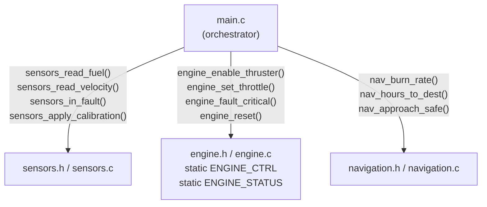

# Phase README — Modular Architecture

> **Phase 08 — Functions and Program Organisation** | Calypso · Core C

Splitting a 490-line monolith into named modules — each with a header that declares its interface and a source file that keeps its implementation private.

By the end of Phase 7, `main.c` runs the entire flight computer: sensor reads, navigation calculations, engine register operations, the command loop, the state machine, and the emergency shutdown path all share one file and one scope. Everything can see and overwrite everything else. The critical fault threshold appears in two separate `switch` cases; `ENGINE_CTRL` is written from multiple locations with no boundary between them; adding a new sensor read means scrolling past 400 lines of code that has nothing to do with sensors. This phase introduces functions and header files as the mechanism for enforcing boundaries — each module owns its data, declares what it offers, and hides how it works.

> **A note on scope.** Pass-by-value is demonstrated explicitly in this phase using `sensors_apply_calibration()`. Modifying data through a pointer — the mechanism that lets a function change a caller's variable — is the subject of Phase 10. Any forward mention of pointers in this phase is a preview, not a requirement.

---

## 🗺️ Contents

- [Branch sequence](#-branch-sequence)
- [Solutions to previous challenges and thought pieces](#-solutions-to-previous-challenges-and-thought-pieces)
- [Why we made this decision](#-why-we-made-this-decision)
- [What we built in the previous branch](#-what-we-built-in-the-previous-branch)
- [What we're doing in this branch](#-what-were-doing-in-this-branch)
- [Learning goals](#-learning-goals)
- [Key concepts](#-key-concepts)
- [What to notice in the code](#-what-to-notice-in-the-code)
- [Running this branch](#-running-this-branch)
- [Challenges for students](#-challenges-for-students)
- [Thought pieces for the next branch](#-thought-pieces-for-the-next-branch)

---

## 📍 Branch sequence

| Branch | What it introduces | Abstraction level |
|---|---|---|
| `main` | Project scaffold — compiles and runs | Scaffold only |
| `phase-01_boot-and-io` | First program · `printf` / `scanf` · compilation model | Raw I/O |
| `phase-02_debugging` | `printf` tracing · VS Code debugger · three C error categories | — |
| `phase-03_integer-types` | `stdint.h` fixed-width types · `PRIu16` format specifiers · overflow guards | — |
| `phase-04_compound-types` | `float` / `double` · `bool` · `enum MissionPhase` · `typedef sensor_float_t` | — |
| `phase-05_operators` | Arithmetic · relational · logical · `sizeof` · explicit casts | — |
| `phase-06_bitwise` | Bitmasks · `ENGINE_CTRL` register · `1u << n` shift pattern | — |
| `phase-07_control-flow` | `while(1)` command loop · `switch` state machine · `goto` emergency shutdown | — |
| `📌 phase-08_functions` | **`sensors.c` / `engine.c` / `navigation.c` split · prototypes · pass-by-value** | Modular |
| `phase-09_arrays` | Circular sensor history buffers · `sizeof` element count · `array[i]` ≡ `*(array + i)` | — |
| `phase-10_pointers` | `&` / `*` · pointer arithmetic · `const T*` vs `T* const` · `**` | — |
| `phase-11_strings` | `char` arrays · `strncpy` / `strcmp` / `strlen` · null terminator | — |
| `phase-12_structs` | `crew_member_t` · `spacecraft_t` · dot / arrow notation · nested structs | — |
| `phase-13_dynamic-memory` | `malloc` / `realloc` / `free` · dynamic crew roster · `NULL` checks | — |
| `phase-14_embedded-patterns` | `volatile` · memory-mapped I/O pointer · struct bitfields · `const` ROM data | Hardware abstraction |
| `phase-15_preprocessor` | `#define` constants · include guards · `#ifdef DEBUG_TELEMETRY` · function-like macro | — |
| `phase-16_file-io` | `fopen` / `fprintf` / `fwrite` · `calypso.log` · binary checkpoint | — |

---

## ✅ Solutions to previous challenges and thought pieces

### How challenges work

Additive challenges from the previous branch are solved in the first commit of this
branch — look for the `SOLUTION:` commit at the top of this branch's git history.
Analytical challenges and thought pieces are answered below.

```bash
git log --oneline          # find the SOLUTION commit hash
git show <hash>            # inspect the solution in isolation
```

### Challenge 1 — Intentional fallthrough and `-Wimplicit-fallthrough`

When `current_phase == LAUNCH`, the switch enters `case LAUNCH:` and runs in order: first `printf("  Launch: ignition sequence active\n")`, then falls through — no `break` — into `case CRUISE:`, which executes `printf("  Active burn: throttle=... | fuel=... | STATUS=...")` before the shared `break`. Two `printf` calls execute. `-Wimplicit-fallthrough` warns when a case has no `break` or `return` and execution would continue into the next case — it catches accidental omissions. The `/* FALLTHROUGH */` comment is recognised by GCC and Clang as explicit intent, suppressing the warning exactly where the fallthrough is deliberate rather than a bug.

### Challenge 2 — `do-while` rewritten as `while`

The extra line required before the loop is the initialiser: `char cmd = '\0';`. A `while` loop tests its condition before the body executes, so `cmd` must already hold a value that makes the condition true on the first check — any non-valid command character (including `'\0'`) works. The `do-while` form eliminates that requirement because the body always runs before the condition is first tested; `cmd` is set by `scanf` inside the body, so there is nothing to pre-initialise. Both forms produce identical runtime behaviour; the `do-while` version is shorter and expresses the guarantee in the loop structure rather than in a pre-initialiser.

### Challenge 4 — `continue` in `for` vs `while`

In a `for` loop, `continue` jumps to the increment expression (`i++`) before re-testing the condition — the increment still runs for the iteration where `continue` fired. In a `while` loop, `continue` jumps directly to the condition check; there is no implicit increment. Rewriting the sensor scan as a `while` requires a manual `i++` placed before each `continue`; without it, `i` stays at the faulted index forever, the condition `i < SENSOR_COUNT` remains true, and the loop never terminates.

### Thought piece 1 — Risks of a growing monolithic `main.c`

A single source file with a single flat scope means every variable is visible to every line of code. As the file grows, any change carries the risk of accidentally interfering with unrelated logic — the navigation section can read or overwrite sensor variables, and the compiler cannot tell you that was wrong. There is no way to express intent: "this part of the code owns `ENGINE_CTRL`" is a comment, not an enforceable boundary. This phase resolves that: each module owns its data, and the compiler enforces the boundary through scope and `static`.

### Thought piece 2 — Restricting who can write to `ENGINE_CTRL`

Moving `ENGINE_CTRL` into `engine.c` as a `static` file-scope variable. `static` at file scope restricts visibility to the translation unit it is declared in — no other `.c` file can name or access the variable. All register writes go through `engine.c` functions (`engine_enable_thruster()`, `engine_set_throttle()`, `engine_reset()`). The compiler enforces this: `main.c` has no declaration of `ENGINE_CTRL`, so any attempt to use the name directly is a compile error.

### Thought piece 3 — Defining a constant once and using it everywhere

`#define`. The preprocessor replaces every occurrence of the name with the literal value before the compiler sees the source. A single `#define CRITICAL_FAULT_TEMP 120` in a shared header means every `switch` case that checks the threshold uses the same value — changing it in one place changes it everywhere. This question is answered in Phase 15, which introduces `#define`, include guards, and conditional compilation throughout the codebase.

---

## 💡 Why we made this decision

### The single file was deliberate — until now

Every construct in Phases 1–7 lived in `main.c` so you could see the entire program in one place while learning each feature. By Phase 7 that file is nearly 500 lines holding seven distinct concerns: boot diagnostics, sensor reads, navigation calculations, engine register operations, a command loop, a state machine, and an emergency shutdown path. None of them is isolated from the others. `ENGINE_CTRL` is a global written from at least three separate locations; the critical fault temperature appears in two `switch` cases; nothing prevents the navigation section from accidentally overwriting a sensor variable.

The problem is not the length — it is the coupling. When every name is visible from everywhere, every change carries risk across the whole file. Functions and header files are the fix: a module declares what it offers and hides how it works. `main.c` becomes a caller, not a container.

### `ENGINE_CTRL` becomes a file-scope static

The most significant structural change is that `ENGINE_CTRL` and `ENGINE_STATUS` move from `main.c`'s global scope into `engine.c` as `static uint32_t` variables. `static` at file scope means "visible only within this translation unit" — `main.c` cannot name or access the register directly. All register access goes through `engine.c` functions. The module boundary is enforced by the compiler, not by convention.



### Pass-by-value is the default

When you call any function in this codebase, C copies your argument into the function's parameter. `sensors_apply_calibration(fuel, 5)` gives the function its own copy of `fuel` to work with. The function can modify that copy freely — the caller's `fuel` variable is untouched after the call. This is not a limitation; it is the default behaviour everywhere in C, and it means functions cannot accidentally mutate caller state through their parameters. Phase 10 introduces the mechanism for when you genuinely need in-place modification: a pointer to the variable.

---

## ⏮️ What we built in the previous branch

`phase-07_control-flow` gave Calypso a persistent runtime: a `while(1)` command loop with `break` to exit on quit and `goto` to jump to an emergency shutdown label on a critical fault. A `switch` on `current_phase` enforced valid mission-phase transitions with intentional fallthrough from `LAUNCH` into `CRUISE`. A `for` sensor scan used `continue` to skip faulted sensors; a `do-while` validated command input. The entire implementation — nearly 500 lines — lived in one `main.c` with one flat scope. The SOLUTION commit for this branch extends Phase 7 with the two additive challenges: a HIGH_WARN threshold check in the sensor scan (Challenge 3) and a thruster-state report in the emergency shutdown block (Challenge 5).

---

## 🎯 What we're doing in this branch

- Extract sensor operations into `sensors.c` and `sensors.h` — `sensors_read_fuel()`, `sensors_read_velocity()`, `sensors_in_fault()`, `sensors_apply_calibration()`; the `sensor_float_t` typedef moves to `sensors.h`
- Extract engine control into `engine.c` and `engine.h` — `engine_enable_thruster()`, `engine_disable_thruster()`, `engine_set_throttle()`, `engine_read_throttle()`, `engine_get_ctrl()`, `engine_get_status()`, `engine_set_fault()`, `engine_clear_status()`, `engine_fault_critical()`, `engine_reset()`; `ENGINE_CTRL` and `ENGINE_STATUS` become `static` file-scope variables invisible to `main.c`
- Extract navigation calculations into `navigation.c` and `navigation.h` — `nav_burn_rate()`, `nav_hours_to_dest()`, `nav_approach_safe()`
- Demonstrate pass-by-value explicitly: `sensors_apply_calibration()` modifies a local copy of the argument; the caller's variable is unchanged after the call
- Update `CMakeLists.txt` to compile all four source files together into the single executable

---

## 🧑🏻‍🏫 Learning goals

### Understand
- **Explain** pass-by-value — how C copies each argument into the corresponding parameter, and why a function modifying its parameter cannot affect the caller's variable
- **Explain** how a header file exposes function declarations across translation units — what the compiler sees when `main.c` calls `sensors_read_fuel()` defined in `sensors.c`
- **Distinguish** between block scope and file scope — how each determines where a name is visible and how long the variable lives
- **Describe** global variables, their risk in larger codebases, and why this phase replaces them with `static` file-scope variables and explicit parameter passing
- **Distinguish** between a function that returns a value, a function that performs an action (`void`-returning), and a function that modifies caller state via a pointer (Phase 10 preview)
- **Explain** name shadowing — what happens when a local variable shares a name with a file-scope variable, and which declaration is visible at a given point
- **Recognise** that C does not support function overloading — each function must have a unique name regardless of its parameter types

### Apply
- **Define** functions with appropriate return types and parameter lists in `sensors.c`, `engine.c`, and `navigation.c`
- **Write** function prototypes in header files to expose declarations to `main.c`
- **Call** functions from `main.c` that are defined in separate translation units, and explain how the linker connects the call site to the definition

### Analyze
- **Examine** `static uint32_t ENGINE_CTRL` in `engine.c` and explain what `static` prevents compared to the Phase 7 global declaration
- **Compare** the Phase 7 monolith and the Phase 8 module split — identify two specific interactions between concerns that become impossible by design in Phase 8

---

## 🔑 Key concepts

| Concept | Plain English |
|---|---|
| **Function prototype** | A declaration that tells the compiler a function's name, return type, and parameter types — without the body. Placed in a header so that any file including the header can call the function. |
| **Translation unit** | One `.c` file and everything `#include`d into it. The compiler processes each translation unit independently and produces one object file. The linker combines the object files into the executable. |
| **Pass-by-value** | When you call a function, C copies each argument into the corresponding parameter. The function works on its own copy; the caller's variable is unaffected. |
| **File scope** | A variable declared outside any function is visible from its declaration to the end of that file. Adding `static` restricts visibility further — the variable cannot be accessed from any other translation unit. |
| **Block scope** | A variable declared inside `{}` is only visible within those braces and is destroyed automatically when execution leaves them. |
| **`void` function** | A function that performs an action and returns no value. `engine_set_throttle(10)` modifies the register and returns — there is nothing to assign the result to. |
| **`static` at file scope** | Makes a variable or function private to its translation unit. `static uint32_t ENGINE_CTRL` in `engine.c` cannot be read or written by any other `.c` file. |
| **Name shadowing** | When a local variable has the same name as an outer-scope variable, the local declaration hides the outer one within its block. The outer variable is unchanged; it simply cannot be named from inside the shadowing block. |

---

## 🔍 What to notice in the code

[Placeholder — completed after code is written]

---

## ▶️ Running this branch

[Placeholder — completed after code is written]

---

## ✏️ Challenges for students

**Challenge 1 — Analytical**
`sensors_apply_calibration()` increments its `reading` parameter inside the function body, but the caller's variable is unchanged after the call. Confirm this by reading the function definition in `sensors.c` and the calling code in `main.c`. Then explain: what exactly does C copy when you call the function? Why is there no path back to the original variable?

**Challenge 2 — Analytical**
`ENGINE_CTRL` is declared `static uint32_t ENGINE_CTRL` at file scope in `engine.c`. What does `static` do here — which parts of the codebase can see and modify this variable? If you removed `static` and instead declared `extern uint32_t ENGINE_CTRL` in `engine.h`, what would change? Name two specific bugs from Phase 7 that the `static` declaration makes impossible in Phase 8.

**Challenge 3 — Analytical**
C does not support function overloading. Look at `sensors_read_fuel()` and `sensors_read_velocity()`. If you wanted a third sensor function that read pressure in PSI rather than kPa, how would you name it to follow the convention used in this codebase? How does the C standard library solve the same naming problem — for example, across the `printf` family?

**Challenge 4 — Additive**
Add a `sensors_read_pressure(void)` function to `sensors.c` and `sensors.h` that returns the cabin pressure value as a `sensor_float_t`. Write its prototype in `sensors.h`. Call it from `main.c` in the boot banner to display cabin pressure, replacing the inline literal `101.325f`. The function should return `101.325f`.

**Challenge 5 — Additive (stretch)**
`navigation.c` already has `nav_hours_to_dest()` for time calculations. Add a `nav_fuel_efficiency(uint32_t distance_km, uint16_t fuel_kg)` function to `navigation.c` and `navigation.h` that returns fuel efficiency as a `sensor_float_t` (km per kg) using floating-point division. Replace the inline efficiency calculation in `main.c` with a call to this new function, and verify the output matches the previous result.

---

## 💭 Thought pieces for the next branch

1. `sensors_read_fuel()` returns one current value — a snapshot. To detect an anomaly we need the last 10 readings. A single return value cannot give us that. What data structure holds a sequence of values in C?
2. We pass sensor values into functions by value. What if a function needed to update a sensor reading in-place — for calibration? A copy will not work. What would we need to pass instead?
3. How much memory does one `uint16_t` sensor reading take? How much for 20 of them? How does C pass that sequence to a function without copying all 20 values?

---

*Previous branch: [`phase-07_control-flow`]*
*Next branch: [`phase-09_arrays`]*
