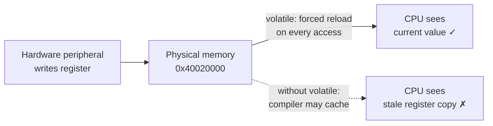

# Phase README — Embedded hardware layer

> **Phase 14 — Embedded C patterns** | Calypso · Core C

Adding `volatile`, memory-mapped I/O pointer declarations, struct bitfields for register layout mapping, and `const` ROM data — the patterns that make C correct for hardware peripherals.

The engine register `ENGINE_CTRL` has been a plain `uint32_t` variable since Phase 6. That works correctly in the simulation because only this program reads and writes it. On real hardware, the situation is different: the engine peripheral controller can update the physical register independently of the CPU running this code. The compiler has no way to know that — nothing in the C code indicates that anyone other than the program touches `ENGINE_CTRL` — so it is legally allowed to keep the last-read value in a CPU register and skip re-reading memory on subsequent accesses. On real hardware, that means the program can miss a peripheral update entirely. The fix is a single keyword: `volatile`.

This phase also introduces the two patterns that go alongside `volatile` in embedded C: the memory-mapped I/O pointer — a `volatile` pointer cast from a fixed integer address, giving C direct access to a hardware peripheral at a known physical location — and struct bitfields, which replace the shift-and-mask sequences from Phase 6 with named fields that mirror the hardware register layout directly in the struct definition.

> **A note on scope.** Calypso runs on a desktop, not a microcontroller. The `volatile` qualifier and the MMIO pointer are demonstrated structurally — you will see the correct declarations and the reasoning behind them — but you are not observing the actual compiler caching behaviour they guard against. That behaviour is an optimisation decision made per compiler, per target, per optimisation level. What you will see is the correct form of every declaration and the rules that govern each.

---

## 🗺️ Contents

- [Branch sequence](#-branch-sequence)
- [Solutions to previous challenges and thought pieces](#-solutions-to-previous-challenges-and-thought-pieces)
- [Why we made this decision](#-why-we-made-this-decision)
- [What we built in the previous branch](#-what-we-built-in-the-previous-branch)
- [What we're doing in this branch](#-what-were-doing-in-this-branch)
- [The abstraction we earned](#-the-abstraction-we-earned)
- [Learning goals](#-learning-goals)
- [Key concepts](#-key-concepts)
- [What to notice in the code](#-what-to-notice-in-the-code)
- [Running this branch](#-running-this-branch)
- [Challenges for students](#-challenges-for-students)
- [Thought pieces for the next branch](#-thought-pieces-for-the-next-branch)

---

## 📍 Branch sequence

| Branch | What it introduces | Abstraction level |
|---|---|---|
| `main` | Project scaffold — compiles and runs | Scaffold only |
| `phase-01_boot-and-io` | First program · `printf` / `scanf` · compilation model | Raw I/O |
| `phase-02_debugging` | `printf` tracing · VS Code debugger · three C error categories | — |
| `phase-03_integer-types` | `stdint.h` fixed-width types · `PRIu16` format specifiers · overflow guards | — |
| `phase-04_compound-types` | `float` / `double` · `bool` · `enum MissionPhase` · `typedef sensor_float_t` | — |
| `phase-05_operators` | Arithmetic · relational · logical · `sizeof` · explicit casts | — |
| `phase-06_bitwise` | Bitmasks · `ENGINE_CTRL` register · `1u << n` shift pattern | — |
| `phase-07_control-flow` | `while(1)` command loop · `switch` state machine · `goto` emergency shutdown | — |
| `phase-08_functions` | `sensors.c` / `engine.c` / `navigation.c` split · prototypes · pass-by-value | Modular |
| `phase-09_arrays` | Sensor history buffers · `sizeof` element count · `array[i]` ≡ `*(array + i)` | — |
| `phase-10_pointers` | `&` / `*` · in-place calibration · pointer arithmetic · `const T*` vs `T* const` · `**` | — |
| `phase-11_strings` | `char` arrays · null terminator · `strncpy` / `strcmp` / `strlen` / `strncat` · literal vs mutable | — |
| `phase-12_structs` | `crew_member_t` · `spacecraft_t` · dot / arrow notation · nested structs · array of structs | — |
| `phase-13_dynamic-memory` | `malloc` / `realloc` / `free` · dynamic crew roster · `NULL` checks · mission log buffer | — |
| `📌 phase-14_embedded-patterns` | **`volatile` · memory-mapped I/O pointer · struct bitfields · `const` ROM data** | Hardware abstraction |
| `phase-15_preprocessor` | `#define` constants · include guards · `#ifdef DEBUG_TELEMETRY` · function-like macro | — |
| `phase-16_file-io` | `fopen` / `fprintf` / `fwrite` · `calypso.log` · binary checkpoint | — |

---

## ✅ Solutions to previous challenges and thought pieces

### How challenges work

Additive challenges from the previous branch are solved in the first commit of this
branch — look for the `SOLUTION:` commit at the top of this branch's git history.
Analytical challenges and thought pieces are answered below.

```bash
git log --oneline          # find the SOLUTION commit hash
git show <hash>            # inspect the solution in isolation
```

### Challenge 1 — `malloc` vs `calloc` for the roster

`malloc` returns uninitialised memory — the bytes contain whatever was previously at that address. If you read `roster[0].name` immediately after a raw `malloc` call without calling `crew_init`, you would be reading garbage bytes from the heap. It might look like a valid string if the first byte happened to be `'\0'`, or it might print garbage characters until finding a `'\0'` somewhere else in the heap — undefined behaviour with unpredictable output. `calloc` prevents this by zeroing every byte before returning, so `roster[0].name[0]` is always `'\0'` — a valid empty C string — before the first `crew_add` call. For the crew roster, that guarantee matters: every slot is in a known clean state without an explicit initialisation loop.

### Challenge 2 — What goes wrong with `roster = realloc(roster, new_size)` on failure

If `realloc` returns `NULL`, the original allocation is not freed — the old block is still valid and still allocated. But by assigning the `NULL` return directly to `roster`, you have overwritten the only pointer that held the old block's address. The old memory is still allocated, can never be freed, and can never be accessed: a permanent memory leak. With the safe pattern — `tmp = realloc(roster, new_size); if (tmp != NULL) { roster = tmp; }` — `roster` still holds the valid old address when `realloc` fails, the data is intact, and the function can return an error to the caller without losing any memory.

### Challenge 3 — Why set `roster = NULL` immediately after `free`

After `free(roster)`, the memory has been returned to the heap. The `roster` variable itself still holds the old address — it is now a dangling pointer. Any code that later calls `crew_add` or dereferences `roster` directly after the `free` would be accessing freed memory: undefined behaviour. Setting `roster = NULL` immediately after `free` makes any accidental later dereference fail visibly — a `NULL` dereference crashes the program at the point of the error rather than silently corrupting data or producing wrong output. It is a safety net: you cannot prevent all misuse, but you can make misuse fail loudly.

### Thought piece 1 — Preventing compiler caching of `ENGINE_CTRL`

The `volatile` keyword is the answer. Qualifying a variable `volatile` tells the compiler that its value can change at any time from outside the program's own code — a hardware peripheral, an interrupt service routine, or another execution context. The compiler must emit a memory load instruction for every access to a `volatile` variable rather than reusing a cached value held in a CPU register. Without `volatile`, a compiler optimising a loop that reads the same variable multiple times without writing to it is legally allowed to perform the read once, cache the result, and skip subsequent memory reads — which silently misses any hardware-driven change to the register.

### Thought piece 2 — Accessing a value at an arbitrary address in C

You cast the integer address to a pointer of the correct type:
```c
volatile uint32_t * const pMMIO_ENGINE_CTRL = (volatile uint32_t *)0x40020000UL;
```
This tells the compiler: treat the value at address `0x40020000` as a `uint32_t`. Dereferencing `*pMMIO_ENGINE_CTRL` now reads from that physical address. On a microcontroller where the engine peripheral is memory-mapped to that address, this reads the live hardware register. The `volatile` qualifier is mandatory — without it the compiler may cache the first read and skip subsequent reloads from memory. The `const` on the pointer itself means the pointer can never be reseated to a different address; only the value at that address can change.

### Thought piece 3 — `malloc` on bare-metal embedded systems

`malloc` requires a C runtime heap — a region of RAM configured by the linker script, a free-list implementation, and a `_sbrk` (or equivalent) call to expand the heap on request. On a bare-metal system with no operating system, none of this is provided automatically, and many embedded toolchains disable the heap entirely. Even where `malloc` is available, the risks are significant: allocation time is non-deterministic because the free-list search takes variable time depending on fragmentation, which can violate hard real-time timing constraints; and heap fragmentation in a long-running system can cause a later allocation to fail even when the total free bytes would be sufficient. The standard embedded practice is to size all buffers statically at startup — large enough for the worst-case scenario — and never call `malloc` after initialisation.

---

## 💡 Why we made this decision

### `volatile` — preventing the compiler from caching hardware register reads

Without `volatile`, the compiler treats `ENGINE_CTRL` as an ordinary variable in RAM. In a tight loop that reads `*pENGINE_CTRL` multiple times without writing to it, the compiler is allowed to prove that nothing in the loop body modifies `ENGINE_CTRL`, load the value once into a CPU register, and use that register for all subsequent tests. On a desktop simulation where only this program writes the variable, that optimisation is always correct. On real hardware, the engine peripheral controller writes to the physical register independently — the CPU's perspective is that nothing in the C program writes it, so the compiler's optimisation is technically legal. The cached register holds a stale value; peripheral updates are silently missed.

Adding `volatile` breaks that optimisation by contract: the compiler must emit a memory load instruction for every read of a `volatile`-qualified variable, regardless of what the surrounding code does.



### Memory-mapped I/O — a pointer that is a hardware address

On a real microcontroller, `ENGINE_CTRL` is not a variable in RAM. It is a specific physical memory address the processor maps to the engine peripheral's control register — `0x40020000` in the Calypso hardware spec. The peripheral controller writes to that address; the CPU reads from it. There is no C variable to take the address of. To give C code access to it, you cast the known integer address to a pointer:

```c
volatile uint32_t * const pMMIO_ENGINE_CTRL = (volatile uint32_t *)0x40020000UL;
```

`*pMMIO_ENGINE_CTRL` now reads from address `0x40020000`. Every read is forced to go to physical memory — not a CPU register — because the pointer type is `volatile uint32_t *`. The `const` on the pointer means it can never be reseated; what it points at can change (that is the peripheral register), but the pointer always refers to the same address.

In the simulation, `pENGINE_CTRL` still points to `&ENGINE_CTRL` — a real variable in RAM, not a hardware address. The MMIO pointer is shown as a commented declaration in `engine.c` to demonstrate the pattern without crashing the program (dereferencing `0x40020000` on a desktop causes a segfault because no memory is mapped there).

### Struct bitfields — naming bits instead of shifting them

Phase 6 introduced shift-and-mask expressions to read and write fields within `ENGINE_CTRL`. The throttle field occupies bits 4–7:

```c
/* read the throttle field */
uint8_t throttle = (uint8_t)((*pENGINE_CTRL >> 4) & 0xF);

/* write the throttle field */
*pENGINE_CTRL &= ~((uint32_t)0xF << 4);
*pENGINE_CTRL |=  ((uint32_t)level << 4);
```

The arithmetic is correct, but the intent — read or write the throttle field — is buried in numbers. A struct bitfield names each field and declares its width in bits:

```c
typedef struct {
    uint32_t thrusters : 4;  /* bits 0-3: one enable bit per thruster pair */
    uint32_t throttle  : 4;  /* bits 4-7: throttle level 0-15 */
    uint32_t reserved  : 24; /* bits 8-31: reserved */
} engine_ctrl_reg_t;
```

`bits.throttle` reads the throttle field directly. The register layout is visible in the struct definition; the field name is self-documenting; and if the throttle field moved to different bits in a new hardware revision, you update the struct in one place rather than hunting through arithmetic.

One important caveat: bitfield layout within a storage unit is **implementation-defined**. The C standard does not guarantee that `thrusters` occupies the lowest bits, or that fields are packed without gaps, or which end of the integer the first field starts from. The mapping above is correct on little-endian targets with GCC and Clang — which covers every platform Calypso targets — but it is not portable across architectures or guaranteed to match the register layout on a different MCU without careful verification.

---

## ⏮️ What we built in the previous branch

Phase 13 replaced the fixed `crew_member_t crew[MAX_CREW]` array with a heap-allocated roster using `calloc`/`realloc`/`free`. A dynamic mission log buffer in `main.c` grew with `realloc` as entries accumulated, using the safe temporary-pointer pattern throughout. Every allocation path included a `NULL` check; every exit path freed the allocations before returning. The SOLUTION commit at the start of this branch adds `crew_shrink()` (Challenge 4) — which reallocates the roster down to exactly `loaded` slots using the same safe-temporary pattern — and marks `log_append()` (Challenge 5 stretch), which was already present in Phase 13's code as the mission log buffer's append function.

---

## 🎯 What we're doing in this branch

- Qualify `ENGINE_CTRL` and `ENGINE_STATUS` as `static volatile uint32_t` in `engine.c` — every access forces a memory read rather than reusing a cached CPU register value
- Update `pENGINE_CTRL` from `uint32_t * const` to `volatile uint32_t * const` — the pointer type must match the volatile-qualified object it points to
- Add a commented `pMMIO_ENGINE_CTRL` declaration in `engine.c` showing the cast from a fixed integer address to a `volatile uint32_t *` — the form used on real hardware with memory-mapped peripherals
- Declare `engine_ctrl_reg_t` in `engine.h` — a struct with three bitfields (`thrusters : 4`, `throttle : 4`, `reserved : 24`) that map the `ENGINE_CTRL` layout into named fields
- Add `engine_read_ctrl_bits()` to `engine.c` — copies the current `ENGINE_CTRL` value into an `engine_ctrl_reg_t` and returns it, so `bits.throttle` can be compared against the manual `(reg >> 4) & 0xF` extraction from Phase 6
- Add `const uint8_t BOOT_CONFIG[]` in `main.c` — a read-only boot data array annotated for ROM/flash placement, demonstrating how `const` signals the linker to keep the data in non-volatile memory on embedded targets

---

## 🏆 The abstraction we earned

> Before this phase, reading the throttle field from `ENGINE_CTRL` required knowing that it occupies bits 4–7 and writing `(uint8_t)((*pENGINE_CTRL >> 4) & 0xF)` — arithmetic that carries no indication of what field it computes. With `engine_ctrl_reg_t`, the register layout is documented once in the struct definition: `throttle : 4` at offset 4. Reading the throttle is now `bits.throttle`. The struct is the hardware register layout written in C; the field name is self-documenting; and if the hardware team moves the throttle field in a board revision, you update the struct definition rather than auditing every shift-and-mask expression in the codebase.

---

## 🧑🏻‍🏫 Learning goals

### Understand
- **Explain** `volatile` — why the compiler must reload a variable from memory on every access, and what silent bugs occur without it in code that reads hardware control and status registers
- **Explain** why heap allocation (`malloc`/`realloc`) is typically avoided in bare-metal embedded systems where timing must be deterministic and no OS reclaims memory on exit
- **Explain** ISR constraints — why an interrupt service routine must return quickly, must not block, must not call `malloc`, and why any variable it shares with the main loop must be `volatile`

### Apply
- **Declare** `volatile`-qualified register variables in `engine.c` and a memory-mapped I/O pointer cast from a fixed integer address — the correct form for accessing hardware peripherals in C
- **Apply** bitmask set, clear, test, and read operations to `volatile uint32_t` hardware control and status registers — the same Phase 6 operations, now on correctly-qualified variables
- **Use** fixed-width integer types (`uint8_t`, `uint16_t`, `uint32_t`) exclusively in all engine register code, making the size and range of every register value explicit
- **Declare** `engine_ctrl_reg_t` as a struct with named bitfields that match the `ENGINE_CTRL` register layout, and use `engine_read_ctrl_bits()` to populate it
- **Apply** `const` to `BOOT_CONFIG[]` to signal read-only ROM/flash placement to both the compiler (reject writes) and the linker (place in flash)

### Analyze
- **Examine** the difference between `uint32_t * const` (a const pointer to non-volatile data) and `volatile uint32_t * const` (a const pointer to volatile data) — what each qualifier prevents and why both are needed for a fixed hardware register pointer
- **Compare** bitfield struct access (`bits.throttle`) with manual shift-and-mask (`(reg >> 4) & 0xF`) — what the abstraction buys in readability, and where its portability limits apply

---

## 🔑 Key concepts

| Concept | Plain English |
|---|---|
| **`volatile`** | A type qualifier that tells the compiler "this variable can change at any time from outside the program — read it from memory on every access, do not cache it in a CPU register." |
| **Compiler register caching** | An optimisation where the compiler holds a variable's value in a CPU register rather than re-reading memory on each access. Safe for ordinary variables; silently wrong for hardware registers updated by the peripheral independently. |
| **Memory-mapped I/O (MMIO)** | Hardware peripherals controlled by reading and writing specific physical memory addresses. The CPU accesses them like ordinary RAM, but the underlying device responds to every read and write. |
| **MMIO pointer** | A `volatile T * const` pointer initialised by casting a known integer address — `(volatile uint32_t *)0x40020000UL` — that gives C code direct access to a hardware peripheral register at a fixed physical location. |
| **Struct bitfields** | Struct members declared with a bit-width — `uint32_t throttle : 4` — that the compiler packs into a specified number of bits. Used to overlay a hardware register and name its fields rather than computing them with shift-and-mask arithmetic. |
| **Bitfield portability** | Bitfield layout within a storage unit is implementation-defined: field order, padding, and which bits a field occupies may vary across compilers and targets. Bitfields work reliably within one compiler/target pair but are not guaranteed to be portable across architectures. |
| **ISR (Interrupt Service Routine)** | A function invoked automatically by the hardware when an interrupt fires. Must return quickly: no blocking calls, no `malloc`, no long computation. Variables shared between an ISR and the main loop must be `volatile` so both sides always see the live memory value. |
| **`const` for ROM placement** | Declaring data `const` signals to the compiler (reject writes at compile time) and the linker (place the object in the read-only flash section). On embedded targets, `const` data lives in non-volatile flash rather than consuming RAM that is lost on power cycle. |

---

## 🔍 What to notice in the code

**[`engine.c:27–28`](engine.c#L27)**
`ENGINE_CTRL` and `ENGINE_STATUS` are now `static volatile uint32_t`. The comment immediately above explains why: on real hardware the peripheral controller writes these registers independently of this program, so the compiler cannot be allowed to cache a stale value in a CPU register.

**[`engine.c:35`](engine.c#L35)**
`pENGINE_CTRL` changed from `uint32_t * const` to `volatile uint32_t * const`. The pointer's target type must match the volatile-qualified variable it addresses — a plain `uint32_t *` pointed at a `volatile uint32_t` would be a type mismatch the compiler should warn about.

**[`engine.c:37–48`](engine.c#L37)**
The commented `pMMIO_ENGINE_CTRL` declaration shows the real-hardware form: a fixed integer address cast directly to a `volatile uint32_t *`. It stays commented because dereferencing an arbitrary address on a desktop process segfaults — there is no memory mapped at `0x40020000` here. `pENGINE_CTRL`, pointing at the simulated `ENGINE_CTRL` variable, is what the rest of the file actually uses.

**[`engine.h:11–25`](engine.h#L11)**
`engine_ctrl_reg_t` maps the register layout into three named bitfields. Read the NOTE above it before relying on this pattern elsewhere — bitfield packing is implementation-defined, and this layout is only guaranteed correct on the little-endian/GCC-or-Clang targets Calypso builds for.

**[`engine.c:84–94`](engine.c#L84)**
`engine_read_ctrl_bits()` is the only place that converts a raw `uint32_t` into the bitfield struct. It uses `memcpy` rather than a pointer cast or union — copying the bytes explicitly avoids any question about alignment or strict-aliasing rules, at the cost of one small copy.

**[`main.c:81–93`](main.c#L81)**
`BOOT_CONFIG` is declared `static const uint8_t[]` at file scope, outside `main()`. It is initialised once at compile time and never written afterward — exactly the property `const` enforces and the property that lets the linker place this data in a read-only segment (flash, on an embedded target) instead of RAM.

**[`main.c:96–101`](main.c#L96)**
The boot banner reads `BOOT_CONFIG` byte by byte and prints it as hex. This is the only place `BOOT_CONFIG` is read — it exists to demonstrate the declaration, not to drive any runtime logic in this phase.

---

## ▶️ Running this branch

**Prerequisites:** GCC or Clang (C99+) and CMake 3.10+, or just GCC/Clang directly.

**With CMake (recommended):**
```bash
cmake -B build
cmake --build build
.\build\Debug\calypso.exe   # Windows (MSVC)
.\build\calypso.exe         # Windows (MinGW)
./build/calypso             # Linux / macOS
```

**Direct compilation (no CMake):**
```bash
gcc -std=c99 main.c sensors.c engine.c navigation.c crew.c -o calypso
./calypso
```

The boot banner now prints the ROM-style configuration bytes:
```
=========================================
  CALYPSO FLIGHT COMPUTER
  Shuttle designation : CALYPSO-7
  Build date          : <build date>
  Mission ID          : 7
  Boot config (ROM)   : 43 41 4C 07 01
=========================================
```

The engine control section is unchanged in output — `ENGINE_CTRL` and `ENGINE_STATUS` are now `volatile`, and the pointer to them is `volatile`-qualified, but the values and bitmask operations behave identically to Phase 13. The change is in the generated code's memory-access guarantees, not in the program's visible behaviour.

| Command | Action |
|---|---|
| `n` | Advance mission phase |
| `s` | Sensor scan — history, averages, drift, channel reconfiguration |
| `m` | Print crew manifest with loaded/capacity counts |
| `e` | Emergency shutdown — frees all allocations before exit |
| `q` | Normal quit — frees all allocations before exit |

---

## ✏️ Challenges for students

**Challenge 1 — Analytical**
In `engine.c`, `ENGINE_CTRL` is now `static volatile uint32_t`. Without the `volatile` qualifier, a compiler optimising the `while (1)` command loop might load `*pENGINE_CTRL` into a CPU register once and reuse that register on every call to `engine_fault_critical()` — never re-reading memory. In the simulation, this would not actually matter because no hardware updates `ENGINE_CTRL` independently. On real hardware, where the engine peripheral controller writes to the register between loop iterations, it would matter critically. Explain in your own words: what would the program see without `volatile`? What does `volatile` change about the generated code? Why does the desktop simulation not let you observe this behaviour directly?

**Challenge 2 — Analytical**
The C standard says bitfield layout within a storage unit is implementation-defined. For `engine_ctrl_reg_t`, the mapping of `thrusters` to bits 0–3 and `throttle` to bits 4–7 is a guarantee provided by GCC and Clang on little-endian targets — not by the C standard itself. What would break if `engine_ctrl_reg_t` were compiled on a big-endian MCU where bitfields are packed from the most-significant bit? Would `bits.throttle` still match `engine_read_throttle()`? How do embedded C projects that need bitfield structs to work correctly across architectures typically handle this?

**Challenge 3 — Additive**
Add `static volatile bool engine_halted = false;` at file scope in `engine.c`. Add two functions: `void engine_halt(void)` sets it to `true`; `bool engine_is_halted(void)` returns it. Declare both in `engine.h`. In the DOCKED case of the mission phase `switch` in `main.c`, call `engine_halt()`. At the top of the `while (1)` command loop, check `engine_is_halted()` and `break` if it returns `true` — the loop exits automatically when the mission completes, without waiting for a `q` command. The `volatile` qualifier matters here: without it, the compiler could legally check `engine_halted` once before the loop begins and never re-read the variable inside the loop.

**Challenge 4 — Analytical**
Phase 13 used `malloc` and `realloc` freely for the dynamic crew roster and mission log buffer. On a bare-metal embedded system with no OS, `malloc` may not be available — and many embedded projects forbid its use entirely, even where a C runtime provides it. Name two specific technical reasons why `malloc` is problematic in a hard real-time embedded context. "There is no OS" does not count as a reason — focus on properties of `malloc` itself that conflict with embedded system requirements.

**Challenge 5 — Additive (stretch)**
In the engine control section of `main.c`, after `engine_set_throttle(7)`, call `engine_read_ctrl_bits()` and print both the raw hex value from `engine_get_ctrl()` and the individual bitfields — `bits.thrusters` and `bits.throttle` — side by side:
```
ENGINE_CTRL bits: raw=0x00000074  thrusters=4  throttle=7
```
Verify that `bits.throttle` matches `engine_read_throttle()` and that the raw hex value is consistent with the bitmask calculations from Phase 6. What should `bits.thrusters` show after `engine_enable_thruster(0)` and `engine_enable_thruster(2)` have been called — and does it match the raw register?

---

## 💭 Thought pieces for the next branch

1. The base address `0x40020000UL` for the engine peripheral lives in `engine.c`. If the hardware team remaps it in a new board revision, we update one place — but imagine it appeared in three source files. What does C give us to define a value once and use it everywhere without going through a function call or a variable?
2. Debug telemetry is mixed into the core sensor reads and engine control output. On a production firmware build, we do not want that output at all. How could we include or exclude it based on a compile-time flag — without deleting and re-adding lines every time we switch between debug and production builds?
3. Headers currently have no multiple-inclusion protection. If `main.c` includes `sensors.h` directly, and also includes `navigation.h` which itself includes `sensors.h` again, the preprocessor expands both `#include` directives in full. What does the compiler then see, and what happens when it encounters the same `typedef` or `enum` declaration a second time in the same translation unit?

---

*Previous branch: [`phase-13_dynamic-memory`]*
*Next branch: [`phase-15_preprocessor`]*
