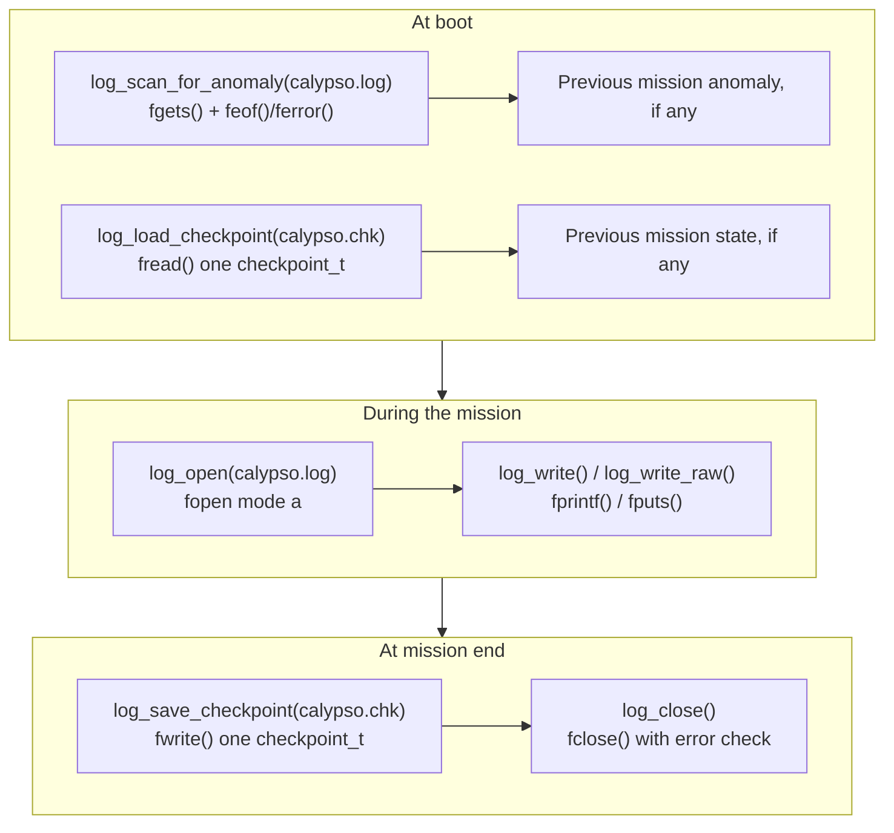

# Phase README — Flight log

> **Phase 16 — File I/O** | Calypso · Core C

Giving Calypso a memory that survives a reboot — a persistent text log and a binary mission checkpoint, both written and read with the standard C file functions.

Every status line Calypso has printed since Phase 1 has gone to `stdout` and nowhere else. The moment the process exits — a clean quit or an emergency shutdown — every boot message, every crew-roster change, every fault a sensor scan caught disappears with it. Phase 15 closed on exactly this gap: if an anomaly happened right before a reboot, this program currently has no way to tell you about it, because nothing it has ever printed outlives the `printf()` call that produced it.

This phase gives Calypso a memory that outlives the process. A new `log.c`/`log.h` module opens `calypso.log` in append mode and writes a subset of the same milestone and anomaly events the existing in-memory `log_buf` already tracks — except this copy is still there after the program exits, growing across every future run instead of starting empty each time. Alongside it, a binary `calypso.chk` file captures a byte-for-byte snapshot of mission state with `fwrite()` — phase, fuel, velocity, crew count — so that a single `fread()` at the next boot can show you exactly where the previous mission left off.

> **A note on scope.** `calypso.log` records boot, crew-roster, docking, and sensor-fault events — not a full per-reading telemetry stream of every sensor sample. The lesson here is the mechanics of `fopen()` / `fread()` / `fwrite()` / `fclose()` and the text-vs-binary distinction, not building an exhaustive logging pipeline.

---

## 🗺️ Contents

- [Branch sequence](#-branch-sequence)
- [Solutions to previous challenges and thought pieces](#-solutions-to-previous-challenges-and-thought-pieces)
- [Why we made this decision](#-why-we-made-this-decision)
- [What we built in the previous branch](#-what-we-built-in-the-previous-branch)
- [What we're doing in this branch](#-what-were-doing-in-this-branch)
- [Learning goals](#-learning-goals)
- [Key concepts](#-key-concepts)
- [What to notice in the code](#-what-to-notice-in-the-code)
- [What this phase revealed](#-what-this-phase-revealed)
- [Running this branch](#-running-this-branch)
- [Challenges for students](#-challenges-for-students)
- [Thought pieces for the next branch](#-thought-pieces-for-the-next-branch)

---

## 📍 Branch sequence

| Branch | What it introduces | Abstraction level |
|---|---|---|
| `main` | Project scaffold — compiles and runs | Scaffold only |
| `phase-01_boot-and-io` | First program · `printf` / `scanf` · compilation model | Raw I/O |
| `phase-02_debugging` | `printf` tracing · VS Code debugger · three C error categories | — |
| `phase-03_integer-types` | `stdint.h` fixed-width types · `PRIu16` format specifiers · overflow guards | — |
| `phase-04_compound-types` | `float` / `double` · `bool` · `enum MissionPhase` · `typedef sensor_float_t` | — |
| `phase-05_operators` | Arithmetic · relational · logical · `sizeof` · explicit casts | — |
| `phase-06_bitwise` | Bitmasks · `ENGINE_CTRL` register · `1u << n` shift pattern | — |
| `phase-07_control-flow` | `while(1)` command loop · `switch` state machine · `goto` emergency shutdown | — |
| `phase-08_functions` | `sensors.c` / `engine.c` / `navigation.c` split · prototypes · pass-by-value | Modular |
| `phase-09_arrays` | Sensor history buffers · `sizeof` element count · `array[i]` ≡ `*(array + i)` | — |
| `phase-10_pointers` | `&` / `*` · in-place calibration · pointer arithmetic · `const T*` vs `T* const` · `**` | — |
| `phase-11_strings` | `char` arrays · null terminator · `strncpy` / `strcmp` / `strlen` / `strncat` · literal vs mutable | — |
| `phase-12_structs` | `crew_member_t` · `spacecraft_t` · dot / arrow notation · nested structs · array of structs | — |
| `phase-13_dynamic-memory` | `malloc` / `realloc` / `free` · dynamic crew roster · `NULL` checks · mission log buffer | — |
| `phase-14_embedded-patterns` | `volatile` · memory-mapped I/O pointer · struct bitfields · `const` ROM data | Hardware abstraction |
| `phase-15_preprocessor` | `#define` constants · `#ifdef DEBUG_TELEMETRY` · `ASSERT_SENSOR_RANGE` macro · include guards | Build-time configuration |
| `📌 phase-16_file-io` | **`fopen` / `fprintf` / `fwrite` · `calypso.log` · binary checkpoint** | — |

---

## ✅ Solutions to previous challenges and thought pieces

### How challenges work

Additive challenges from the previous branch are solved in the first commit of this
branch — look for the `SOLUTION:` commit at the top of this branch's git history.
Analytical challenges and thought pieces are answered below.

```bash
git log --oneline          # find the SOLUTION commit hash
git show <hash>            # inspect the solution in isolation
```

### Challenge 1 — What `__FILE__`/`__LINE__` would print from inside a function instead of a macro

`__FILE__` and `__LINE__` are evaluated at the point they appear in the source — which, inside `assert_sensor_range()`'s body, is the one line in that function's own definition, not any of the three call sites in `main.c`. Every one of the three calls executes that same line, so every one of them would print the file and line number of the function's definition itself, regardless of which call actually triggered the failure. The macro version behaves differently only because the preprocessor pastes `ASSERT_SENSOR_RANGE`'s text — `__FILE__`, `__LINE__`, and all — directly into each separate call site before the compiler ever runs, so each expansion reports its own surrounding context instead of one shared one.

### Challenge 4 — The convention that keeps `assert`-style macros safe despite double-evaluating their argument

The convention is to only ever pass a side-effect-free expression — a bare variable or a comparison between variables — never a function call, an increment, or an assignment. Nothing in the macro itself enforces this; the C standard's own description of `assert()` relies on programmers following exactly this discipline, and `ASSERT_SENSOR_RANGE` is no different. The hazard stays invisible at the call site precisely because the preprocessor has no concept of "evaluate once and reuse the result" — only the caller's choice of what to pass keeps it from ever mattering.

### Thought piece 1 — Finding out about an anomaly that happened before a reboot

This phase is the answer: `calypso.log` is opened in append mode, so every line a previous run wrote is still there when the next run starts. `log_scan_for_anomaly()` reads that file with `fgets()` before this run writes anything of its own, looking for any line that records a fault, and prints it at boot if one is found.

### Thought piece 2 — Writing output to something other than the screen

`stdio.h`'s file functions are not specific to the screen at all — `printf()` is really just `fprintf(stdout, ...)` with the handle filled in for you. Any `FILE*` returned by `fopen()` works with the exact same `fprintf()` / `fputs()` calls; this phase's `log_write()` and `log_write_raw()` are that same family of calls aimed at a file handle instead of `stdout`.

### Thought piece 3 — Text vs binary storage tradeoffs for a float sensor value

A text representation like `"32.7\n"` is human-readable and portable — any program on any machine can parse those characters back into a float — but it is larger on disk and loses exactness to formatting precision. The raw 4-byte IEEE-754 representation this phase writes into `calypso.chk` is compact and exact, but only readable correctly by a program on a machine with the same float layout and byte order; that is exactly why `calypso.log` (meant to be read by a person) is text, and `calypso.chk` (meant to be read back only by this same program) is binary.

---

## 💡 Why we made this decision

### `FILE*` as the one interface for every kind of file access

`fopen()` returns a `FILE*` — an opaque handle. Neither `log.c` nor `main.c` knows or needs to know what is actually behind that pointer; every later operation, whether it's `fprintf()`-ing a text line or `fwrite()`-ing raw bytes, goes through the same handle and the same small family of functions. Without this abstraction, talking to a file would mean dropping down to the operating system's own file API — `open()`/`read()`/`write()`/`close()` on Linux and macOS, a completely different `CreateFile()`/`ReadFile()`/`WriteFile()` set on Windows — and Calypso would need a different implementation of `log.c` for every platform the PRD requires it to run on. `stdio.h` is plumbing over exactly that difference: one interface, implemented once per platform by the C standard library, so the code calling it never has to change.

### One file in text mode, one in binary mode

`calypso.log` is opened with `"a"` and written with `fprintf()` and `fputs()` because its entire purpose is to be read by a person after the fact — a plain-text append-only diary of what happened. `calypso.chk` is opened with `"wb"`/`"rb"` and moved with `fwrite()`/`fread()` because its entire purpose is to be read back by this same program, as the exact `checkpoint_t` it was written from — there is no formatting to parse and no reason to pay the cost of converting numbers to and from text twice. Mixing the two up would not just be inefficient: writing a struct's raw bytes in text mode risks the platform's newline translation silently corrupting any byte in the struct that happens to match a line-ending character, and reading text data with `fread()` would interpret it as an opaque block of bytes carrying none of `fprintf()`'s formatting.



---

## ⏮️ What we built in the previous branch

Phase 15 added `#define` constants for the engine register base address and the sensor fault-range thresholds, a function-like `ASSERT_SENSOR_RANGE` macro that reports its own call site with `__FILE__`/`__LINE__`, `#ifdef DEBUG_TELEMETRY` gating around the periodic scan's debug output, and include guards in every header. The SOLUTION commit at the start of this branch resolves the three additive challenges that phase left open: `engine.h` now defines `THRUSTER_COUNT` (Challenge 2), used in `engine.c`'s `thruster_bit()` instead of the bare literal `4u`; the boot banner's `BOOT_CONFIG` hex dump in `main.c` is now wrapped in `#ifdef DEBUG_TELEMETRY` / `#endif` (Challenge 3); and a new `CLAMP(val, lo, hi)` macro in `engine.h` is used inside `engine_set_throttle()` (Challenge 5, stretch) so a request like `engine_set_throttle(20)` is silently capped at the register's maximum throttle value of 15 instead of corrupting the reserved bits above the field.

---

## 🎯 What we're doing in this branch

- Add `log.c` / `log.h` — a `checkpoint_t` struct and the functions that read and write `calypso.log` (text) and `calypso.chk` (binary)
- At boot, before printing anything new: `log_scan_for_anomaly("calypso.log")` walks the previous run's log line by line with `fgets()`, reporting the most recent fault it finds, and `log_load_checkpoint("calypso.chk", ...)` reads back the previous run's mission-state snapshot with `fread()`
- `log_open("calypso.log")` opens this session's append-mode handle, checking `fopen()`'s return value before any write is attempted
- `log_write()` (built on `fprintf()`) records the same boot, crew-load, and docking-transfer milestones the existing in-memory `log_buf` already tracks — and a new entry whenever the periodic sensor scan flags a fault, which is exactly the anomaly trail `log_scan_for_anomaly()` reads back on the *next* run
- `log_write_raw()` (built on `fputs()`) writes a literal `=== MISSION START ===` marker with no formatting
- At mission end — both the normal-quit path and the emergency-shutdown path — a `checkpoint_t` snapshot of mission phase, fuel, velocity, and crew count is written with `log_save_checkpoint()`, a final entry is recorded, and `log_close()` closes the handle with `fclose()`'s return value checked
- `CMakeLists.txt` builds `log.c`; `.gitignore` excludes the `calypso.log` / `calypso.chk` files the program generates

---

## 🧑🏻‍🏫 Learning goals

### Understand
- **Explain** `FILE*` as an opaque handle to an open file — `log_open()`'s static `FILE *log_fp` in `log.c` is used identically by every function in this module regardless of what kind of file it points to
- **Distinguish** text mode (`"a"`, `"r"`) from binary mode (`"wb"`, `"rb"`) and explain why `calypso.log` uses one and `calypso.chk` uses the other

### Apply
- **Use** `fopen()` / `fclose()` to manage `calypso.log`'s lifetime across one mission, checking `fopen()`'s return value in `log_open()` before any write is attempted
- **Use** `fprintf()` and `fputs()` in `log_write()` and `log_write_raw()` to append two visibly different kinds of entries to `calypso.log`
- **Use** `fgets()` in `log_scan_for_anomaly()` to read `calypso.log` back one line at a time, searching each line for a fault marker
- **Use** `fwrite()` and `fread()` in `log_save_checkpoint()` and `log_load_checkpoint()` to persist and restore one `checkpoint_t` struct in `calypso.chk`

### Analyze
- **Examine** `fread()`'s return value in `log_load_checkpoint()` — what a result of `1` confirms versus what any other value means
- **Compare** `feof()` and `ferror()` as the two distinct reasons `fread()` or `fgets()` can come back short, and trace which branch of `log_load_checkpoint()` each one reaches

---

## 🔑 Key concepts

| Concept | Plain English |
|---|---|
| **`FILE*`** | An opaque handle to an open file, returned by `fopen()`. Every other standard file function takes it as a parameter; no code ever looks inside it. |
| **Text mode vs binary mode** | `"r"`/`"a"`/`"w"` open a file as text; on some platforms this translates line endings on the way in or out. `"rb"`/`"wb"` open it as binary, transferring bytes exactly as stored — required whenever the data isn't human-readable text, like a struct snapshot. |
| **`fprintf()` / `fputs()`** | Both write to a `FILE*`. `fprintf()` formats values into text the way `printf()` does; `fputs()` writes a string verbatim, with no formatting and no implicit newline. |
| **`fgets()`** | Reads one line at a time into a buffer, including the trailing `\n`, and returns `NULL` on end-of-file or a read error — telling those two apart needs `feof()` / `ferror()`. |
| **`fwrite()` / `fread()`** | Transfer raw bytes between memory and a binary-mode file in fixed-size blocks. Both return the number of complete elements actually transferred, which can be less than what was requested. |
| **`feof()` / `ferror()`** | Two distinct reasons a read came back short: `feof()` means the file simply ended where expected; `ferror()` means the underlying I/O genuinely failed. |

---

## 🔍 What to notice in the code

*Completed once the code for this phase is written.*

---

## 🔗 What this phase revealed

> **LEARNING MOMENT:** `log_load_checkpoint()` faithfully restores the previous mission's state into a `checkpoint_t` — but `main.c` only *prints* it at boot. The mission still starts from `PREFLIGHT` every time, with sensor readings re-taken from scratch, no matter what the checkpoint says. A flight computer that genuinely resumed a mission would need to feed `checkpoint_t`'s fields back into the live `mission_phase`, the crew roster, and sensor state — and that is a meaningfully bigger problem than reading and writing a struct: it means deciding what "resuming" a partially-completed docking manoeuvre or an in-progress burn even means. This phase gives you the I/O primitives a real resume feature would be built on; it does not build the resume feature itself.

---

## ▶️ Running this branch

*Completed once the code for this phase is written.*

---

## ✏️ Challenges for students

**Challenge 1 — Analytical**
`log_write()` and `log_write_raw()` both check `if (log_fp == NULL) return;` — if `log_open()` failed, every later call to either function silently does nothing for the rest of the mission, with no further warning. Phase 13's `log_buf` allocation takes the opposite approach: a failed `malloc()` there is treated as fatal, and the program exits immediately. What is the trade-off between these two responses to a failure, and what about each kind of failure makes one response more appropriate than the other?

**Challenge 2 — Additive**
Right now, only the boot, crew-load, and docking-transfer milestones get a `log_write()` call. Add one more: immediately after `PETROV` is transferred aboard in the docking-transfer section, build a short entry with `snprintf()` reporting the new crew total — e.g. `"DOCK: 5 crew aboard"` using `crew_count()` — and write it with `log_write()`.

**Challenge 3 — Analytical**
`log_save_checkpoint()` opens `calypso.chk` with `"wb"`, which truncates and completely overwrites whatever was there from the previous run. Suppose the program crashed mid-mission with no chance to reach `log_save_checkpoint()` at all — `calypso.chk` would then still hold the *previous* successful checkpoint. Is that a problem, or is it actually the behaviour you want from a checkpoint file? What would change about `log_load_checkpoint()` if `calypso.chk` were instead meant to hold every checkpoint ever written, one after another, using `"ab"`?

**Challenge 4 — Additive**
`log_scan_for_anomaly()` only ever keeps and reports the *last* line containing `"FAULT"` or `"ANOMALY"`, even if the previous mission's log contains several. Add a counter that tracks how many matching lines were found, and print both the count and the most recent matching line at boot.

**Challenge 5 — Additive (stretch)**
`log_load_checkpoint()` returns a plain `bool`, so `main.c` cannot tell "no checkpoint file existed yet" apart from "a checkpoint file existed but was corrupt" — both just come back `false`. Define an `enum` with three values (e.g. `CHECKPOINT_OK`, `CHECKPOINT_NOT_FOUND`, `CHECKPOINT_CORRUPT`), change `log_load_checkpoint()` to return it instead of `bool`, and update the boot-time call in `main.c` to print a different message for each case.

---

## 💭 Thought pieces for the next branch

This is the final phase of the Core C module — there is no Phase 17 in this repo to carry these questions into. They are left here as open engineering questions worth thinking about beyond what this phase builds:

1. `calypso.log` grows by one append every single run and is never truncated or rotated. On a flight computer running for months, what would you need to add to keep that file from growing without bound, and how would that interact with `log_scan_for_anomaly()` needing to find the most recent entries?
2. `checkpoint_t` is written with one `fwrite()` call that copies its in-memory layout byte-for-byte — including any compiler-inserted padding between fields, the same padding Phase 12 noted structs can have. If `calypso.chk` were copied to a different machine with a different compiler or CPU architecture, would `log_load_checkpoint()` reliably read it back? What would have to be true of both machines for that to work?
3. Every file operation in this phase is a blocking call — the program pauses until `fopen()`, `fread()`, or `fwrite()` returns. What happens to the command loop's responsiveness if `calypso.log` lived on a slow or unreliable storage device, and what would a real flight computer need instead of a plain blocking write?

---

*Previous branch: [`phase-15_preprocessor`]*
*Next branch: None — this is the final phase of the Core C module.*
