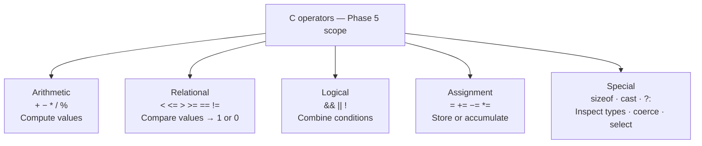

# Phase README — Navigation Calculations

> **Phase 05 — Operators and Expressions** | Calypso · Core C

Computing burn rate, time-to-destination, and approach safety — arithmetic, relational, and logical operators in C.

Calypso can display every sensor reading on the boot report, but the flight computer cannot act on any of them yet. A fuel level and a burn rate are two numbers sitting next to each other — the computer cannot tell you how long the fuel will last unless it can subtract, divide, and compare. An approach velocity is just a `float` unless there is a check that compares it to a safe limit and evaluates `true` or `false`. This phase adds the inline navigation calculations that the boot sequence performs: burn rate from consumed fuel and elapsed time, hours remaining to destination, and a compound check that combines velocity and fuel margin into a single approach-safe verdict.

All three calculations are written directly in `main.c` rather than as separately defined blocks. That works at this scale, but by the end of the phase you can see the cost: the calculations are mixed in with the display code, and the threshold values are buried in the middle of a long expression. How to give a named scope to a reusable sequence of calculations is the question Phase 8 answers.

> **A note on scope.** This phase covers arithmetic, relational, logical, assignment, and special operators (`sizeof`, cast, `?:`). Bitwise operators (`&`, `|`, `^`, `~`, `<<`, `>>`) operate on binary patterns rather than values; their first genuine use case — controlling individual bits in the engine hardware register — arrives in Phase 6.

---

## 🗺️ Contents

- [Branch sequence](#-branch-sequence)
- [Solutions to previous challenges and thought pieces](#-solutions-to-previous-challenges-and-thought-pieces)
- [Why we made this decision](#-why-we-made-this-decision)
- [What we built in the previous branch](#-what-we-built-in-the-previous-branch)
- [What we're doing in this branch](#-what-were-doing-in-this-branch)
- [Learning goals](#-learning-goals)
- [Key concepts](#-key-concepts)
- [What to notice in the code](#-what-to-notice-in-the-code)
- [What this phase revealed](#-what-this-phase-revealed)
- [Running this branch](#-running-this-branch)
- [Challenges for students](#-challenges-for-students)
- [Thought pieces for the next branch](#-thought-pieces-for-the-next-branch)

---

## 📍 Branch sequence

| Branch | What it introduces | Abstraction level |
|---|---|---|
| `main` | Project scaffold — compiles and runs | Scaffold only |
| `phase-01_boot-and-io` | First program · `printf` / `scanf` · compilation model | Raw I/O |
| `phase-02_debugging` | `printf` tracing · VS Code debugger · three C error categories | — |
| `phase-03_integer-types` | `stdint.h` fixed-width types · `PRIu16` format specifiers · overflow guards | — |
| `phase-04_compound-types` | `float` / `double` · `bool` · `enum MissionPhase` · `typedef sensor_float_t` | — |
| `📌 phase-05_operators` | **Arithmetic · relational · logical · `sizeof` · explicit casts** | — |
| `phase-06_bitwise` | Bitmasks · `ENGINE_CTRL` register · `1u << n` shift pattern | — |
| `phase-07_control-flow` | `while(1)` command loop · `switch` on mission phase · `goto` emergency shutdown | — |
| `phase-08_functions` | `sensors.c` / `engine.c` / `navigation.c` split · prototypes · pass-by-value | Modular |
| `phase-09_arrays` | Circular sensor history buffers · `sizeof` element count · `array[i]` ≡ `*(array + i)` | — |
| `phase-10_pointers` | `&` / `*` · pointer arithmetic · `const T*` vs `T* const` · `**` | — |
| `phase-11_strings` | `char` arrays · `strncpy` / `strcmp` / `strlen` · null terminator | — |
| `phase-12_structs` | `crew_member_t` · `spacecraft_t` · dot / arrow notation · nested structs | — |
| `phase-13_dynamic-memory` | `malloc` / `realloc` / `free` · dynamic crew roster · `NULL` checks | — |
| `phase-14_embedded-patterns` | `volatile` · memory-mapped I/O pointer · struct bitfields · `const` ROM data | Hardware abstraction |
| `phase-15_preprocessor` | `#define` constants · include guards · `#ifdef DEBUG_TELEMETRY` · function-like macro | — |
| `phase-16_file-io` | `fopen` / `fprintf` / `fwrite` · `calypso.log` · binary checkpoint | — |

---

## ✅ Solutions to previous challenges and thought pieces

### How challenges work

Additive challenges from the previous branch are solved in the first commit of this
branch — look for the `SOLUTION:` commit at the top of this branch's git history.
Analytical challenges and thought pieces are answered below.

```bash
git log --oneline          # find the SOLUTION commit hash
git show <hash>            # inspect the solution in isolation
```

### Challenge 1 — Does `float` store 32.7 exactly, and is `==` reliable?

`float` cannot store 32.7 exactly. The IEEE-754 mantissa has 23 bits of precision — roughly 7 significant decimal digits — and 32.7 in binary is a repeating fraction, so the stored value is the nearest representable number (approximately 32.70000076). Comparing two `float` values with `==` is unreliable for the same reason: two computations that ought to produce the same result may differ by one bit in the mantissa. The idiomatic test is `fabsf(a - b) < epsilon`, where `epsilon` is chosen to match the precision your use case requires.

### Challenge 2 — `LAUNCH + 1`: does it equal `CRUISE`, and should you depend on that?

`LAUNCH + 1` evaluates to the integer `2`, which is the integer value assigned to `CRUISE` — so today it produces the right answer. But it is fragile. If a new state (`INSERTION`, say) is inserted between `LAUNCH` and `CRUISE` in the future, `LAUNCH + 1` now evaluates to `INSERTION` without any compiler warning; the name `CRUISE` still holds `3`, but the expression still returns `2`. Code that relies on enum arithmetic silently advances to the wrong state. Always use named constants in comparisons and assignments — `current_phase = CRUISE` — and never depend on the arithmetic between enum values.

### Challenge 3 — Additive: `cabin_pressure_kpa` sensor

Solved in the SOLUTION commit. See `main.c` — the `// SOLUTION (Challenge 3):` comment marks the `cabin_pressure_kpa` variable, the `%10.3f` format specifier, the `< 80.0f || > 120.0f` range check, and the ternary `sensor_fault` print. At the initialised value of 101.325 kPa the guard does not trigger, so `sensor_fault` remains `false`.

### Challenge 4 — Why does `char shuttle_id[8]` need to be 8 elements wide?

The string `"CAL-007"` is 7 printable characters plus one null terminator (`'\0'`) — 8 bytes in total. The null terminator is how `printf`'s `%s` specifier knows where the string ends: it reads bytes until it encounters `'\0'`. If you declare `char shuttle_id[7]`, the compiler may silently omit the null terminator. When `printf` then reads past position 6, it continues into adjacent stack memory — a buffer overread with non-deterministic output that may print garbage, crash, or appear to work on one run and fail on the next.

### Challenge 5 — Additive (stretch): element assignment vs array-name assignment

Solved in the SOLUTION commit for the `shuttle_id[6] = '9'` change. An array name in C is a non-modifiable lvalue — it represents the fixed address of the first element, baked in at compile time. Writing `shuttle_id = "NEW-001"` asks the compiler to change what address `shuttle_id` refers to, which is not possible for arrays. An individual element like `shuttle_id[6]` is a modifiable lvalue — it refers to a specific byte in memory — so assignment to it works normally.

### Thought piece 1 — What operator categories does C provide?

C operators fall into six main categories: arithmetic (`+`, `-`, `*`, `/`, `%`), relational (`<`, `<=`, `>`, `>=`, `==`, `!=`), logical (`&&`, `||`, `!`), bitwise (`&`, `|`, `^`, `~`, `<<`, `>>`), assignment (`=`, `+=`, `-=`, etc.), and special operators including `sizeof`, the cast operator, and the ternary `?:`. The categories matter because they operate on different representations: arithmetic and relational operate on values; bitwise operators operate on individual bits within the binary pattern (Phase 6); logical operators treat any non-zero value as true.

### Thought piece 2 — What is the result type of `fuel_consumed / burn_rate` when the types differ?

When `uint16_t fuel_consumed` is divided by `sensor_float_t burn_rate` (`float`), C applies the usual arithmetic conversions: `uint16_t` is promoted to `float` first, then the division produces a `float` result. C does not warn about this — the promotion is implicit and silent. Values up to 65,535 fit exactly in a `float` (the 23-bit mantissa can represent all integers up to 2²⁴ = 16,777,216 without error), so the result is correct in this specific case. The risk appears with signed/unsigned integer mixing: a `uint32_t` combined with an `int32_t` in a comparison can produce counterintuitive results that compile without warning.

### Thought piece 3 — `current_phase = LAUNCH + 1`: could you, and should you?

See Challenge 2 above — the answer is the same. `LAUNCH + 1` evaluates to `2`, and assigning `2` to `current_phase` compiles because the compiler stores an `enum` variable as `int`. It produces the right answer today and the wrong answer silently if the sequence changes. Use `current_phase = CRUISE`.

---

## 💡 Why we made this decision

### Operators as the language of computation

The boot report so far has been purely declarative: values are assigned to variables and then printed. The flight computer becomes useful when it can answer operational questions — how fast is fuel being consumed, how long until arrival, is the approach safe. These require arithmetic, comparison, and logical combination working together.

C's operator set is divided into categories with distinct purposes:



Bitwise operators are deliberately absent here. They operate on binary patterns rather than on values, and no calculation in this phase requires them. Their first genuine requirement — enabling or disabling individual thruster bits in the engine control register — appears in Phase 6.

### Integer vs float division: the most common silent error

`10 / 3` in C evaluates to `3`, not `3.333...`. When both operands are integer types, `/` performs integer division — the fractional part is discarded without rounding or warning. This is the single most common source of silent wrong answers in C arithmetic because the result is a valid integer, not a crash or a NaN.

The fix is to ensure at least one operand is a float type before the division takes place. The explicit cast `(sensor_float_t)consumed_kg / mission_elapsed_s` promotes `consumed_kg` to `float` first; the compiler then promotes `mission_elapsed_s` to match, and the division is float division throughout. The cast goes on the numerator because that is the operand whose type would otherwise drive the operation to integer division — and naming the cast makes the intent visible to the next reader.

---

## ⏮️ What we built in the previous branch

`phase-04_compound-types` extended the sensor suite with the types that integer types cannot represent. `sensor_float_t velocity_kms` and `sensor_float_t distance_au` hold fractional sensor values using the IEEE-754 `float` encoding; `double velocity_kms_precise` sits alongside for precision comparison. `enum MissionPhase` replaced the raw integer phase counter with five named constants (`PREFLIGHT` through `DOCKED`). `bool sensor_fault` from `<stdbool.h>` replaced a plain `int` flag. `typedef float sensor_float_t` created a domain-readable alias for `float`. The Challenge 3 SOLUTION added `cabin_pressure_kpa` with a float range check; the Challenge 5 SOLUTION demonstrated single-element array assignment with `shuttle_id[6] = '9'`.

---

## 🎯 What we're doing in this branch

- Add a `/* --- Navigation calculations --- */` section to `main.c` with three inline computation blocks
- Compute `burn_rate_kgs` using `(sensor_float_t)consumed_kg / mission_elapsed_s` — explicit cast to force float division
- Compute `hours_to_dest` using `distance_to_destination_km / (velocity_kms * 3600.0f)` — parentheses to control evaluation order
- Compute `bool approach_safe` by combining a velocity threshold and a fuel margin check with `&&`
- Print `sizeof(sensor_float_t)` and `sizeof(uint16_t)` to make the byte sizes of sensor types visible
- Demonstrate prefix increment (`++sensor_index`) and postfix increment (`sensor_index++`) on a sensor index counter
- Use compound assignment (`+=`) to accumulate a running fuel total across two simulated burn periods
- Apply `%` (modulo) to derive a sensor cycle phase from a running counter

---

## 🧑🏻‍🏫 Learning goals

### Understand
- **Differentiate** between the five operator categories in scope for this phase — arithmetic, relational, logical, assignment, and special — and describe what each category operates on
- **Explain** implicit type promotion: how C converts a `uint16_t` to `float` when it appears alongside a `float` operand, why the promotion is silent, and when it can produce a wrong result

### Apply
- **Use** arithmetic operators (`+`, `-`, `*`, `/`, `%`) in the navigation calculations — including the explicit cast that forces float division when both sensor values are otherwise integer types
- **Apply** relational operators (`<`, `<=`, `>`, `>=`) to check velocity and fuel thresholds in the approach safety condition
- **Use** logical operators (`&&`, `||`, `!`) to combine two sensor conditions into a single `bool approach_safe` verdict
- **Apply** compound assignment operators (`+=`) to accumulate a running fuel total
- **Use** `sizeof` on `sensor_float_t` and `uint16_t` to inspect and print the byte sizes of Calypso's sensor types
- **Apply** explicit type casting from `uint16_t` to `sensor_float_t` before a division to prevent integer truncation
- **Apply** operator precedence rules — use parentheses in `hours_to_dest` to make evaluation order explicit and verifiable

### Analyze
- **Examine** the burn rate calculation with and without the explicit cast — what integer result does truncation produce, and why does it look plausible rather than obviously wrong?
- **Compare** prefix (`++sensor_index`) and postfix (`sensor_index++`) increment in a context where the value is used in the same expression — what is the difference in the observed output?

---

## 🔑 Key concepts

| Concept | Plain English |
|---|---|
| **Arithmetic operators** | `+`, `-`, `*`, `/`, `%` — perform calculations on numeric values. `/` between two integer operands truncates toward zero; `/` with at least one `float` operand produces a `float` result. |
| **Integer division** | When both operands of `/` are integer types, C discards the fractional part without rounding and without warning. `7 / 2` is `3`, not `3.5`. |
| **Relational operators** | `<`, `<=`, `>`, `>=`, `==`, `!=` — compare two values and produce `1` (true) or `0` (false) as a plain `int`. The result is typically used directly in a condition. |
| **Logical operators** | `&&` (AND), `\|\|` (OR), `!` (NOT) — combine or invert conditions. `&&` is false if either operand is zero; `\|\|` is true if either is non-zero. Both short-circuit: if the left operand determines the result, the right operand is not evaluated. |
| **Short-circuit evaluation** | With `a && b`, if `a` is false, `b` is never evaluated. With `a \|\| b`, if `a` is true, `b` is never evaluated. This is guaranteed by the C standard, not just an optimisation. |
| **Implicit type promotion** | When operands of different types appear in an expression, C converts the smaller or narrower type to match the larger one before the operation. A `uint16_t` combined with a `sensor_float_t` becomes `sensor_float_t`. The original variable is unchanged. |
| **Explicit cast** | `(sensor_float_t)consumed_kg` converts the value to `float` before the division. It makes the promotion visible in the source and ensures the compiler does not perform integer division when both operands would otherwise be integers. |
| **`sizeof`** | A compile-time operator that returns the byte size of a type or variable as a `size_t`. `sizeof(sensor_float_t)` is `4`; `sizeof(uint16_t)` is `2`. It is evaluated entirely by the compiler — no code runs at runtime. |
| **Compound assignment** | `+=`, `-=`, `*=`, `/=` are shorthand for read-modify-write: `total += reading` means `total = total + reading`. The left operand is evaluated once, not twice. |
| **Operator precedence** | The rules that determine which sub-expressions are evaluated first when parentheses are absent. `*` and `/` bind more tightly than `+` and `-`. Parentheses override precedence and make intent explicit. |

---

## 🔍 What to notice in the code

**[`main.c` — burn rate and integer division demo](main.c)**
The `burn_rate_kgs` line shows the explicit cast pattern: `(sensor_float_t)consumed_kg / mission_elapsed_s`. The two `demo_a / demo_b` lines immediately below it exist specifically because `50 / 10` divides evenly — the truncation would be invisible with those values. With `7 / 2`, integer division produces `3` and float division produces `3.5`, making the difference concrete.

**[`main.c` — `hours_to_dest` and operator precedence](main.c)**
The block comment above `hours_to_dest` explains the precedence trap. `/` and `*` share equal precedence and associate left-to-right, so `distance / velocity * 3600` would evaluate as `(distance / velocity) * 3600` — giving a result in seconds, roughly 42 million hours. The parentheses around `(velocity_kms * 3600.0f)` force the multiplication first and produce the correct km / (km/h) form. This is the standard pattern for any formula where an intermediate product must be computed before a division.

**[`main.c` — `approach_safe` with `&&`](main.c)**
Both sub-expressions are wrapped in their own parentheses — `(velocity_kms <= 2.0f)` and `(fuel_level >= 50)` — before being combined with `&&`. The `printf` lines below it print each condition independently so you can see that velocity is `false` (32.70 > 2.0) and fuel is `true` (950 >= 50), confirming that `approach_safe` is `NO` and that the short-circuit fired after the first condition.

**[`main.c` — `sizeof` usage](main.c)**
`sizeof(sensor_float_t)` and `sizeof(double)` print `4` and `8` respectively, making the memory cost of the precision difference from Phase 4 visible. The cast to `(unsigned)` before the `%u` format specifier is a portability measure: `sizeof` returns `size_t`, which is 64 bits on most modern platforms and would mismatch a `%u` without the cast. The values are small enough (4 and 8) that the cast loses nothing.

**[`main.c` — prefix vs postfix increment](main.c)**
The results are assigned to `pre_val` and `post_val` rather than passed directly to `printf`. This matters: if both `++sensor_index` and `sensor_index` were arguments to the same `printf` call, the order of argument evaluation would be unspecified — that is undefined behaviour in C. Assigning first, then printing, keeps the evaluation order explicit and safe.

**[`main.c` — compound assignment and modulo](main.c)**
`total_fuel_used += consumed_kg` followed by `total_fuel_used += 15` accumulates 50 + 15 = 65 kg across two separate statements — the typical pattern for running totals. The `sensor_cycle % 4` block shows how modulo produces a periodic counter: `5 % 4 = 1` (skip) and `8 % 4 = 0` (update due), demonstrating both a non-zero and zero remainder in sequence.

---

## 🔗 What this phase revealed

By the end of this phase, the navigation section of `main.c` is a flat sequence of variable declarations, arithmetic expressions, and `printf` calls. Each block has a clear intent — computing burn rate, computing time to destination, checking approach safety — but that intent is visible only through comments, not through the structure of the code itself. The threshold values (`2.0f`, `50`) and the intermediate results (`hours_to_dest`, `approach_safe`) are all visible to the entire `main` scope, even though nothing outside the navigation block uses them.

> **LEARNING MOMENT:** A sequence of calculations that takes defined inputs and produces a named result has a natural structure — it is logically self-contained. The mechanism C provides for packaging that structure, giving it a name, its own scope, and a defined output, is introduced in Phase 8. The friction you feel reading this phase's code — "I can see what this block does, but the language does not name it" — is exactly what that phase is designed to resolve.

---

## ▶️ Running this branch

**Prerequisites:** GCC or Clang (C99+) and CMake 3.10+, or just GCC/Clang on its own.

**With CMake (recommended):**
```bash
cmake -B build
cmake --build build
.\build\Debug\calypso.exe   # Windows (MSVC)
.\build\calypso.exe         # Windows (MinGW)
./build/calypso             # Linux / macOS
```

**Direct compilation (no CMake):**
```bash
gcc -std=c99 main.c -o calypso
./calypso
```

The program prints the boot banner, the full sensor suite (including the deliberate out-of-range fault messages), and then the navigation section. When prompted for a command and crew ID, enter any single character for each. The navigation output is the new section for this phase.

**Expected navigation output:**
```
--- Navigation ---
Burn rate            :   5.00 kg/s
  int div  7 / 2     : 3    (truncated -- remainder discarded)
  float div 7 / 2    : 3.5  (explicit cast preserves remainder)

Hours to destination :     3.27 h

Approach safe        : NO
  velocity (32.70 km/s) <= 2.0   : false
  fuel (950 kg) >= 50             : true

Type sizes:
  sizeof(sensor_float_t) = 4 bytes
  sizeof(uint16_t)       = 2 bytes
  sizeof(double)         = 8 bytes

Prefix  ++sensor_index : result = 1, sensor_index = 1
Postfix sensor_index++ : result = 0, sensor_index = 1

Total fuel used      : 65 kg  (accumulated with +=)

Sensor cycle = 5 : % 4 = 1  [skip]
Sensor cycle = 8 : % 4 = 0  [update due]
```

---

## ✏️ Challenges for students

**Challenge 1 — Analytical**
The `hours_to_dest` calculation is written as `distance_to_destination_km / (velocity_kms * 3600.0f)`. Why does the parenthesisation matter here? Write out what the expression `distance_to_destination_km / velocity_kms * 3600.0f` would evaluate to without the parentheses, using the actual values from the code. Is it the same result? What operator precedence rule explains the difference?

**Challenge 2 — Analytical**
The approach safety check uses `&&` to combine a velocity condition and a fuel condition. What does short-circuit evaluation guarantee about the right operand when the left operand is false? Write a hypothetical two-part condition where short-circuit behaviour prevents a divide-by-zero — and explain why that guarantee matters for the correctness of compound conditions in C.

**Challenge 3 — Additive**
Add a `fuel_efficiency` variable of type `sensor_float_t` that divides `distance_to_destination_km` by `fuel_level` to produce km per kg of fuel. First compute the division without any cast and print the result. Then add an explicit cast on the numerator and print again. Add a comment explaining what changed and why the first version produces the value it does.

**Challenge 4 — Analytical**
`sizeof(sensor_float_t)` returns `4` and `sizeof(double)` returns `8`. In Phase 4 you saw that `float` gives roughly 7 significant decimal digits and `double` gives roughly 15. What is the relationship between byte size and available precision? Does doubling the bytes double the significant digits — and if not, why not?

**Challenge 5 — Additive (stretch)**
Add a `sensor_cycle` variable of type `uint8_t` initialised to `0`. Use `+=` to advance it by `5`. Then compute `sensor_cycle % 4` and store the result in a `uint8_t`. Print whether the result is zero using the ternary conditional — zero means the sensor is due for an update, non-zero means it is not. Now advance `sensor_cycle` by another `3` using `+=` and repeat the check. What values do you get, and do they match your expectation?

---

## 💭 Thought pieces for the next branch

1. The engine has eight thruster pairs, each controlled by a dedicated bit in a single 32-bit hardware register. Addition and subtraction cannot change one bit without affecting all the others. What operator can set exactly one bit without touching the rest?
2. Bits 4–7 of the engine register represent a 4-bit throttle level (values 0–15). How do you extract just those four bits — producing a result in the range 0–15 — without disturbing bits 0–3 or bits 8–31?
3. The logical AND operator `&&` in the approach safety check produces `1` or `0`. C also has a `&` operator. What does `&` do that `&&` does not, and why would applying `&` to the same sensor values produce a different result?

---

*Previous branch: [`phase-04_compound-types`]*
*Next branch: [`phase-06_bitwise`]*
