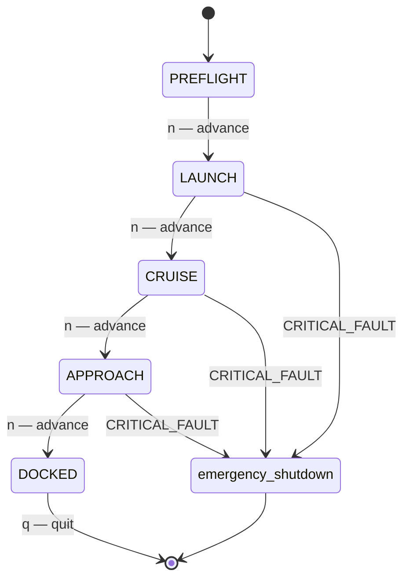

# Phase README — Mission State Machine

> **Phase 07 — Control Flow** | Calypso · Core C

Giving Calypso a persistent runtime loop, a mission state machine, and fault-response behaviour using C's control-flow constructs.

By the end of Phase 6, `main.c` can read sensors, run navigation calculations, and manipulate the engine register — but it executes from top to bottom and exits. A real flight computer does none of that. It runs continuously, waits for operator commands, enforces which mission-phase transitions are legal, and jumps immediately to an emergency shutdown if a critical fault fires. All three of those behaviours need control flow: a loop to keep the computer alive, a selection construct to branch on mission state, and a jump construct to escape a fault condition without returning through normal code. This phase introduces every major C control-flow construct and puts each one to work in the Calypso flight computer.

> **A note on scope.** All code remains in `main.c` — the sensor suite, navigation calculations, and engine register operations from earlier phases are already there. Named functions, separate source files, and module headers are the subject of Phase 8. If `main.c` starts to feel unwieldy, that observation is intentional — Phase 8 resolves it.

---

## 🗺️ Contents

- [Branch sequence](#-branch-sequence)
- [Solutions to previous challenges and thought pieces](#-solutions-to-previous-challenges-and-thought-pieces)
- [Why we made this decision](#-why-we-made-this-decision)
- [What we built in the previous branch](#-what-we-built-in-the-previous-branch)
- [What we're doing in this branch](#-what-were-doing-in-this-branch)
- [Learning goals](#-learning-goals)
- [Key concepts](#-key-concepts)
- [What to notice in the code](#-what-to-notice-in-the-code)
- [What this phase revealed](#-what-this-phase-revealed)
- [Running this branch](#-running-this-branch)
- [Challenges for students](#-challenges-for-students)
- [Thought pieces for the next branch](#-thought-pieces-for-the-next-branch)

---

## 📍 Branch sequence

| Branch | What it introduces | Abstraction level |
|---|---|---|
| `main` | Project scaffold — compiles and runs | Scaffold only |
| `phase-01_boot-and-io` | First program · `printf` / `scanf` · compilation model | Raw I/O |
| `phase-02_debugging` | `printf` tracing · VS Code debugger · three C error categories | — |
| `phase-03_integer-types` | `stdint.h` fixed-width types · `PRIu16` format specifiers · overflow guards | — |
| `phase-04_compound-types` | `float` / `double` · `bool` · `enum MissionPhase` · `typedef sensor_float_t` | — |
| `phase-05_operators` | Arithmetic · relational · logical · `sizeof` · explicit casts | — |
| `phase-06_bitwise` | Bitmasks · `ENGINE_CTRL` register · `1u << n` shift pattern | — |
| `📌 phase-07_control-flow` | **`while(1)` command loop · `switch` state machine · `goto` emergency shutdown** | — |
| `phase-08_functions` | `sensors.c` / `engine.c` / `navigation.c` split · prototypes · pass-by-value | Modular |
| `phase-09_arrays` | Circular sensor history buffers · `sizeof` element count · `array[i]` ≡ `*(array + i)` | — |
| `phase-10_pointers` | `&` / `*` · pointer arithmetic · `const T*` vs `T* const` · `**` | — |
| `phase-11_strings` | `char` arrays · `strncpy` / `strcmp` / `strlen` · null terminator | — |
| `phase-12_structs` | `crew_member_t` · `spacecraft_t` · dot / arrow notation · nested structs | — |
| `phase-13_dynamic-memory` | `malloc` / `realloc` / `free` · dynamic crew roster · `NULL` checks | — |
| `phase-14_embedded-patterns` | `volatile` · memory-mapped I/O pointer · struct bitfields · `const` ROM data | Hardware abstraction |
| `phase-15_preprocessor` | `#define` constants · include guards · `#ifdef DEBUG_TELEMETRY` · function-like macro | — |
| `phase-16_file-io` | `fopen` / `fprintf` / `fwrite` · `calypso.log` · binary checkpoint | — |

---

## ✅ Solutions to previous challenges and thought pieces

### How challenges work

Additive challenges from the previous branch are solved in the first commit of this
branch — look for the `SOLUTION:` commit at the top of this branch's git history.
Analytical challenges and thought pieces are answered below.

```bash
git log --oneline          # find the SOLUTION commit hash
git show <hash>            # inspect the solution in isolation
```

### Challenge 1 — Trace the clear-bit operation

Mask: `1u << 2 = 0b0100`. Complement: `~0b0100 = 0b1011`. AND with `reg = 0b1101`: `0b1101 & 0b1011 = 0b1001` — bit 2 (which was 1) is cleared; bits 0, 1, and 3 are unchanged. The AND truth table is the key: ANDing any bit with 1 produces the original value; ANDing with 0 forces the result to 0. The complement mask places a 0 only at the target bit position and 1 everywhere else, so only the target bit is affected.

### Challenge 2 — `1 << 31` on a 32-bit `int`

`1 << 31` shifts a 1 into the sign bit of a signed 32-bit `int`. The C standard (through C17) classifies this as undefined behaviour — the compiler is free to produce any result, and optimisers can eliminate surrounding code on the assumption that UB never occurs. GCC with `-Wall` or `-Wshift-overflow` will warn. `1u` is `unsigned int`, so `1u << 31` is always well-defined for a 32-bit target; the shift produces the largest power of 2 representable in `unsigned int`. On a target where `unsigned int` is 16 bits the safe maximum without the `(uint32_t)` cast is `1u << 15` — which is why the register operations always cast to `(uint32_t)` before shifting.

### Challenge 4 — Reversed throttle extraction ordering

With `ENGINE_CTRL = 0xA0u` (throttle field = 10, no thrusters set):

- **Code order** — `(0xA0 >> 4) & 0x0F`: right-shift first gives `0x0A = 10`, then masking with `0x0F` gives `10`. Correct.
- **Reversed order** — `(0xA0 & 0x0F) >> 4`: `THROTTLE_MASK = 0x0Fu` covers only bits 0–3. `0xA0 & 0x0F = 0x00` — the throttle field in bits 4–7 is entirely zeroed before the shift. Result: 0, not 10.

To make the reversed order correct, the in-place mask must cover bits 4–7: `(ENGINE_CTRL & (THROTTLE_MASK << THROTTLE_SHIFT)) >> THROTTLE_SHIFT`. `0x0F << 4 = 0xF0`. `0xA0 & 0xF0 = 0xA0`. `0xA0 >> 4 = 10`. The lesson: the mask must match the field's actual position in the register at the moment it is applied.

### Thought piece 1 — What construct maps a discrete state to a block of behaviour?

`switch`. A `switch` statement maps a single integer-valued expression — here an `enum MissionPhase` constant — to one of N labelled blocks. Each `case` label names the value directly, so `case LAUNCH:` reads as clearly as the enum constant itself. The compiler can warn if any enum value is missing a case (`-Wswitch`), giving free exhaustiveness checking. An `if`/`else if` chain could do the same job, but `switch` makes the intent explicit — you are selecting one of a known, finite set of alternatives — and the exhaustiveness warning catches the class of bugs where a new enum value is added without updating all switch sites.

### Thought piece 2 — How to express "run forever unless told to stop"

`while(1)` with `break` inside. In embedded systems, "run forever" is not a workaround — it is the intended behaviour. An MCU has no OS to return to; the loop body is the program. `while(1)` expresses this directly: the loop has no natural exit condition. The exit paths are made explicit at the exact points in the code where the decision is made: `break` on a user quit command, `goto` on a critical fault. A flag variable (`while(!quit)`) would require the flag to be correctly updated before every exit point and checked on every iteration; `while(1)` with `break` puts the exit logic where it belongs and leaves nothing implicit.

### Thought piece 3 — How to jump immediately to emergency shutdown

`goto`. `goto` transfers execution unconditionally to a labelled statement anywhere in the same function. For the emergency shutdown path, `goto emergency_shutdown` jumps immediately past all remaining command-loop iterations to the cleanup block before `return`. The alternative — setting a `critical_fault_detected` flag and testing it at every branch point in the loop — requires the flag to be checked correctly in every code path; one missed check means the loop continues past the fault condition. `goto` to a single cleanup label is the recognised C idiom for this pattern; it appears throughout the Linux kernel and embedded firmware precisely because the jump is unambiguous and the cleanup code runs exactly once.

---

## 💡 Why we made this decision

### The flight computer needs a persistent runtime

A program that executes top-to-bottom and exits is not a flight computer — it is a one-shot report. The computer must run continuously: accept commands, check sensor state on every cycle, enforce mission rules, and only exit when explicitly told to or when a fault forces a controlled shutdown. `while(1)` is the C idiom for this. It expresses "this loop has no natural endpoint" without needing a flag variable or a sentinel value. The two defined exit paths — `break` on a quit command, `goto` on a critical fault — are placed exactly where the exit decisions are made, not polled at the top of each iteration.

### Discrete states need a selection construct designed for them

The `MissionPhase` enum has five named constants. `switch` is the right construct for this: each `case` label names the value it handles, the compiler can verify that every enum value is covered, and the fall-through mechanism provides a documented way to share behaviour between adjacent cases. In this codebase, `LAUNCH` falls through to `CRUISE` because both phases require the same engine-active monitoring block — the `LAUNCH` case prints its own header and then deliberately falls into the `CRUISE` body. That is not a bug; it is the fall-through pattern used intentionally. The `/* FALLTHROUGH */` comment makes the intent explicit so that a future reader — and a compiler warning — can distinguish it from an accidental omission of `break`.

The five-phase progression enforced by the `switch` forms a state machine: each state defines what operations are legal and what the valid next state is.



### `goto` for the emergency shutdown path

`goto` is one of C's most contested constructs. In general application code it should be avoided because it makes control flow hard to follow. But jumping to a single labelled cleanup point before exit is a well-recognised exception in C systems programming — used throughout the Linux kernel and embedded firmware precisely because the jump is unconditional, unambiguous, and produces no intermediate state. The flight computer uses exactly this pattern: if `CRITICAL_FAULT` is detected anywhere during the command loop, `goto emergency_shutdown` jumps immediately past all remaining loop iterations to a block that clears the engine register and exits cleanly. The alternative — a flag variable checked at every branch — risks the flag being missed in a path added later.

---

## ⏮️ What we built in the previous branch

`phase-06_bitwise` added `ENGINE_CTRL` and `ENGINE_STATUS` as `uint32_t` register simulations. Bitmask operations — set (`|=`), clear (`&=`), toggle (`^=`), and test (`& ... != 0`) — were applied to individual bits using the `(uint32_t)1u << N` shift pattern. The throttle field in bits 4–7 was written with a shifted value and read back by right-shifting and masking with `THROTTLE_MASK`. Fault flags in `ENGINE_STATUS` were set and tested. The SOLUTION commit added thruster 1 enable and throttle-to-10 (Challenge 3), and the `BATTERY_LEVEL` field in `ENGINE_STATUS` bits 4–7 (Challenge 5).

---

## 🎯 What we're doing in this branch

- Wrap all runtime logic in a `while(1)` command loop that runs until the user quits or a critical fault fires
- Use a `do-while` loop to validate command input — the prompt re-appears if the user enters an unrecognised character
- Add a `switch` on `current_phase` with `break` for each normal case and one documented intentional fallthrough from `LAUNCH` into `CRUISE`
- Write `if`/`else if`/`else` chains for sensor threshold checks inside the command loop
- Use the ternary operator for compact status-string selection (fault flag and phase name display)
- Add a `for` loop over a small sensor readings array; use `continue` to skip faulted sensors
- Use `break` to exit the command loop on a quit command
- Add a `goto emergency_shutdown` for the critical-fault path, jumping to a cleanup label before `return`

---

## 🧑🏻‍🏫 Learning goals

### Understand
- **Explain** fallthrough behaviour in `switch` — what happens when `break` is omitted, and how to distinguish an intentional fallthrough (with a `/* FALLTHROUGH */` comment) from a bug
- **Explain** how `do-while` guarantees at least one execution of the loop body before the condition is tested, and why that guarantee matters for the command input validator
- **Explain** how `continue` behaves differently in a `for` loop (jumps to the increment expression) versus a `while` loop (jumps to the condition check)
- **Explain** the role of `while(1)` in embedded and systems C — why an intentional infinite loop is the correct structure for a program with no natural exit point

### Apply
- **Write** `if`/`else if`/`else` chains for sensor threshold decisions in the status scan
- **Use** the ternary operator to select a status string from a boolean condition without an `if` block
- **Write** a `switch` on `MissionPhase` using `enum` constants as case labels, with `break` and one documented intentional fallthrough
- **Implement** a `while(1)` command loop, a `do-while` input validator, and a `for` sensor scan with `continue`
- **Use** `break` to exit the command loop and `goto` to jump to the emergency shutdown label

### Analyze
- **Examine** the `switch` on `MissionPhase` and explain why `enum` constants as case labels are more maintainable than integer literals
- **Compare** `break` used inside a `switch` versus `break` used inside a loop — what does each one exit?

---

## 🔑 Key concepts

| Concept | Plain English |
|---|---|
| **`if` / `else if` / `else`** | Executes the first branch whose condition is true; subsequent branches are skipped. If no condition matches and an `else` is present, that block runs. |
| **Ternary operator (`?:`)** | A compact single-expression alternative to `if`/`else` that produces a value: `condition ? value_if_true : value_if_false`. |
| **`switch` / `case` / `break`** | Matches an integer expression against a list of constant labels. Execution starts at the matching label and continues — falling through — until a `break`, `return`, or the end of the `switch` body. |
| **Intentional fallthrough** | When `break` is deliberately omitted so that one `case` block continues into the next. Must be documented with a `/* FALLTHROUGH */` comment so it can be distinguished from a forgotten `break`. |
| **`while(1)` infinite loop** | A loop with a condition that is always true. The standard idiom for "run until an explicit exit is reached" in embedded and systems code. Exits via `break`, `return`, or `goto`. |
| **`do-while`** | A loop that tests its condition after the body executes, guaranteeing at least one iteration regardless of the initial state. Used when the loop body must run once before any check is meaningful. |
| **`for` loop** | Bundles initialisation, condition, and increment into one line. `continue` inside a `for` loop jumps to the increment expression before re-testing the condition. |
| **`break`** | Exits the innermost enclosing `switch`, `for`, `while`, or `do-while`. Does not exit nested structures beyond the immediately enclosing one. |
| **`continue`** | Skips the rest of the current loop iteration. In `for`, jumps to the increment; in `while` and `do-while`, jumps directly to the condition check. |
| **`goto` and labels** | Unconditionally transfers execution to a named label in the same function. The legitimate use case in C is jumping to a single cleanup label before exit — the emergency-shutdown pattern. |

---

## 🔍 What to notice in the code

**[`main.c:353`](main.c#L353) — `while(1)` command loop**
The loop has no exit condition in its header — exit is entirely via `break` (line 376, quit command) or `goto` (lines 384 and 481, fault paths). This is the embedded-systems structure: the loop body is the program, and every exit path is named explicitly at the point where the decision is made.

**[`main.c:365–372`](main.c#L365) — `do-while` input validator**
The body reads a character and checks it before the condition is tested. The `'\0'` initialiser on `cmd` is a defensive floor against `scanf` returning EOF on a closed pipe — it is not a sentinel the loop depends on. In normal terminal operation, the do-while guarantee means `cmd` is always set by a real `scanf` read before it is used. Challenge 2 asks you to rewrite this as a plain `while` and identify what extra setup code is required.

**[`main.c:355–360`](main.c#L355) and [`main.c:427–435`](main.c#L427) — ternary chains**
Both phase-name ternary chains produce a string value without an `if` block. The pattern `(condition) ? "value" : (next condition) ? ...` chains as many cases as needed; the final `: "UNKNOWN"` is the catch-all arm. Ternary is the right tool when every branch produces a value and none has side effects.

**[`main.c:397–421`](main.c#L397) — `switch` with intentional fallthrough**
`case LAUNCH` prints the launch-specific line, then falls through into `case CRUISE` — there is no `break` between them. The `/* FALLTHROUGH */` comment documents the intent so a future reader (and `-Wimplicit-fallthrough`) can distinguish this from a forgotten `break`. When `current_phase == LAUNCH`, both the LAUNCH printf and the "Active burn" printf execute; when `current_phase == CRUISE`, only "Active burn" executes. Phase advancement happens after the switch (lines 425–436), not inside it, keeping the fallthrough body free of state mutations.

**[`main.c:458–471`](main.c#L458) — `for` loop with `continue`**
`continue` at line 461 skips the classification and printing for a faulted sensor. In a `for` loop, `continue` jumps to the increment expression (`i++`) before re-testing the condition — Challenge 4 asks what it jumps to in a `while` loop instead.

**[`main.c:380–385`](main.c#L380) and [`main.c:481–488`](main.c#L481) — `goto emergency_shutdown`**
Two paths use `goto`: the `'e'` command (explicit request) and the end-of-cycle fault check (implicit trigger). Both jump to the same `emergency_shutdown:` label at line 488, which clears `ENGINE_CTRL` to zero and exits. The `'q'` → `break` path does not hit the label — it falls through to the normal-shutdown `printf` and `return 0` instead, giving two distinct exit sequences from one function.

---

## 🔗 What this phase revealed

By the end of this phase, `main.c` handles the boot sequence, sensor reads, navigation calculations, engine register operations, the command loop, the mission state machine, the sensor scan loop, and the emergency shutdown path — all in one file, all in one scope. Every threshold value, every fault condition, every valid phase transition is a raw value written inline. There is no boundary between the sensor layer and the engine layer; nothing prevents one code path from silently overwriting `ENGINE_CTRL` in a way that conflicts with another.

> **LEARNING MOMENT:** The friction you feel reading this file is the problem Phase 8 solves. Wrapping related operations in named functions with explicit parameters would give each operation an identity, hide the implementation detail, and make accidental interference between code paths much harder. The monolithic file is not a mistake — it is a deliberate accumulation so that the value of modularisation is visible from the diff.

---

## ▶️ Running this branch

**Prerequisites:** GCC or Clang (C99+) and CMake 3.10+, or just GCC/Clang on its own.

**With CMake (recommended):**
```bash
cmake -B build
cmake --build build
.\build\Debug\calypso.exe   # Windows (MSVC)
.\build\calypso.exe         # Windows (MinGW)
./build/calypso             # Linux / macOS
```

**Direct compilation (no CMake):**
```bash
gcc -std=c99 main.c -o calypso
./calypso
```

The program prints the boot banner, the full sensor suite, the navigation calculations, and the engine control section from previous phases, then enters the command loop. Commands:

| Command | Action |
|---|---|
| `n` | Advance the mission phase (`PREFLIGHT → LAUNCH → CRUISE → APPROACH → DOCKED`) |
| `s` | Run the periodic sensor scan (three sensors, one faulted — watch `continue` skip it) |
| `e` | Trigger the emergency shutdown via `goto` |
| `q` | Normal quit via `break` |

Any unrecognised character re-prompts (the `do-while` validator).

**Expected output excerpt — LAUNCH → CRUISE phase advance (showing intentional fallthrough):**
```
[LAUNCH] Command (n/s/e/q): n
  Launch: ignition sequence active
  Active burn: throttle=10 | fuel=950 kg | STATUS=0x00000000
  >> Phase advanced to CRUISE
```

**Expected output — emergency shutdown:**
```
[LAUNCH] Command (n/s/e/q): e
EMERGENCY COMMAND RECEIVED -- initiating shutdown

--- EMERGENCY SHUTDOWN ---
ENGINE_CTRL cleared    : 0x00000000
ENGINE_STATUS          : 0x00000005
Calypso offline.
```

---

## ✏️ Challenges for students

**Challenge 1 — Analytical**
The `switch` on `MissionPhase` has an intentional fallthrough from `LAUNCH` into `CRUISE`. List, in order, every `printf` call that executes when `current_phase == LAUNCH`. Then explain what a compiler warning about implicit fallthrough (`-Wimplicit-fallthrough`) is telling you — and why this particular fallthrough is documented as intentional rather than flagged as a bug.

**Challenge 2 — Analytical**
The command input uses a `do-while` loop. Rewrite it as a plain `while` loop that behaves identically. What extra line do you need to add before the loop, and why does the `do-while` form eliminate that line?

**Challenge 3 — Additive**
The sensor scan loop uses `continue` to skip faulted sensors. Add a second threshold check inside the loop: if a sensor reading exceeds a `HIGH_WARN` value (use `2000.0f`), set `TEMP_WARNING_BIT` in `ENGINE_STATUS` using the `|=` bitmask pattern from Phase 6, then `continue` to skip the normal output line for that sensor and print a warning message instead. Print `ENGINE_STATUS` in hex after the loop to confirm the bit was set.

**Challenge 4 — Analytical**
In the sensor scan `for` loop, `continue` jumps to `i++` before re-checking `i < SENSOR_COUNT`. If you rewrote the same loop as a `while` loop, where would `continue` jump instead? Rewrite the loop as a `while` — mark clearly in your version where `continue` lands — and explain what you must add to prevent the loop from hanging on the iteration where `continue` fires.

**Challenge 5 — Additive (stretch)**
The `emergency_shutdown` block currently clears `ENGINE_CTRL` to zero and prints the register value, but gives no indication of which thrusters were active at the moment of shutdown. Extend the block: before clearing the register, add a `for` loop over bit positions 0–3 and use the bitmask test pattern from Phase 6 to check which thruster bits are set. For each active thruster, print its number. The four bit-position constants `THRUSTER_0_BIT` through `THRUSTER_3_BIT` are already declared.

---

## 💭 Thought pieces for the next branch

1. `main.c` is now several hundred lines — sensor reads, register operations, state transitions, and command handling all share one file and one scope. What are the risks of letting a single source file keep growing? When does a monolithic `main.c` become a maintenance liability?
2. Multiple places in `main.c` write to `ENGINE_CTRL` directly. If two code paths make conflicting writes — say, the normal phase transition and a fault-recovery path — which one wins? Is there a way in C to restrict which code is allowed to write to the register?
3. The critical fault temperature threshold appears in two separate `switch` cases. If you need to change it, you update two places — and risk them falling out of sync. How does C let you define a constant once and use it everywhere it is needed? (This question is answered in Phase 15.)

---

*Previous branch: [`phase-06_bitwise`]*
*Next branch: [`phase-08_functions`]*
