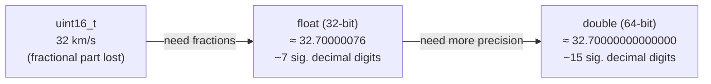
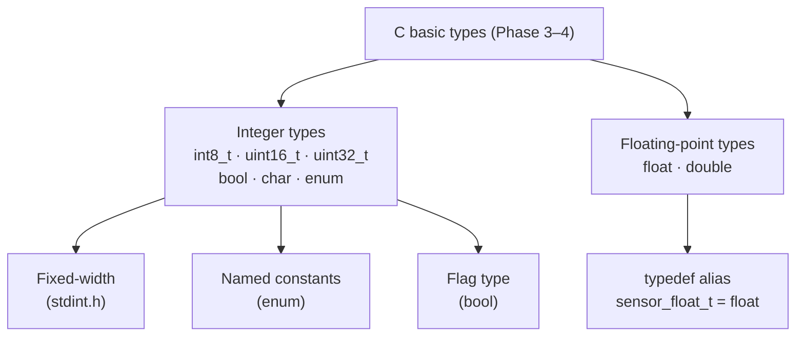

# Phase README — Full Sensor Suite

> **Phase 04 — Floating-Point, Characters, and Compound Types** | Calypso · Core C

Introducing `float`, `bool`, `enum`, and `typedef` — the types that make fractional sensor values, named mission states, and self-describing flags possible.

The integer sensors are now correctly typed, but three new requirements have surfaced that integer types cannot satisfy. The velocity sensor reads 32.7 km/s: `uint16_t` can hold 32 or 33, but not the fractional part, and no combination of integer arithmetic recovers what was lost. The mission phase is an `int` counting from zero — a function that receives the value `4` has no way to know whether it is a mission phase, a sensor ID, a crew count, or a loop iteration. And the sensor fault flag is stored as a `1` or `0` `int` that carries no indication of what it represents or what values it can legally hold.

This phase introduces the remaining basic types. `float` and `double` give Calypso fractional sensor values using the IEEE-754 representation — a compact encoding that covers an enormous range by trading precision for breadth. `enum MissionPhase` wraps the raw integer sequence in named constants, making `PREFLIGHT` self-describing where `0` was not. `bool` from `<stdbool.h>` gives fault flags a dedicated type whose legal values are exactly `true` and `false`. And `typedef` creates `sensor_float_t`, a named alias for `float` that makes the sensor domain visible in declarations without changing the underlying type. By the end of this phase, every value in the boot report has a type that matches what it represents.

> **A note on scope.** This phase introduces floating-point arithmetic and character data but does not cover the mathematical consequences of floating-point rounding in detail — that comes up naturally when you build navigation calculations in Phase 5. The `char shuttle_id[8]` array introduced here is the first array in the codebase; full array coverage — bounds checking, pointer decay, `sizeof` element count — is Phase 9.

---

## 🗺️ Contents

- [Branch sequence](#-branch-sequence)
- [Solutions to previous challenges and thought pieces](#-solutions-to-previous-challenges-and-thought-pieces)
- [Why we made this decision](#-why-we-made-this-decision)
- [What we built in the previous branch](#-what-we-built-in-the-previous-branch)
- [What we're doing in this branch](#-what-were-doing-in-this-branch)
- [Learning goals](#-learning-goals)
- [Key concepts](#-key-concepts)
- [What to notice in the code](#-what-to-notice-in-the-code)
- [Running this branch](#-running-this-branch)
- [Challenges for students](#-challenges-for-students)
- [Thought pieces for the next branch](#-thought-pieces-for-the-next-branch)

---

## 📍 Branch sequence

| Branch | What it introduces | Abstraction level |
|---|---|---|
| `main` | Project scaffold — compiles and runs | Scaffold only |
| `phase-01_boot-and-io` | First program · `printf` / `scanf` · compilation model | Raw I/O |
| `phase-02_debugging` | `printf` tracing · VS Code debugger · three C error categories | — |
| `phase-03_integer-types` | `stdint.h` fixed-width types · `PRIu16` format specifiers · overflow guards | — |
| `📌 phase-04_compound-types` | **`float` / `double` · `bool` · `enum MissionPhase` · `typedef sensor_float_t`** | — |
| `phase-05_operators` | Arithmetic · relational · logical · `sizeof` · explicit casts | — |
| `phase-06_bitwise` | Bitmasks · `ENGINE_CTRL` register · `1u << n` shift pattern | — |
| `phase-07_control-flow` | `while(1)` command loop · `switch` on mission phase · `goto` emergency shutdown | — |
| `phase-08_functions` | `sensors.c` / `engine.c` / `navigation.c` split · prototypes · pass-by-value | Modular |
| `phase-09_arrays` | Circular sensor history buffers · `sizeof` element count · `array[i]` ≡ `*(array + i)` | — |
| `phase-10_pointers` | `&` / `*` · pointer arithmetic · `const T*` vs `T* const` · `**` | — |
| `phase-11_strings` | `char` arrays · `strncpy` / `strcmp` / `strlen` · null terminator | — |
| `phase-12_structs` | `crew_member_t` · `spacecraft_t` · dot / arrow notation · nested structs | — |
| `phase-13_dynamic-memory` | `malloc` / `realloc` / `free` · dynamic crew roster · `NULL` checks | — |
| `phase-14_embedded-patterns` | `volatile` · memory-mapped I/O pointer · struct bitfields · `const` ROM data | Hardware abstraction |
| `phase-15_preprocessor` | `#define` constants · include guards · `#ifdef DEBUG_TELEMETRY` · function-like macro | — |
| `phase-16_file-io` | `fopen` / `fprintf` / `fwrite` · `calypso.log` · binary checkpoint | — |

---

## ✅ Solutions to previous challenges and thought pieces

### How challenges work

Additive challenges from the previous branch are solved in the first commit of this
branch — look for the `SOLUTION:` commit at the top of this branch's git history.
Analytical challenges and thought pieces are answered below.

```bash
git log --oneline          # find the SOLUTION commit hash
git show <hash>            # inspect the solution in isolation
```

### Challenge 1 — uint16_t underflow: what is the printed fuel level?

The maximum value of `uint16_t` is 65,535 (2¹⁶ − 1). If a sign error causes `consumed_kg` to hold the unwrapped value 70,000, the `(uint16_t)(70000)` cast wraps silently: 70,000 − 65,536 = 4,464. The subtraction `TANK_CAPACITY_KG − consumed_kg` then evaluates as `1000 − 4464` in unsigned 16-bit arithmetic. Since the mathematical result is negative, it wraps by adding 65,536 once: 1,000 − 4,464 + 65,536 = **62,072**. The assignment does not crash, does not clamp, and prints no warning — 62,072 appears as a plausible reading (the tank appears 62,072 kg full) while the tank is actually empty.

### Challenge 2 — `UINT16_MAX` vs `65535` when the type changes

With `UINT16_MAX`: the name makes the dependency explicit. If `fuel_level` changes from `uint16_t` to `uint32_t`, the name `UINT16_MAX` signals that the guard limit must also change to `UINT32_MAX` — you cannot miss it when reading the code. With `65535`: the code still compiles, and the guard still evaluates `raw_fuel_adc > 65535`. But that check is now wrong: a `uint32_t` destination can validly hold values up to 4,294,967,295. Every value in the range [65,536, UINT32_MAX] is a valid reading that fits without truncation, but the guard faults on all of them. The bug is silent — the program compiles, runs, and prints spurious fault messages for perfectly valid sensor readings.

### Challenge 3 — Additive: distance sensor

Solved in the SOLUTION commit. See `main.c` — the `// SOLUTION (Challenge 3):` comment marks the `distance_to_destination_km` variable, its `PRIu32` format specifier, and the `UINT32_MAX / 2` range guard. With a value of 384,400 km the guard does not trigger — 384,400 is far below the ~2.1 billion threshold — but the guard pattern is present and correct.

### Challenge 4 — Why hexadecimal for hardware registers

`0x1F` = 31 decimal = 0001 1111 binary. Each hex digit maps to exactly 4 bits: the high nibble `0x1` is `0001` and the low nibble `0xF` is `1111`. When individual bits control separate hardware functions — thruster pairs, fault flags, enable lines — you can read which bits are set at a glance from the hex. The decimal `31` gives no such information; to identify which bits are active you must decompose it by hand. As registers grow wider (a 32-bit `ENGINE_CTRL` with 8 thruster bits, a 4-bit throttle field, and several status bits), hex remains readable while decimal becomes opaque.

### Challenge 5 — Additive (stretch): `total_burn_s` two-step initialisation

Solved in the SOLUTION commit. See `main.c` — `total_burn_s` is declared on one line and initialised on the next, mirroring `mission_elapsed_s`. If you read `total_burn_s` before the initialisation line, C does not catch it — reading an uninitialised variable is undefined behaviour. The variable lives on the stack and holds whatever bytes were there from a previous function call. The compiler may warn with `-Wuninitialized`, but it is not required to, and the code compiles and runs either way. The output is non-deterministic: you may see zero, garbage, or the value from a previous call — none of it is guaranteed.

### Thought piece 1 — What type does 32.7 km/s require?

`uint16_t` cannot hold 32.7 — it can only represent whole numbers from 0 to 65,535, so any fractional part is lost permanently on assignment. The type needed is `float` or `double`. Both use the IEEE-754 encoding: a fixed-width binary field split into sign, exponent, and mantissa. This allows an enormous range — `float` covers roughly 1.2 × 10⁻³⁸ to 3.4 × 10³⁸ — but at a cost: the mantissa has a finite number of bits, so the stored value is the closest representable number to 32.7, not 32.7 exactly. `float` gives roughly 7 significant decimal digits; `double` gives roughly 15. For a velocity sensor on a spacecraft, a `float` error in the seventh decimal place is usually acceptable; for a guidance algorithm that compounds thousands of operations, `double` may be warranted.

### Thought piece 2 — Raw integer for mission phase: what is the risk?

If a function received the value `4`, it has no way to know it is a mission phase. `4` is a valid `int` — it could be a sensor ID, a crew count, an array index, or a phase number. A value of `7` (beyond `DOCKED`) would also be silently accepted. An `enum` gives the constants names — `PREFLIGHT`, `LAUNCH`, `CRUISE`, `APPROACH`, `DOCKED` — and makes intent visible in switch cases and function signatures. The underlying storage is still `int`; the enum adds documentation and compiler warnings in some tools, not hard type safety. Assigning `current_phase = 99` still compiles.

### Thought piece 3 — Is there a dedicated bool type in C?

Yes. C99 provides `bool` via `<stdbool.h>`, with `true` (1) and `false` (0) as the two defined values. Assigning any non-zero integer to a `bool` converts to `1`; zero converts to `0`. This replaces `int sensor_fault = 0` with `bool sensor_fault = false` — the type signals that only two states are intended, the values are self-describing, and code that reads `if (sensor_fault)` is unambiguous.

---

## 💡 Why we made this decision

### Floating-point for fractional sensor values

An integer type can only represent whole numbers. `uint16_t velocity_kms = 32` loses the 0.7 permanently — no cast, shift, or arithmetic recovers a fractional part once truncated. `float` and `double` solve this using the IEEE-754 standard: a 32- or 64-bit field split into sign (1 bit), exponent (8 or 11 bits), and mantissa (23 or 52 bits). The exponent gives the type its range; the mantissa gives it precision.



Neither `float` nor `double` stores 32.7 exactly — both store the closest representable value. The rule is: choose the precision that the use case actually requires. For a velocity sensor whose hardware has 4–5 digits of accuracy, `float` is sufficient and uses half the memory of `double`. For a guidance calculation that accumulates thousands of operations, `double`'s extra bits reduce error propagation. This phase uses `float` (via `sensor_float_t`) for all sensor readings and `double` for one precise reference value to make the distinction visible.

### Named types for categorical and binary values

Three declarations in the existing codebase carry meaning that their types do not express.

**`enum MissionPhase`** — the mission phase `0` is indistinguishable from any other integer. Giving the constants names (`PREFLIGHT`, `LAUNCH`, `CRUISE`, `APPROACH`, `DOCKED`) makes them self-documenting in switch cases and comparisons. The compiler still stores `current_phase` as an `int` and will not stop an out-of-range assignment. The improvement is readability and code-search-ability, not runtime safety.

**`bool sensor_fault`** — `int sensor_fault = 1` admits `2`, `−1`, or `1000` as equally valid states. `bool sensor_fault = true` declares intent: this value is a flag, not a number. Any non-zero value assigned to a `bool` converts to `1`; zero converts to `0`. The type matches what the variable actually represents.

**`typedef float sensor_float_t`** — `typedef` creates an alias: `sensor_float_t` is `float` as far as the compiler is concerned. Every sensor reading declared `sensor_float_t` signals its domain in the declaration itself. If the underlying precision requirement ever changes from `float` to `double`, one line changes rather than every sensor declaration in the file.

---

## ⏮️ What we built in the previous branch

`phase-03_integer-types` redeclared all sensor variables using `<stdint.h>` fixed-width types: `uint16_t fuel_level`, `int8_t engine_temp_delta`, `uint32_t mission_elapsed_s`. Both Phase 2 bugs were fixed as part of the type correction — the off-by-one in the burn period and the sign error in the fuel calculation. Range-check guards using `UINT16_MAX` and `INT8_MIN` / `INT8_MAX` replaced magic number literals. Every `printf` format specifier was updated to the matching `<inttypes.h>` macro (`PRIu16`, `PRId8`, `PRIu32`). The engine status register was initialised with a hex literal (`0x1F`) and printed in both hex and decimal to demonstrate binary-to-hex correspondence.

---

## 🎯 What we're doing in this branch

- Define `typedef float sensor_float_t` before `main` to alias `float` for all sensor readings
- Define `enum MissionPhase { PREFLIGHT, LAUNCH, CRUISE, APPROACH, DOCKED }` before `main`
- Add `sensor_float_t velocity_kms` and `sensor_float_t distance_au` to the sensor suite
- Add `double velocity_kms_precise` alongside the float version to demonstrate precision difference
- Format float output using width and precision specifiers (`%8.2f`, `%12.8f`, `%8.4f`)
- Add `char shuttle_id[8]` initialised to `"CAL-007"` and print using escape sequences (`\t`, `\'`, `\\`)
- Add `bool sensor_fault` from `<stdbool.h>` and print using the ternary conditional
- Declare `enum MissionPhase current_phase` and print the phase name and its integer value

---

## 🧑🏻‍🏫 Learning goals

### Understand
- **Explain** the IEEE-754 floating-point model — how sign, exponent, and mantissa encode a wide range of values and why precision is finite
- **Explain** the trade-off between `float` and `double`: memory cost vs number of significant digits available
- **Explain** how characters are encoded using ASCII — why `char` is a small integer type with a dual numeric/character nature
- **Explain** how `enum` values are stored as integers and how named constants relate to their underlying numeric values

### Apply
- **Use** `float` and `double` for fractional sensor values and format them with width and precision specifiers
- **Use** `typedef` to create a named alias (`sensor_float_t`) and use it in place of the underlying type
- **Define** `enum MissionPhase` with five named states and use it to declare a mission phase variable
- **Use** `bool` from `<stdbool.h>` to represent a sensor fault flag with `true` / `false`
- **Use** character escape sequences (`\n`, `\t`, `\\`, `\'`) in formatted output strings

### Analyze
- **Examine** the difference between `float velocity_kms` and `double velocity_kms_precise` in the code — what does the extra precision cost, and when does it matter?
- **Compare** `enum MissionPhase current_phase` with the previous `int phase` — what is the difference in type safety, and what can still go wrong?

---

## 🔑 Key concepts

| Concept | Plain English |
|---|---|
| **`float`** | A 32-bit IEEE-754 floating-point type. Covers a wide range but stores only about 7 significant decimal digits. The standard type for sensor readings where hardware precision is the limiting factor. |
| **`double`** | A 64-bit IEEE-754 floating-point type. Covers the same range as `float` with roughly 15 significant decimal digits. Used when a calculation needs to accumulate many operations without losing precision. |
| **IEEE-754** | The international standard that defines how floating-point numbers are stored in binary: 1 sign bit, exponent bits for range, mantissa bits for precision. Neither `float` nor `double` can represent every real number — each stores the closest representable value. |
| **`char`** | A type that holds a single character — stored as a small integer (typically 8 bits) using the ASCII encoding. `'A'` is stored as 65; `'0'` is stored as 48. A `char` variable can be used either as a character or as an integer. |
| **Escape sequence** | A two-character literal starting with `\` that represents a single control character: `\n` (newline), `\t` (tab), `\\` (backslash), `\'` (single quote), `\"` (double quote). Escape sequences appear inside string or character literals. |
| **`enum`** | A named list of integer constants. `enum MissionPhase { PREFLIGHT, LAUNCH, CRUISE, APPROACH, DOCKED }` assigns integer values starting from 0. The names appear in the source; the integers are an implementation detail. Does not add runtime range safety. |
| **`bool`** | A type from `<stdbool.h>` (C99) with exactly two values: `true` (1) and `false` (0). Any non-zero integer assigned to a `bool` converts to `1`. Signals binary intent; does not prevent misuse. |
| **`typedef`** | Creates an alias for an existing type. `typedef float sensor_float_t` makes `sensor_float_t` a synonym for `float`. The compiler sees `float`; the reader sees the domain. Useful for making a single-line change if the underlying type needs to change. |



---

## 🔍 What to notice in the code

**[`main.c` — includes](main.c)**
Four headers now, not three. `<stdbool.h>` is the only new addition — it defines `bool`, `true`, and `false`. None of the four standard headers pull in the others, so each must be listed explicitly.

**[`main.c` — `typedef` and `enum` before `main`](main.c)**
Both live at file scope, above `main`. `typedef float sensor_float_t` is a single statement — it tells the compiler that `sensor_float_t` is an alias for `float`. The `enum MissionPhase` block lists all five states with inline comments showing their integer values. The enumerator names are visible to the whole translation unit from this point forward; the integers assigned to them are not special — they are ordinary `int` constants starting from 0.

**[`main.c` — `velocity_kms` and `velocity_kms_precise`](main.c)**
Two variables, same logical value, different types. `sensor_float_t velocity_kms = 32.7f` is a `float`; `double velocity_kms_precise = 32.714159265` is a `double`. The `f` suffix on `32.7f` matters: without it, `32.7` is a `double` literal assigned to a `float`, which the compiler narrows silently. The format specifiers make the precision difference visible in the output — `%8.2f` shows two decimal places and `%12.8f` shows eight. Both types use the same format verb `%f`; width and precision are formatting choices, not type-driven.

**[`main.c` — `shuttle_id` and escape sequences](main.c)**
`char shuttle_id[8] = "CAL-007"` allocates exactly 8 bytes: 7 characters plus the null terminator `'\0'` the compiler appends automatically. The COMMS `printf` line uses three escape sequences in one string: `\t` produces a tab character, `\'` produces a literal single-quote, and `\\` produces a single backslash. Each escape sequence is two characters in the source but one byte in the compiled output. The `%s` specifier in `printf` reads bytes starting at `shuttle_id[0]` until it finds `'\0'`.

**[`main.c` — `sensor_fault` and `current_phase`](main.c)**
`bool sensor_fault = false` is `0` in memory. The ternary `sensor_fault ? "true" : "false"` selects a string literal at runtime — this is the idiomatic way to print a `bool` as text, since `%d` would print `0` or `1`. `enum MissionPhase current_phase = PREFLIGHT` is stored as the integer `0`. The cast `(int)current_phase` in `printf` makes the promotion explicit rather than relying on the implicit conversion — and the output shows both the name and the number side by side so you can see they refer to the same thing.

---

## ▶️ Running this branch

**Prerequisites:** GCC or Clang (C99+) and CMake 3.10+, or just GCC/Clang on its own.

**With CMake (recommended):**
```bash
cmake -B build
cmake --build build
.\build\Debug\calypso.exe   # Windows (MSVC)
.\build\calypso.exe         # Windows (MinGW)
./build/calypso             # Linux / macOS
```

**Direct compilation (no CMake):**
```bash
gcc -std=c99 main.c -o calypso
./calypso
```

The program prints the boot banner, triggers both range-check fault messages (the out-of-range ADC values are deliberate), then prints the full sensor status report — including the float velocity pair, distance in AU, shuttle ID with escape-sequence output, fault flag, and mission phase — before prompting for a command character and crew ID.

**Expected output (sensor section):**
```
FAULT: fuel ADC reading (65540) exceeds uint16_t range [0, 65535]

--- Sensor Status ---
Fuel level           : 950 kg
FAULT: temperature delta (-130) outside int8_t range [-128, 127]
Engine temp delta    : -12 K
Mission elapsed      : 10 s
Total burn           : 10 s

Distance to dest     : 384400 km

Velocity (sensor)    :    32.70 km/s
Velocity (precise)   :  32.71415926 km/s
Distance             :   0.0027 AU

Shuttle ID           : CAL-007
COMMS:	'CAL-007' status nominal -- log: calypso\flight.log

Sensor fault         : false

Mission phase        : PREFLIGHT (0)

Engine status reg    : 0x1F  (decimal: 31)
```

---

## ✏️ Challenges for students

**Challenge 1 — Analytical**
The code prints `velocity_kms` as `32.70 km/s`. Does `float` store exactly 32.7? Explain what the IEEE-754 mantissa field trades off to achieve its range, and what that trade-off produces for the stored value. What would happen if you compared two float sensor readings with `==` — is that a reliable test for equality?

**Challenge 2 — Analytical**
`enum MissionPhase` assigns `PREFLIGHT = 0`, `LAUNCH = 1`, ..., `DOCKED = 4` — the underlying storage is `int`. What does the expression `LAUNCH + 1` evaluate to? Does it equal `CRUISE`? Should you write code that depends on that arithmetic? What specifically breaks if a new phase (say, `INSERTION`) is inserted between `LAUNCH` and `CRUISE` in the future?

**Challenge 3 — Additive**
Add a `sensor_float_t` variable `cabin_pressure_kpa` initialised to `101.325`. Print it with a format specifier showing exactly 3 decimal places, right-aligned in a field at least 10 characters wide. Add a range check: if the value drops below `80.0f` or rises above `120.0f`, set `sensor_fault = true` and print a fault message that includes the actual value and both bounds. Print `sensor_fault` after the check using the ternary conditional already used for the existing fault flag.

**Challenge 4 — Analytical**
`char shuttle_id[8]` is initialised with `"CAL-007"`. C stores the 7 characters plus a null terminator `'\0'` — 8 bytes in total. Why does the array need to be 8 elements wide rather than 7? If you declared `char shuttle_id[7]` instead and initialised it the same way, what would the compiler do — and what silent problem would that introduce at runtime?

**Challenge 5 — Additive (stretch)**
After the `shuttle_id` initialisation, try writing `shuttle_id = "NEW-001"`. Does it compile? Now change the last character by direct index assignment — write `shuttle_id[6] = '9'` to change `'7'` to `'9'`. Print the modified ID with `%s`. Explain: why can a single element be assigned while the array name itself cannot?

---

## 💭 Thought pieces for the next branch

1. Calypso can read and display sensor data but the flight computer cannot act on it yet. To compute fuel burn rate you need subtraction; to check whether approach velocity is within safe limits you need comparison. What categories of operator does C provide for working with values, and what are they called?
2. If `fuel_consumed` is `uint16_t` and `burn_rate` is `sensor_float_t` (`float`), what is the result type of `fuel_consumed / burn_rate`? Does C tell you at compile time? Could it silently produce a wrong answer?
3. The `MissionPhase` enum stores integer values under the hood. Could you write `current_phase = LAUNCH + 1` to advance to `CRUISE`? Should you? What breaks if a new phase is inserted into the sequence?

---

*Previous branch: [`phase-03_integer-types`]*
*Next branch: [`phase-05_operators`]*
