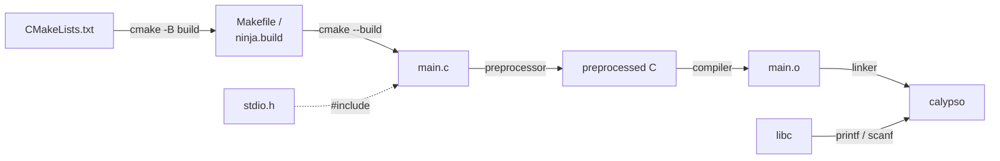

# Phase README — Hello Calypso

> **Phase 01 — The C Compilation Model and First Program** | Calypso · Core C

The flight computer boots, identifies itself, and reads its first operator command from the terminal.

Before Calypso can do anything — read sensors, advance mission phases, manage crew — we need to prove the toolchain works and give the shuttle a voice. This phase builds the simplest possible program that does something real: a boot banner printed with `printf`, a command character read with `scanf`. Its deliberate simplicity is the point — a single `main.c` keeps the focus on the compilation pipeline itself, which is the foundation everything else in this repo stands on.

---

## 🗺️ Contents

- [Branch sequence](#-branch-sequence)
- [Solutions to previous challenges and thought pieces](#-solutions-to-previous-challenges-and-thought-pieces)
- [Why we made this decision](#-why-we-made-this-decision)
- [What we built in the previous branch](#-what-we-built-in-the-previous-branch)
- [What we're doing in this branch](#-what-were-doing-in-this-branch)
- [Learning goals](#-learning-goals)
- [Key concepts](#-key-concepts)
- [What to notice in the code](#-what-to-notice-in-the-code)
- [Running this branch](#-running-this-branch)
- [Challenges for students](#-challenges-for-students)

---

## 📍 Branch sequence

| Branch | What it introduces | Abstraction level |
|---|---|---|
| `main` | Project scaffold — compiles and runs | Scaffold only |
| `📌 phase-01_boot-and-io` | **First program · `printf` / `scanf` · compilation model** | Raw I/O |
| `phase-02_debugging` | `printf`-trace debugging · VS Code debugger · breakpoints | — |
| `phase-03_integer-types` | `stdint.h` fixed-width types · `PRIu16` format specifiers · overflow guards | — |
| `phase-04_compound-types` | `float` · `char` · `bool` · `enum MissionPhase` · `typedef` | — |
| `phase-05_operators` | Arithmetic · relational · logical · `sizeof` · explicit casts | — |
| `phase-06_bitwise` | Bitmasks · `ENGINE_CTRL` register · `1u << n` shift pattern | — |
| `phase-07_control-flow` | `while(1)` command loop · `switch` on mission phase · `goto` emergency shutdown | — |
| `phase-08_functions` | `sensors.c` / `engine.c` / `navigation.c` split · prototypes · pass-by-value | Modular |
| `phase-09_arrays` | Circular sensor history buffers · `sizeof` element count · `array[i]` ≡ `*(array + i)` | — |
| `phase-10_pointers` | `&` / `*` · pointer arithmetic · `const T*` vs `T* const` · `**` | — |
| `phase-11_strings` | `char` arrays · `strncpy` / `strcmp` / `strlen` · null terminator | — |
| `phase-12_structs` | `crew_member_t` · `spacecraft_t` · dot / arrow notation · nested structs | — |
| `phase-13_dynamic-memory` | `malloc` / `realloc` / `free` · dynamic crew roster · `NULL` checks | — |
| `phase-14_embedded-patterns` | `volatile` · memory-mapped I/O pointer · struct bitfields · `const` ROM data | Hardware abstraction |
| `phase-15_preprocessor` | `#define` constants · include guards · `#ifdef DEBUG_TELEMETRY` · function-like macro | — |
| `phase-16_file-io` | `fopen` / `fprintf` / `fwrite` · `calypso.log` · binary checkpoint | — |

---

## ✅ Solutions to previous challenges and thought pieces

### How challenges work

This is the first phase — there are no previous challenges or thought pieces to resolve.

From Phase 2 onward, every phase branch opens with a `SOLUTION:` commit that resolves the previous phase's additive challenges in code, and answers the analytical challenges and thought pieces here in the README.

```bash
git log --oneline          # find the SOLUTION commit hash
git show <hash>            # inspect the solution in isolation
```

---

## 💡 Why we made this decision

### Start with a single file and no abstractions

The Calypso flight computer will eventually span multiple modules — sensors, engine control, crew management, file logging. But none of that is useful if we have not first established that the toolchain works and that the simplest possible C program compiles and runs on the target machine. Starting with a single `main.c` is not a shortcut — it is the right scope for this phase, because the compilation model is the lesson. A multi-file project at this point would immediately require understanding headers, translation units, and the linker before we have had a chance to understand what `printf` does or why `#include` is necessary.

The sequence — preprocessor → compiler → linker → executable — is a data flow that drives every build in this repo. Making it visible once, at the start, means every subsequent phase can refer back to it without re-explaining it.

This repo uses CMake as its build system generator. CMake is not a compiler — it is a layer above the compilation pipeline. It reads `CMakeLists.txt` and generates the platform-appropriate build instructions (a `Makefile` on Linux and macOS, a `ninja.build` or MSVC project on Windows). When you run `cmake --build build`, CMake invokes the real compiler — `gcc` or `clang` — with the correct flags and source files. The pipeline below still runs exactly as described; CMake just automates the invocation. You can verify this directly: `gcc main.c -o calypso` compiles the scaffold without CMake and produces the same binary.



### Use `printf` and `scanf` directly

We use `printf` and `scanf` from `<stdio.h>` rather than any higher-level I/O helper. This keeps the dependency chain short and visible: one `#include`, one header, one library linked at the end. Students compiling with `gcc main.c -o calypso` can see exactly what is happening — no hidden layers. The C standard library is the only I/O dependency Calypso will ever need for terminal interaction, and introducing it directly here, rather than wrapping it, means students understand what they are using before they use it.

---

## ⏮️ What we built in the previous branch

`main` is the project scaffold — a minimal `main.c` that prints a boot message and exits. It proves the build system is configured and the project compiles, but it has no operator interface, no formatted output, and no interactive loop. It is a starting point, not a flight computer.

---

## 🎯 What we're doing in this branch

- Replace the scaffold `main.c` with a boot banner that prints the shuttle designation and build date using `printf` with format specifiers
- Add a command prompt loop that reads a single character from the operator using `scanf` and the address-of operator
- Echo the entered command back with a status string using the `%c` format specifier
- Demonstrate the full compile-and-run workflow from a single source file to an executing binary

---

## 🧑🏻‍🏫 Learning goals

### Understand
- **Explain** how `main.c` is transformed into the `calypso` executable — the sequential roles of the preprocessor, compiler, and linker in the build pipeline
- **Describe** what a `.o` object file contains and why the linker needs it to produce the final binary
- **Distinguish** between `stdio.h` (a header — declarations only) and a `.c` source file (definitions that get compiled), and explain why C separates the two
- **Identify** whether an error is a compiler error or a linker error based on what the message reports and where in the pipeline it occurs
- **Identify** the four components of the Calypso `main.c`: `main()`, `#include <stdio.h>`, `printf()`, and `return 0`
- **Explain** why `main()` is where the OS starts execution and what the integer it returns communicates to the calling process
- **Explain** what `#include <stdio.h>` does and what would break if it were removed
- **Explain** why `scanf("%c", &cmd)` passes `&cmd` rather than `cmd` — and what would happen at runtime if the `&` were omitted

### Apply
- **Compile** `main.c` from the command line — invoke `gcc` or `clang` directly and confirm the resulting `calypso` binary runs
- **Use** `printf()` with `%s`, `%c`, and `%d` format specifiers to produce the boot banner and echo operator commands
- **Use** `scanf()` with `%c` and the address-of operator to read a single command character from the operator

---

## 🔑 Key concepts

| Concept | Plain English |
|---|---|
| **Compilation pipeline** | The three steps that turn `main.c` into `calypso`: the preprocessor resolves `#include` directives, the compiler translates the result to machine code, and the linker combines object files with libraries into a single executable. |
| **Object file** | The compiled but not yet linked output of a single source file — machine code with unresolved placeholders for symbols (like `printf`) whose definitions live in another file or library. |
| **Header file** | A `.h` file containing declarations — function signatures and type definitions — but no compiled code. `#include <stdio.h>` brings `printf`'s declaration into scope so the compiler knows how to call it. |
| **Source file** | A `.c` file containing definitions — the actual function bodies that get compiled into machine code. Each source file is compiled independently into its own object file. |
| **Compiler error vs linker error** | A compiler error means something is wrong in the source text itself — a syntax mistake or missing declaration. A linker error means the source compiled but a symbol was declared and never defined — the linker cannot find the machine code for it. |
| **`main()` and return value** | `main()` is the program entry point — where the OS hands control to the program. Its return value is the process exit code: `0` signals success, any non-zero value signals failure. Shell scripts and build tools read this value. |
| **`#include` directive** | A preprocessor instruction that copies the contents of the named header file into the source file before compilation begins. Without `#include <stdio.h>`, the compiler does not know `printf` exists. |
| **Address-of operator (`&`)** | Produces the memory address of a variable. `scanf` must write a value into the caller's variable — it needs the address to know where to write. Passing the variable directly gives `scanf` a copy, not a location to write back to. |

---

## 🔍 What to notice in the code

**[`main.c`](main.c)**
The boot banner uses `printf` with the `%s` format specifier to embed `__DATE__` — a string produced by the preprocessor at compile time, not at runtime. The `// NOTE:` comment flags it as a Phase 15 topic so students know it is not unexplained magic. Everything in the banner is a literal format string; the format specifiers `%s` and `%c` are the only dynamic elements.

**[`main.c` — `scanf` call](main.c)**
`scanf(" %c", &cmd)` has two things worth examining: the address-of operator (`&cmd`) tells `scanf` where to write the result, and the leading space in `" %c"` silently discards any whitespace — including the newline left by pressing Enter — before reading the character. The block comment above the call explains both. Removing the `&` compiles without error on most setups but writes to a garbage address at runtime.

**[`CMakeLists.txt`](CMakeLists.txt)**
The `if(MSVC)` block suppresses MSVC's deprecation warning for standard C functions like `scanf`. It is build scaffolding, not a lesson — CMake and the preprocessor are covered properly in Phase 15. GCC and Clang compile `main.c` without this definition.

---

## ▶️ Running this branch

**Prerequisites:** GCC or Clang (C99+) and CMake 3.10+, or just GCC/Clang on its own.

**With CMake (recommended):**
```bash
cmake -B build
cmake --build build
.\build\Debug\calypso.exe   # Windows (MSVC)
.\build\calypso.exe         # Windows (MinGW)
./build/calypso             # Linux / macOS
```

**Direct compilation (no CMake):**
```bash
gcc main.c -o calypso
./calypso
```

The program prints the boot banner, prompts for a single character, echoes it, and exits. Press any key followed by Enter when prompted.

---

## ✏️ Challenges for students

**Challenge 1 — Analytical**
`printf("%c", cmd)` and `printf("%d", cmd)` both accept the same `char` variable without a compile error. What does each print, and why do they produce different output from the same value? What does this tell you about how `printf` interprets its arguments?

**Challenge 2 — Analytical**
`return 0` in `main()` tells the OS the program exited cleanly. If Calypso encountered a fault — say `scanf` failed to read anything useful — what value would you return instead, and how would an operator script detect that the flight computer shut down abnormally?

**Challenge 3 — Additive**
Add two commands to the prompt: `'s'` prints `"CALYPSO: all systems nominal"`, and `'q'` prints a shutdown message and returns from `main()`. Any other input should print `"Unknown command."`. Keep the loop running until `'q'` is entered.

**Challenge 4 — Analytical**
The boot banner shows the build date via `__DATE__` — a value fixed at compile time. Calypso is designed to run for months without recompiling. What is the problem with a compile-time date in a long-running flight computer, and what runtime mechanism would give you the actual start time instead?

**Challenge 5 — Additive (stretch)**
Add a `mission_id` integer to the boot banner and print it using `%d`. Now deliberately swap the format specifiers — use `%s` for the integer and `%d` for the name string. Does it compile? Does it run? What does the output look like, and what does this reveal about how `printf` handles its arguments at runtime?

---

## 💭 Thought pieces for the next branch

1. The boot sequence prints static values. If a sensor reading were wrong, how would we find where the fault originates — especially if there are no error messages?
2. The command prompt uses `scanf`. What happens if the user types something that doesn't match the format specifier?
3. If the compile step fails with a linker error rather than a compiler error, where does the bug live — in the source file or somewhere else?

---

*Previous branch: [`main`]*
*Next branch: [`phase-02_debugging`]*
